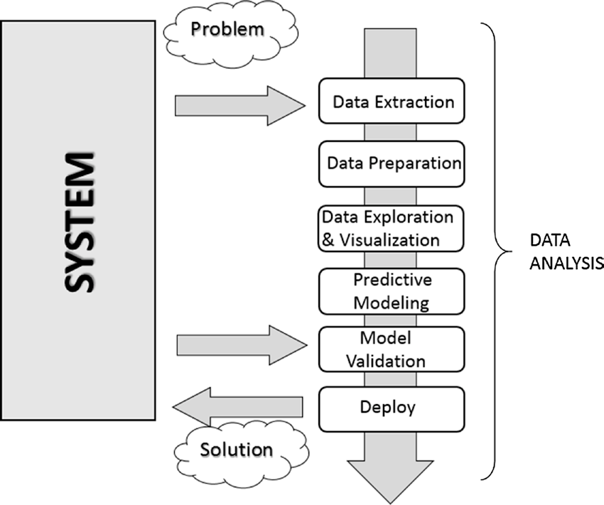

[*第一章：数据分析导论*](./README.md)

# 1.4. 数据分析过程

数据分析可以被描述为一个由几个步骤组成的过程，在这个过程中，原始数据被转换和处理，以产生数据可视化和预测，这是基于收集的数据的数学模型。然后，数据分析只不过是一系列步骤，每个步骤在后面的步骤中都起着关键作用。因此，将数据分析规划为一个过程链，由以下几个阶段组成:

* 问题定义
* 数据提取
* 数据准备.数据清洗
* 数据准备-数据转换
* 数据探索与可视化
* 预测建模
* 模型验证/测试
* 部署-结果的可视化和解释
* 部署-解决方案的部署

图1-1显示了数据分析所涉及的所有进程的示意图.

>> 图1-1. 数据分析过程

## 问题定义

数据分析的过程实际上早在原始数据收集之前就开始了。事实上，数据分析总是从一个需要解决的问题开始，这个问题需要定义。

只有当你把你想研究的系统集中起来之后，问题才会被定义;一般来说，这可能是一种机制、应用程序或流程。一般来说，这项研究是为了更好地理解它的运作，但特别地，这项研究将被设计来理解它的行为原则，以便能够做出预测或选择(定义为知情选择)。

科学问题或业务的定义步骤和相应的文档(可发布)都非常重要，以便将整个分析严格地集中在获取结果上。事实上，对系统进行全面或详尽的研究有时是很复杂的，而且开始时并不总是有足够的信息。因此，问题的定义，尤其是它的规划，可以决定整个项目要遵循的指导方针。

一旦定义并记录了问题，您就可以转移到数据分析的项目计划阶段。需要进行规划，以了解需要哪些专业人员和资源来满足尽可能有效地执行项目的要求。所以你要考虑这个领域的问题包括问题的解决。您将寻找各种感兴趣领域的专家，并安装执行数据分析所需的软件。

同时在计划阶段，你要选择一个有效的团队。一般来说，这些团队应该是跨学科的，以便通过从不同的角度观察数据来解决问题。因此，建立一个好的团队肯定是数据分析成功的关键因素之一。

## 数据提取

一旦定义了问题，第一步是获取数据以执行分析。数据的选择必须以建立预测模型为基本目的，因此数据的选择也是分析成功的关键。收集的样本数据必须尽可能地反映真实世界，即系统对来自真实世界的刺激的反应。例如，如果您使用的是大量的原始数据集，而这些数据集没有得到很好的收集，那么这些数据集可能会描述错误或不平衡的情况。

因此，对数据的糟糕选择，甚至对不完全代表系统的数据集进行分析，都将导致模型偏离所研究的系统。

数据的搜索和检索通常需要一种超越单纯的技术研究和数据提取的直觉。这个过程还需要对数据的性质和形式有仔细的了解，只有在问题应用领域有良好的经验和知识才能提供这些数据。

不管所需的数据质量和数量如何，另一个问题是使用最好的数据源。

如果工作室环境是实验室(技术或科学)，并且生成的数据是实验性的，那么在这种情况下，数据源是很容易识别的。在这种情况下，问题将只与实验装置有关。

但是，数据分析不可能再现在每个应用领域都以严格的实验方式收集数据的系统。许多领域需要从周围的世界中寻找数据，通常依赖于外部的实验数据，或者更多的是通过访谈或调查收集数据。因此，在这些情况下，找到一个能够提供数据分析所需的所有信息的良好数据源是相当具有挑战性的。通常需要从多个数据源检索数据，以弥补任何不足，识别任何差异，并使数据集尽可能一般化。

当您想要获得数据时，最好的起点是Web。但是网络上的大多数数据很难获取;事实上，并不是所有数据都可以在文件或数据库中使用，但可能是HTML页面中以许多不同格式显示的内容。为此，一种称为web抓取的方法允许通过识别网页中出现的HTML标记来收集数据。有专门为此目的而设计的软件，一旦发现目标，它就会提取所需的数据。一旦搜索完成，您将得到一个数据列表，准备好进行数据分析。

## 数据准备

在数据分析涉及的所有步骤中，数据准备虽然看起来问题不大，但实际上需要更多的资源和时间来完成。数据通常从不同的数据源收集，每个数据源中的数据都具有不同的表示形式和格式。所以，所有这些数据都必须为数据分析的过程做好准备。

数据的准备涉及到获取、清理、规范化和将数据转换为优化数据集，即以通常为表格的格式编制数据集，适用于在设计阶段安排的分析方法。

可能会出现许多潜在问题，包括无效的、模糊的或缺失的值、重复的字段和超出范围的数据。

## 数据探测/可视化

探索数据本质上包括在图形或统计表示中搜索数据，以便找到模式、连接和关系。数据可视化是突出可能的模式的最佳工具。

近年来，数据可视化已经发展到这样一种程度，数据可视化本身已经成为一门真正的学科。事实上，许多技术被专门用于显示数据，许多显示类型被应用于从数据集中提取尽可能好的信息。

数据探索包括对数据的初步审查，这对于理解所收集的信息类型及其含义是很重要的。结合在定义问题中获得的信息，这种分类将确定哪种数据分析方法最适合达到模型定义。

一般来说，这个阶段除了通过可视化数据对图表进行详细研究外，还可能包括下列一项或多项活动:

* 汇总数据
* 分组数据
* 探索不同属性之间的关系
* 确定模式和趋势
* 构建回归模型
* 构建分类模型

一般来说，数据分析需要对要研究的数据进行总结。摘要是将数据简化为解释而不牺牲重要信息的过程。

聚类是一种数据分析方法，用于查找由公共属性(也称为分组)联合的组。

分析的另一个重要步骤是识别数据中的关系、趋势和异常。为了找到这类信息，您常常不得不求助于工具，并执行另一轮数据分析，这次是在数据可视化本身上。

其他数据挖掘方法，如决策树和关联规则，会自动从数据中提取重要事实或规则。这些方法可以与数据可视化并行使用，以发现数据之间的关系。

## 预测建模

预测建模是数据分析中用来创建或选择合适的统计模型来预测结果概率的过程。

在探索数据之后，您就有了开发用于编码数据之间关系的数学模型所需的所有信息。这些模型对于理解所研究的系统很有用，并且它们在特定的方式下用于两个主要目的。首先是对系统产生的数据值进行预测;在本例中，您将处理回归模型。第二个目的是对新生成的数据进行分类，在这种情况下，您将使用分类模型或聚类模型。实际上，可以根据产生的结果类型对模型进行划分:

* 分类模型:如果模型类型得到的结果是分类的。
* 回归模型:如果模型类型得到的结果是数值型的。
* 聚类模型:如果模型类型得到的结果是描述性的。

生成这些模型的简单方法包括线性回归、逻辑回归、分类和回归树以及k-近邻等技术。但是，分析的方法很多，每一种都有特定的特性，这使得它对于某些类型的数据和分析非常优秀。每一种方法都会生成一个特定的模型，然后它们的选择与产品模型的性质相关。

其中一些模型将根据实际系统的结构提供相应的数值。他们将以简单明了的方式解释正在研究的系统的一些特征。其他模型将继续给出良好的预测，但它们的结构只不过是一个`黑盒子`，解释系统特征的能力有限。

## 模型验证

模型的验证(即测试阶段)是一个重要的阶段，它允许您在开始数据的基础上验证构建的模型。这很重要，因为它允许您通过直接将模型生成的数据与实际系统进行比较来评估模型生成的数据的有效性。但这一次，你从一组开始的数据中走出来，整个分析都建立在这些数据上。

通常，在使用数据构建模型时，您会将其作为训练集引用，在使用数据验证模型时将其作为验证集引用。

因此，通过将模型生成的数据与系统生成的数据进行比较，您将能够评估错误，并且使用不同的测试数据集，您可以估计生成模型的有效性限制。事实上，正确的预测值只能在一定范围内有效，或者根据所考虑的取值范围有不同程度的匹配。

此过程不仅允许您对模型的有效性进行数值评估，还允许您将其与任何其他现有模型进行比较。在这方面有几个技巧; 最著名的是交叉验证。这种技术是基于将训练集划分成不同的部分。每一部分轮流作为验证集，而其他部分作为训练集。在这种迭代的方式中，你会有一个越来越完善的模型。

## 部署

这是分析过程的最后一步，目的是展示结果，即分析的结论。在业务环境的部署过程中，分析被转换为委托它的客户的收益。在技术或科学环境中，它被翻译成设计解决方案或科学出版物。也就是说，部署基本上包括将从数据分析中获得的结果付诸实践。

有几种方法可以部署数据分析或数据挖掘的结果。通常，数据分析师的部署包括为管理层或要求进行分析的客户编写报告。本文将概念性地描述从数据分析中得到的结果。报告应该直接交给经理们，这样他们就能做出决定。然后，他们将把分析的结论付诸实践。

在分析人员提供的文档中，将详细讨论这四个主题：

* 分析结果
* 决策部署
* 风险分析
* 衡量业务影响

当项目的结果包括生成预测模型时，这些模型可以作为独立的应用程序部署，也可以集成到其他软件中。

