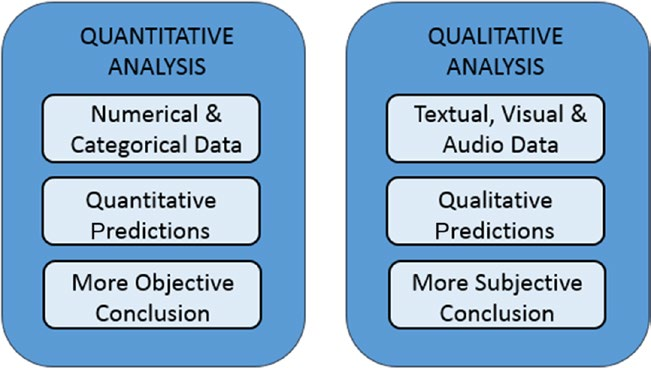

[*第一章：数据分析概论*](./)

# 1.5. 定量和定性数据分析

数据分析完全集中在数据上。根据数据的性质，可以进行一些区分。

当被分析的数据具有严格的数值或范畴结构时，那么你是在谈论定量分析，但是当你处理通过自然语言描述表达的价值时，那么你就是在谈论定性分析。

正是由于这两种类型的分析所处理的数据的性质不同，您可以观察到它们之间的一些差异。

定量分析与数据的逻辑顺序有关，或者可以以某种方式进行分类。这导致数据内部结构的形成。

顺序、分类和结构依次提供更多的信息，并允许以更数学的方式进一步处理数据。这导致了提供定量预测的模型的产生，从而允许数据分析师得出更客观的结论。

定性分析与通常没有结构的数据有关，至少不是显而易见的，它们的性质既不是数字也不是范畴。例如，定性研究中的数据可以包括书面文本、可视数据或音频数据。因此，这种类型的分析必须以方法为基础，通常是特别的，以提取信息，这些信息通常会导致能够提供定性预测的模型，从而得出数据分析人员可以得出的结论

也可能包括主观解释。另一方面，定性分析可以探索更复杂的系统，并得出严格的数学方法不可能得出的结论。这种类型的分析常常涉及到对诸如社会现象或复杂结构等系统的研究，这些系统不易测量。

图1-2显示了这两种分析类型之间的差异.

