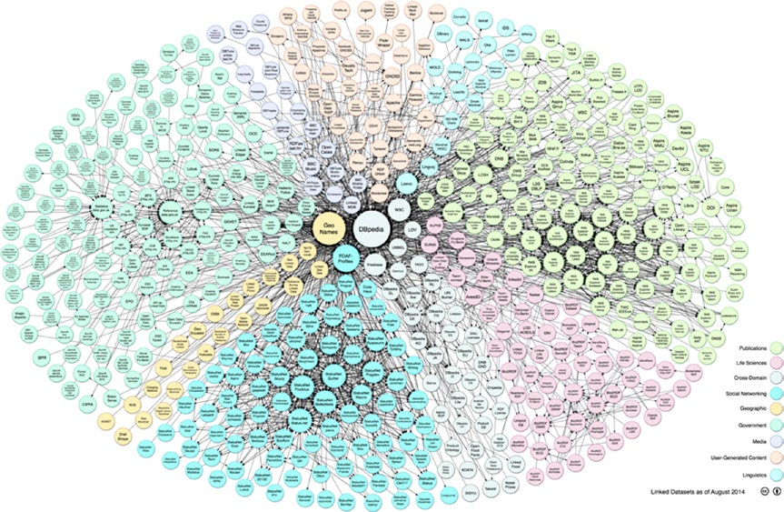

[*第一章：数据分析导论*](./README.md)

# 1.6. 开放数据

为了支持对数据日益增长的需求，大量的数据源现在可以在互联网上使用。这些数据源免费向任何需要的人提供信息，它们被称为开放数据。

以下是一些在线公开数据的列表

* DataHub (http://datahub.io/dataset)
* 世界卫生组织(http://www.who.int/research/en/))
* Data.gov (http://data.gov)
* 欧盟开放数据门户(http://open-data.europa.eu/en/data/)
* 亚马逊网络服务数据集(http://awcom.com/ dataset)。
* Facebook Graph (http://developers.facebook.com/docs/graph-api)
* Healthdata gov (http://www.healthdata.gov)
* 谷歌趋势(http://www.google.com/trends/explore))
* 谷歌财经(https://www.google.com/finance))
* 谷歌图书(http://storage.googleapis.com/books/ngrams / Books /datasetsv2.html)
* 机器学习代码仓库(http://archive.com/uciedu/ml/)。

作为在线可用的开放数据源的概念，您可以查看LOD云图(http://lod-cloud.net)，它显示了当前网络上可用的几个开放数据源之间的数据链接的连接(参见图1-3)。

>> 图1-3.2014年开放数据云图链接，由Max Schmachtenberg、Christian Bizer、Anja Jentzsch和Richard Cyganiak编写。http://lod-cloud.net/[CC-by-SA许可证]

