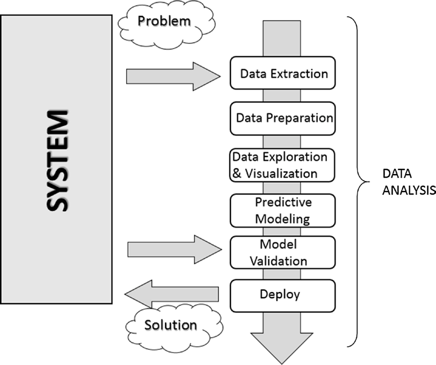

[*Chapter 1 : An Introduction to Data Analysis*](./)

# 1.4. The Data Analysis Process 

Data analysis can be described as a process consisting of several steps in which the raw data are transformed and processed in order to produce data visualizations and make predictions thanks to a mathematical model based on the collected data. Then, data analysis is nothing more than a sequence of steps, each of which plays a key role in the subsequent ones. So, data analysis is schematized as a process chain consisting of the following sequence of stages:
* Problem definition
* Data extraction
* Data preparation - Data cleaning
* Data preparation - Data transformation
* Data exploration and visualization
* Predictive modeling
* Model validation/test
* Deploy - Visualization and interpretation of results
* Deploy - Deployment of the solution

Figure 1-1 shows a schematic representation of all the processes involved in the
data analysis.

## Problem Definition 
The process of data analysis actually begins long before the collection of raw data. In fact, data analysis always starts with a problem to be solved, which needs to be defined.
The problem is defined only after you have focused the system you want to study; this may be a mechanism, an application, or a process in general. Generally this study can be in order to better understand its operation, but in particular the study will
be designed to understand the principles of its behavior in order to be able to make predictions or choices (defined as an informed choice).
The definition step and the corresponding documentation (deliverables) of the scientific problem or business are both very important in order to focus the entire analysis strictly on getting results. In fact, a comprehensive or exhaustive study of the system is sometimes complex and you do not always have enough information to start with. So the definition of the problem and especially its planning can determine the guidelines to follow for the whole project.
Once the problem has been defined and documented, you can move to the project planning stage of data analysis. Planning is needed to understand which professionals and resources are necessary to meet the requirements to carry out the project as efficiently as possible. So you’re going to consider the issues in the area involving the resolution of the problem. You will look for specialists in various areas of interest and install the software needed to perform data analysis.
Also during the planning phase, you choose an effective team. Generally, these teams should be cross-disciplinary in order to solve the problem by looking at the data from different perspectives. So, building a good team is certainly one of the key factors leading to success in data analysis.

## Data Extraction

Once the problem has been defined, the first step is to obtain the data in order to perform the analysis. The data must be chosen with the basic purpose of building the predictive model, and so data selection is crucial for the success of the analysis as well. The sample data collected must reflect as much as possible the real world, that is, how the system responds to stimuli from the real world. For example, if you’re using huge datasets of raw data and they are not collected competently, these may portray false or unbalanced situations.
Thus, poor choice of data, or even performing analysis on a dataset that’s not perfectly representative of the system, will lead to models that will move away from the system under study.
The search and retrieval of data often require a form of intuition that goes beyond mere technical research and data extraction. This process also requires a careful understanding of the nature and form of the data, which only good experience and knowledge in the problem’s application field can provide.
Regardless of the quality and quantity of data needed, another issue is using the best
data sources.
If the studio environment is a laboratory (technical or scientific) and the data generated are experimental, then in this case the data source is easily identifiable. In this case, the problems will be only concerning the experimental setup.
But it is not possible for data analysis to reproduce systems in which data are gathered in a strictly experimental way in every field of application. Many fields require searching for data from the surrounding world, often relying on external experimental data, or even more often collecting them through interviews or surveys. So in these cases, finding a good data source that is able to provide all the information you need for data analysis can be quite challenging. Often it is necessary to retrieve data from multiple data sources to supplement any shortcomings, to identify any discrepancies, and to make the dataset as general as possible.
When you want to get the data, a good place to start is the Web. But most of the data on the Web can be difficult to capture; in fact, not all data are available in a file or database, but might be content that is inside HTML pages in many different formats. To this end, a methodology called web scraping allows the collection of data through the recognition of specific occurrence of HTML tags within web pages. There is software specifically designed for this purpose, and once an occurrence is found, it extracts the
desired data. Once the search is complete, you will get a list of data ready to be subjected to data analysis.

## Data Preparation

Among all the steps involved in data analysis, data preparation, although seemingly less problematic, in fact requires more resources and more time to be completed. Data are often collected from different data sources, each of which will have data in it with a different representation and format. So, all of these data will have to be prepared for the process of data analysis.
The preparation of the data is concerned with obtaining, cleaning, normalizing, and transforming data into an optimized dataset, that is, in a prepared format that’s normally tabular and is suitable for the methods of analysis that have been scheduled during the design phase.
Many potential problems can arise, including invalid, ambiguous, or missing values, replicated fields, and out-of-range data.

## Data Exploration/Visualization

Exploring the data involves essentially searching the data in a graphical or statistical presentation in order to find patterns, connections, and relationships. Data visualization is the best tool to highlight possible patterns.
In recent years, data visualization has been developed to such an extent that it has become a real discipline in itself. In fact, numerous technologies are utilized exclusively to display data, and many display types are applied to extract the best possible information from a dataset.
Data exploration consists of a preliminary examination of the data, which is important for understanding the type of information that has been collected and what it means. In combination with the information acquired during the definition problem, this categorization will determine which method of data analysis will be most suitable for arriving at a model definition.
Generally, this phase, in addition to a detailed study of charts through the visualization data, may consist of one or more of the following activities:
* Summarizing data
* Grouping data
* Exploring the relationship between the various attributes
* Identifying patterns and trends
* Constructing regression models
* Constructing classification models

Generally, data analysis requires summarizing statements regarding the data to be studied. Summarization is a process by which data are reduced to interpretation without sacrificing important information.
Clustering is a method of data analysis that is used to find groups united by common attributes (also called grouping).
Another important step of the analysis focuses on the identification of relationships, trends, and anomalies in the data. In order to find this kind of information, you often have to resort to the tools as well as perform another round of data analysis, this time on the data visualization itself.
Other methods of data mining, such as decision trees and association rules, automatically extract important facts or rules from the data. These approaches can be used in parallel with data visualization to uncover relationships between the data.

## Predictive Modeling

Predictive modeling is a process used in data analysis to create or choose a suitable statistical model to predict the probability of a result.
After exploring the data, you have all the information needed to develop the mathematical model that encodes the relationship between the data. These models are useful for understanding the system under study, and in a specific way they are used for two main purposes. The first is to make predictions about the data values produced by the system; in this case, you will be dealing with regression models. The second purpose is to classify new data products, and in this case, you will be using classification models or clustering models. In fact, it is possible to divide the models according to the type of result they produce:
* Classification models: If the result obtained by the model type is categorical.
* Regression models: If the result obtained by the model type is numeric.
* Clustering models: If the result obtained by the model type is descriptive.
Simple methods to generate these models include techniques such as linear regression, logistic regression, classification and regression trees, and k-nearest neighbors. But the methods of analysis are numerous, and each has specific characteristics that make it excellent for some types of data and analysis. Each of these methods will produce a specific model, and then their choice is relevant to the nature of the product model.
Some of these models will provide values corresponding to the real system and according to their structure. They will explain some characteristics of the system under study in a simple and clear way. Other models will continue to give good predictions, but their structure will be no more than a “black box” with limited ability to explain characteristics of the system.

## Model Validation

Validation of the model, that is, the test phase, is an important phase that allows you to validate the model built on the basis of starting data. That is important because it allows you to assess the validity of the data produced by the model by comparing them directly with the actual system. But this time, you are coming out from the set of starting data on which the entire analysis has been established.
Generally, you will refer to the data as the training set when you are using them for building the model, and as the validation set when you are using them for validating the model.
Thus, by comparing the data produced by the model with those produced by the system, you will be able to evaluate the error, and using different test datasets, you can estimate the limits of validity of the generated model. In fact the correctly predicted values could be valid only within a certain range, or have different levels of matching depending on the range of values taken into account.
This process allows you not only to numerically evaluate the effectiveness of the model but also to compare it with any other existing models. There are several techniques in this regard; the most famous is the cross-validation. This technique is based on the division of the training set into different parts. Each of these parts, in
turn, will be used as the validation set and any other as the training set. In this iterative manner, you will have an increasingly perfected model.

## Deployment

This is the final step of the analysis process, which aims to present the results, that is, the conclusions of the analysis. In the deployment process of the business environment, the analysis is translated into a benefit for the client who has commissioned it. In technical or scientific environments, it is translated into design solutions or scientific publications. That is, the deployment basically consists of putting into practice the results obtained from the data analysis.
There are several ways to deploy the results of data analysis or data mining.
Normally, a data analyst’s deployment consists in writing a report for management or for the customer who requested the analysis. This document will conceptually describe the results obtained from the analysis of data. The report should be directed to the managers, who are then able to make decisions. Then, they will put into practice the conclusions of the analysis.
In the documentation supplied by the analyst, each of these four topics will be discussed in detail:
* Analysis results
* Decision deployment
* Risk analysis
* Measuring the business impact
When the results of the project include the generation of predictive models, these models can be deployed as stand-alone applications or can be integrated into other software.

