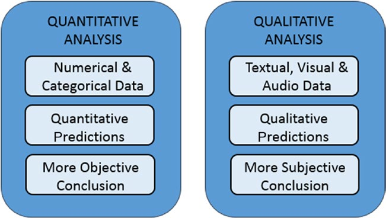

[*Chapter 1 : An Introduction to Data Analysis*](./)

# 1.5 Quantitative and Qualitative Data Analysis

Data analysis is completely focused on data. Depending on the nature of the data, it is possible to make some distinctions.
When the analyzed data have a strictly numerical or categorical structure, then you are talking about quantitative analysis, but when you are dealing with values that are expressed through descriptions in natural language, then you are talking about qualitative analysis.
Precisely because of the different nature of the data processed by the two types of analyses, you can observe some differences between them.
Quantitative analysis has to do with data with a logical order or that can be categorized in some way. This leads to the formation of structures within the data.
The order, categorization, and structures in turn provide more information and allow further processing of the data in a more mathematical way. This leads to the generation of models that provide quantitative predictions, thus allowing the data analyst to draw more objective conclusions.
Qualitative analysis instead has to do with data that generally do not have a structure, at least not one that is evident, and their nature is neither numeric nor categorical. For example, data under qualitative study could include written textual, visual, or audio data. This type of analysis must therefore be based on methodologies, often ad hoc, to extract information that will generally lead to models capable of providing qualitative predictions, with the result that the conclusions to which the data analyst can arrive
may also include subjective interpretations. On the other hand, qualitative analysis can explore more complex systems and draw conclusions that are not possible using a strictly mathematical approach. Often this type of analysis involves the study of systems such as social phenomena or complex structures that are not easily measurable.
Figure 1-2 shows the differences between the two types of analysis.

