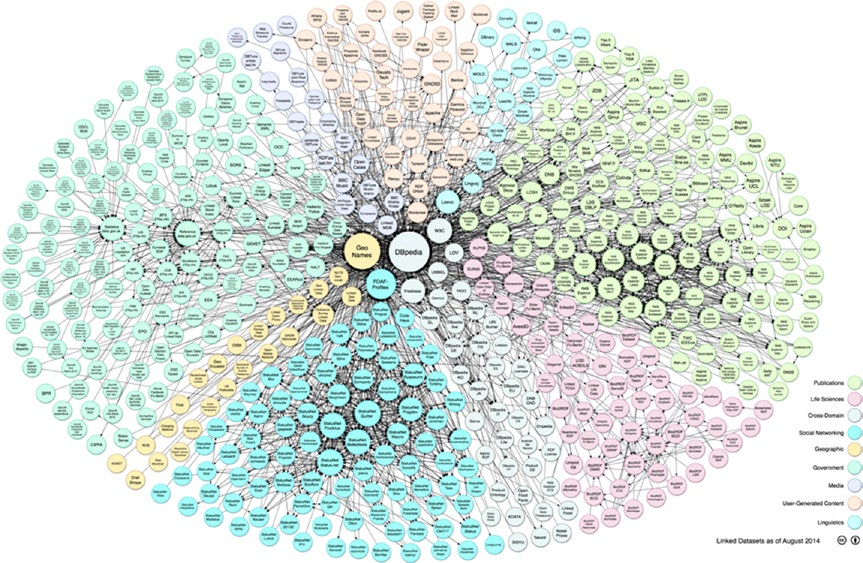

[*Chapter 1 : An Introduction to Data Analysis*](./)

# 1.6. Open Data

In support of the growing demand for data, a huge number of data sources are now available on the Internet. These data sources freely provide information to anyone in need, and they are called open data.
Here is a list of some open data available online. You can find a more complete list and details of the open data available online in Appendix B.
* DataHub (http://datahub.io/dataset)
* World Health Organization (http://www.who.int/research/en/)
* Data.gov (http://data.gov)
* European Union Open Data Portal (http://open-data.europa.eu/ en/data/)
* Amazon Web Service public datasets (http://aws.amazon.com/ datasets)
* Facebook Graph (http://developers.facebook.com/docs/graph-api)

* Healthdata.gov (http://www.healthdata.gov)
* Google Trends (http://www.google.com/trends/explore)
* Google Finance (https://www.google.com/finance)
* Google Books Ngrams (http://storage.googleapis.com/books/ ngrams/books/datasetsv2.html)
* Machine Learning Repository (http://archive.ics.uci.edu/ml/)

As an idea of open data sources available online, you can look at the LOD cloud diagram (http://lod-cloud.net), which displays the connections of the data link among several open data sources currently available on the network (see Figure 1-3).

Figure 1-3. Linking open data cloud diagram 2014, by Max Schmachtenberg, Christian Bizer, Anja Jentzsch, and Richard Cyganiak. http://lod-cloud.net/ [CC-BY-SA license]

