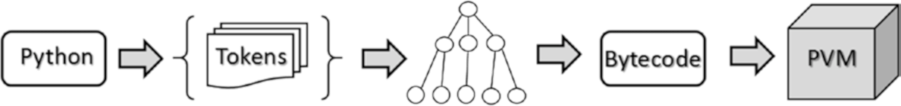

[*第2章：Python世界简介*](./)

Python语言及其周围的世界是由解释器、工具、编辑器、库、NoteBook等组成的。近年来，这个Python世界得到了极大的扩展，采用的形式日益丰富，这些形式令第一次接触Python的开发人员觉得复杂, 进而会产生某些误导。因此，如果您是第一次接触Python，您可能会在这么多的选择中感到不知所措，尤其是在从哪里开始的问题上。

本章向您概述了整个Python世界。首先，您将阅读Python语言及其独特特性的描述。您将看到从哪里开始，解释器是什么，以及如何开始用Python编写第一行代码。然后，您将看到关于shell的一些新的、更高级的交互书写形式，例如IPython和IPythonNoteBook。

# 2.1. Python-编程语言

Python编程语言是由Guido Von Rossum于1991年创建的，最初使用的是ABC语言。这种语言可以用一系列形容词来描述: 

* 解释型的
* 可移植的
* 笔记薄
* 面向对象的
* 交互式
* 界面上
* 开源的
* 易懂易用

Python是一种解释型编程语言，也就是说，它是伪编译的。一旦编写了代码，就需要一个解释器来运行它。解释器是安装在每台机器上的程序，它的任务是解释源代码并运行它。与C、c++和Java等语言不同，Python没有编译时间。

Python是一种高度可移植的编程语言。使用解释器作为读取和运行代码的接口的决定有一个关键优势：可移植性。实际上，您可以在任何平台(Linux、Windows和Mac)上安装解释器，Python代码不会改变。因此，Python经常被用作许多小型设备的编程语言，例如Raspberry PI和其他微控制器。

Python是一种面向对象的编程语言。实际上，它允许您指定对象的类并实现它们的继承。但是与c++和Java不同的是，没有构造函数和析构函数。Python还允许您在代码中实现特定的构造来管理异常。然而，这种语言的结构是如此灵活，它允许您使用与面向对象的方法不同的方法进行编程。例如，您可以使用函数方法或向量方法。

Python是一种交互式编程语言。由于Python使用解释器来执行，这种语言可以根据使用它的上下文呈现非常不同的方面。实际上，您可以编写由许多行组成的代码，类似于您在c++或Java等语言中所做的，然后启动程序，或者您可以立即输入命令行并执行它，立即获得命令的结果。然后，根据结果，您可以决定接下来运行哪个命令。这种高度交互的代码执行方式使得Python计算环境类似于MATLAB。Python的这个特性是它受到科学界欢迎的原因之一。

Python是一种可以交互的编程语言。实际上，这种编程语言可以与用其他编程语言(如C/C++和FORTRAN)编写的代码进行交互。甚至这也是一个成功的选择。实际上，由于这方面的原因，Python可以弥补它唯一的弱点--执行速度。Python作为一种高度动态的编程语言，其本质有时会导致程序的执行速度比用其他语言编译的相应静态程序慢100倍。因此，这种性能问题的解决方案是将Python作为自己的代码来使用，将其与其他语言的编译代码进行接口。

Python是一种开源编程语言。CPython是Python语言的参考实现，是完全免费的开源的。此外，网络中的每个模块或库都是开源的，它们的代码可以在线获取。每个月，一个广泛的开发社区都会进行改进，使这种语言及其所有库更加丰富和高效。CPython是由非盈利组织Python软件基金会管理的，该基金会成立于2001年，其任务是推广、保护和推进Python编程语言。

最后，Python是一种易于使用和学习的简单语言。这个方面可能是最重要的，因为它是开发人员(甚至是新手)面对的最直接的方面。Python代码的高直观性和易读性常常导致对这种编程语言的`同情`，因此它是大多数编程新手的选择。然而，它的简单并不意味着狭隘，因为Python是一种在计算的每个领域都在传播的语言。此外，与c++、Java和FORTRAN等现有编程语言相比，Python所做的所有这些工作都非常简单。

## Python-解释器

如前几节所述，每次运行python命令时，python解释器都会启动，其特征是>>>提示符。

Python解释器只是一个程序，它读取和解释传递给提示符的命令。您已经看到，解释器一次可以接受一个命令，也可以接受Python代码的整个文件。然而，它执行此操作的方法总是相同的。

每次按Enter键时，解释器就开始通过令牌(称为令牌化)扫描代码(行或完整的代码文件)。这些标记是解释器在树结构中排列的文本片段。得到的树是程序的逻辑结构，然后转换为字节码(.pyc或.pyo)。流程链以将由Python虚拟机(PVM)执行的字节码结束。见图2-1.

>> 图2-1. Python解释器执行的步骤

您可以在https://www.ics.uci.edu/~Pattis/ICS-31/ORISS/Tokens.pdf上找到关于这一过程的非常好的文档。

标准的Python解释器报告为Cython，因为它是用c语言编写的;用c#开发的IronPython(仅适用于Windows);PyPy，完全是用Python开发的。

### Cython

Cython项目基于创建一个编译器，该编译器将Python代码转换为c语言，然后在运行时在Cython环境中执行该代码。这种类型的编译系统使得在Python代码中引入C语义成为可能，从而使其更加高效。这个系统导致了编程语言的两个世界与Cython的诞生相结合，Cython被认为是一种新的编程语言。你可以在网上找到很多关于它的文档;我建议您访问http://docs.cython.org。

### Jython

与Cython并行，有一个完全用Java构建和编译的版本，名为Jython。它是1997年由Jim Hugunin创建的(http://www.jython.org)。Jython是Java中Python编程语言的一种实现;它的步特点是使用Java类而不是Python模块来实现Python的扩展和包。

### PyPy 

PyPy解释器是一个JIT(即时)编译器，它在运行时直接在机器码中转换Python代码。这个选择是为了加速Python的执行。然而，这种选择导致使用了更小的Python命令子集，即RPython。有关这方面的更多信息，请参阅官方网站http://pypy.org。

