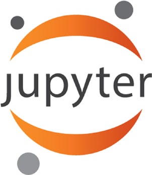
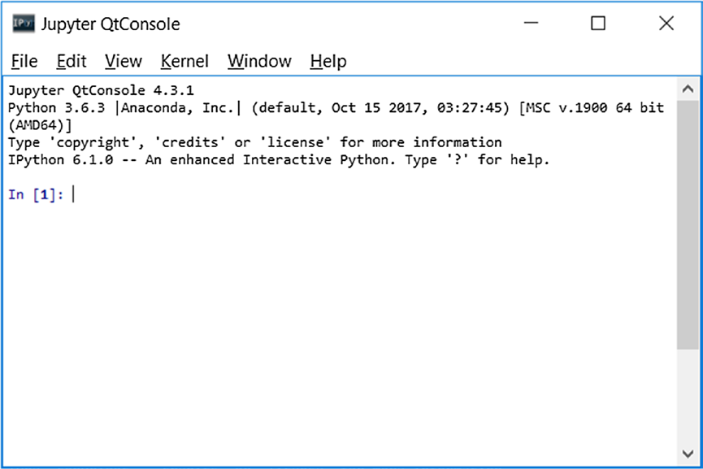
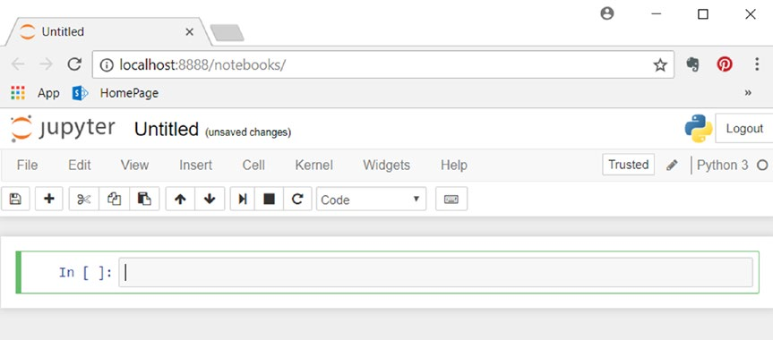

[*第2章：Python世界简介*](./)


# 2.2. Python 2与Python 3

Python社区仍然处于从系列2的解释器到系列3的过渡阶段。事实上，您目前会发现两个并行使用的Python版本(版本2.7和版本3.6)。这种模棱两可会造成混淆，特别是在选择使用哪个版本以及这两个版本之间的差异方面。您肯定要问的一个问题是，为什么是版本2。如果x是围绕3.x这样的增强版发行的，那么它仍然是发行的。

当Python的创始人Guido Van Rossum (Guido Van Rossum)决定对Python语言进行重大修改时，他很快发现这些修改将使新版本与许多现有代码不兼容。因此，他决定从Python的新版本Python 3.0开始。为了克服不兼容的问题，避免创建大量不可用的代码，它决定维护一个兼容的版本，准确地说是2.7。

Python 3.0首次亮相是在2008年，而2.7版本是在2010年发布的，并承诺不会有大的发布，目前的版本是3.6.5(2018年)。

在这本书中，我们提到Python3.x版本；但是，除了少数例外，Python2.7.x版本应该没有问题(最后一个版本是2.7.14，发布于2017年9月)。

## 安装Python

为了用Python开发程序，您必须在操作系统上安装它。Linux发行版和MacOSX机器应该已经预装了Python版本。如果没有，或者如果您想用另一个版本替换该版本，您可以轻松地安装它。Python的安装因操作系统而异；然而，它是一个相当简单的操作。

在Debian-Ubuntu Linux系统上运行这个命令

```commandline
apt-get install python
```

在使用rpm包的RedHat Fedora Linux系统上，运行以下命令

```commandline
yum install python
```

如果您正在运行Windows或MacOS X，您可以访问Python官方站点(http://www.python.org)并下载您喜欢的版本。本例中的包是自动安装的。

然而，现在有一些发行版提供了许多工具，使Python、所有库和相关应用程序的管理和安装变得更容易。我强烈建议您选择一个在线发行版。

## 的Python发行版

由于Python编程语言的成功，多年来开发了许多Python工具来满足各种功能。有如此之多，几乎不可能手动管理所有这些。

在这方面，许多Python发行版有效地管理了数以百计的Python包。实际上，不需要单独下载解释器(只包含标准库)，然后需要单独安装所有其他库，安装Python发行版要容易得多。

这些发行版的核心是包管理器，它只是自动管理、安装、升级、配置和删除作为发行版一部分的Python包的应用程序。

它们的功能非常有用，因为用户只是对特定的包(例如可以安装)提出请求，而包管理器(通常通过Internet)通过分析必要的版本来执行操作，同时分析与任何其他包的所有依赖项，并在它们不存在的情况下载它们。


### Anaconda

Anaconda是由Continuum Analytics公司(https://www.anaconda.com)免费分发的Python包。这个发行版支持Linux、Windows和MacOS X操作系统。除了提供Python世界中最新发布的包之外，Anaconda还附带了设置Python开发环境所需的大多数工具。

实际上，当您在系统上安装Anaconda发行版时，您可以使用本章中描述的许多工具和应用程序，而不必担心必须分别安装和管理它们。基本的发行版包括作为IDE的Spyder、IPython QtConsole和Notebook。

整个Anaconda发行版的管理由一个名为conda的应用程序执行。这是Anaconda发行版的包管理器和环境管理器，它处理所有包及其版本。

```commandline
conda install <package name>
```

这个发行版最有趣的一个方面是能够管理多个开发环境，每个开发环境都有自己的Python版本。实际上，在安装Anaconda时，Python版本2.7是默认安装的。然后，所有安装的包都将引用该版本。这不是问题，因为Anaconda通过创建新环境提供了与其他Python版本同时独立工作的可能性。例如，您可以创建一个基于Python 3.6的环境。

```commandline
conda create -n py36 python=3.6 anaconda
```

这将生成一个新的Anaconda环境，包含与Python 3.6版本相关的所有包。这个安装不会以任何方式影响Python 2.7构建的环境。安装之后，您可以通过输入以下命令来激活新环境。

```commandline
source activate py36
```

On Windows, use this instead: 
在Windows上，请使用以下方法：

```commandline
activate py36 C:\Users\

Fabio>activate py36
(py36) C:\Users\Fabio>

```

您可以创建任意数量的Python版本;您只需要更改conda create命令中python选项传递的参数。当您想要重新使用原始的Python版本时，您必须使用以下命令:

```commandline
source deactivate
```

在Windows上，请使用以下命令：

```commandline
(py36) C:\Users\
Fabio>deactivate Deactivating 
environment "py36"... C:\Users\
Fabio>
```

## 使用Python

Python很丰富，但是很简单，而且非常灵活。它允许将开发活动扩展到许多工作领域(数据分析、科学、图形界面等)。 

正是由于这个原因，Python可以在许多不同的上下文中使用，这通常取决于开发人员的品味和能力。本节介绍在本书中使用Python的各种方法。根据在不同章节中讨论的不同主题，这些不同的方法将被特别使用，因为它们将更适合于手头的任务。


### Python Shell

接近Python世界的最简单方法是在Python shell中打开一个会话，这是一个运行命令行的终端。实际上，您可以一次输入一个命令并立即测试它的操作。这种模式清楚地说明了Python底层解释器的性质。实际上，解释器可以一次读取一个命令，保持前几行中指定的变量的状态，这种行为类似于MATLAB和其他计算软件。

这种方法在第一次接触Python时很有用。您可以一次测试一个命令，而无需编写、编辑和运行整个程序，该程序可以由许多行代码组成。

这种模式也适用于一次一行地测试和调试Python代码，或者简单地进行计算。要在终端上启动会话，只需在命令行上键入:

```commandline
>>> python

Python 3.6.3 (default, Oct	15 2017, 03:27:45) [MSC v.1900 64 bit (AMD64)]
on win32
Type "help", "copyright", "credits" or "license" for more information.
>>>
```

现在Python shell是活动的，解释器可以接收Python中的命令了。首先输入最简单的命令，但这是开始编程的经典方法。

```commandline
>>> print("Hello World!") Hello World!
```

### Run an Entire Program
### 运行整个程序

熟悉Python的最好方法是编写一个完整的程序，然后从终端运行它。首先使用简单的文本编辑器编写程序。例如，您可以使用清单2-1所示的代码，并将其保存为MyFirstProgram.py。


```python
myname = input("What is your name? ")
print("Hi " + myname + ", I'm glad to say: Hello world!")
```
>> 清单2-1.myFirstProgram.py

现在您已经用Python编写了第一个程序，您可以通过调用Python命令和包含程序代码的文件的名称直接从命令行运行它。

```commandline
python MyFirstProgram.py

What is your name? Fabio Nelli
Hi Fabio Nelli, I'm glad to say: Hello world!

```

### 使用IDE实现代码

一个比以前更全面的方法是使用IDE(集成开发环境)。这些编辑器提供了开发Python代码的工作环境。他们拥有丰富的工具，使开发人员的生活更轻松，特别是在调试时。在下面的部分中，您将详细了解当前可用的ide。


### 与Python交互

最后一种方法，在我看来，可能是最具创新性的，是交互式方法。事实上，除了前面的三种方法之外，这种方法还为您提供了直接与Python代码交互的机会。

在这方面，随着IPython的引入，Python世界得到了极大的丰富。IPython是一种非常强大的工具，专门设计用于满足Python解释器和开发人员之间交互的需求，在这种方法下，开发人员扮演分析师、工程师或研究人员的角色。IPython及其特性将在后面的部分中详细介绍。


## 编写Python代码

在上一节中，您看到了如何编写一个简单的程序，其中打印了字符串`Hello World`。现在，在本节中，您将获得Python语言基础的简要概述。

本节的目的不是教你如何用Python编程，也不是为了演示编程语言的语法规则，而是为了让您快速了解一些Python的基本原理，以便继续学习本书所涉及的主题。

如果您已经知道Python语言，那么可以放心地跳过这一介绍部分。相反，如果您不熟悉编程并且觉得很难理解主题，我强烈建议您访问各种在线文档、教程和课程。

### 计算

您已经看到print()函数对于打印几乎任何东西都很有用。Python除了是一种打印工具之外，还是一种很棒的计算器。在Python shell上启动一个会话并开始执行以下数学操作:

```python
>>> 1 + 2
3
>>> (1.045 * 3)/4 
0.78375

>>> 4 ** 2
16

>>> ((4 + 5j) * (2 + 3j)) 
(-7+22j)

>>> 4 < (2*3)
True
```

Python可以计算许多类型的数据，包括复数和带有布尔值的条件。从这些计算中可以看到，Python解释器直接返回计算结果，而不需要使用print()函数。同样的事情也适用于变量中包含的值。调用变量来查看其内容就足够了。

```python
>>> a = 12 * 3.4
>>> a 40.8
```
### 导入新的库和函数

您已经看到，Python的特点是通过导入大量的包和模块来扩展其功能。要完整地导入模块，必须使用import命令。

```python
>>> import math

```

通过这种方式，math包中包含的所有函数都可以在Python会话中使用，因此您可以直接调用它们。因此，您已经扩展了启动Python会话时可用的标准函数集。使用以下表达式调用这些函数。

```python
library_name.function_name()
```

例如，现在可以计算变量a中包含的值的正弦值。

```python
>>> math.sin(a)
```

如您所见，该函数与库的名称一起被调用。有时，您可能会发现声明导入的表达式如下。

```python
>>> from math import *
```

即使这一做法行之有效，实践中也应该避免。实际上，以这种方式编写导入涉及到所有函数的导入，而无需定义它们所属的库。

```python
>>> sin(a)
 0.04069325734986
 4856
```

这种形式的导入可能会导致非常大的错误，特别是如果导入的库很多的话。实际上，不同的库具有相同名称的函数并非不可能，导入所有这些函数将导致以前导入的同名函数的覆盖。因此，程序的行为可能会产生大量错误或更糟的异常行为。

实际上，这种导入方式通常只用于有限数量的函数，也就是说，对于程序的功能来说，这些函数是严格必需的，因此在完全没有必要的情况下，可以避免导入整个库。

```python
>>> from math import sin
```

### 数据结构

在前面的示例中，您看到了如何使用包含单个值的简单变量。Python提供了许多非常有用的数据结构。这些数据结构能够同时包含大量数据，有时甚至包含不同类型的数据。

根据内部数据的结构，提供的各种数据结构有不同的定义。

* List
* Set
* Strings
* Tuples
* Dictionary
* Deque
* Heap

这只是能用Python构造的所有数据结构中的一小部分。在所有这些数据结构中，最常用的是字典和列表。

类型字典，也被定义为dicts，是一种数据结构，其中每个特定的值与一个称为键的特定标签相关联。在字典中收集的数据没有内部顺序，只是键/值对的定义。

```python
>>> dict = {'name':'William', 'age':25, 'city':'London'}
```

如果希望访问字典中的特定值，则必须指定相关键的名称。

```python
>>> dict["name"] 
'William'
```

如果要在字典中迭代值对，则必须使用for-in结构。这可以通过使用item()函数来实现。

```python
>>> for key, value in dict.items():
...	print(key,value)
...
name William
age 25
city London
```

列表类型是一种数据结构，它以精确的顺序包含许多对象，以形成可以添加和删除元素的序列。每一项都标有与序列顺序相对应的数字，称为索引。

```python
>>> list = [1,2,3,4]
>>> list
[1, 2, 3, 4]
```

如果要访问各个元素，只需在方括号中指定索引(列表中的第一项以0作为其索引)，而如果您取出列表的一部分(或一个序列)，则只需指定与该部分对应的索引i和j的范围即可。

```python
>>> list[2] 
3
>>> list[1:3] 
[2, 3]
```

如果你用的是负数索引，这意味着所指的是列表中的最后一项，然后逐渐移到第一项。

```python
>>> list[-1] 4
```
为了对列表中的元素进行扫描，可以使用for-in结构。

```python
>>> items = [1,2,3,4,5]
>>> for item in items:
...	print(item + 1)
... 2
3
4
5
6
```

### 函数式编程

前面示例中显示的for-in循环与其他编程语言中的循环非常相似。但实际上，如果您想成为`Python`开发人员，您必须避免使用显式循环。Python提供了其他的方法，指定了一些编程技术，比如函数式编程(面向表达式的编程)。

Python提供的用于开发函数式编程的工具包括一系列函数:

* map(function, list)
* filter(function, list)
* reduce(function, list)
* lambda
* list comprehension

您刚才看到的for循环有一个特定的目的，即对每个项应用操作，然后以某种方式收集结果。这可以通过map()函数实现。

```python
>>> items = [1,2,3,4,5]
>>> def inc(x): return x+1
...
>>> list(map(inc,items)) 
[2, 3, 4, 5, 6]
```
在前面的示例中，它首先定义了对每个元素执行操作的函数，然后将其作为map()的第一个参数传递。Python允许使用lambda函数直接在第一个参数中定义函数。这大大减少了代码，并将前面的构造压缩为一行代码。

```python
>>> list(map((lambda x: x+1),items))
 [2, 3, 4, 5, 6]
```

以类似方式工作的另外两个函数是filter()和reduce()。filter()函数提取该函数返回True的列表元素。reduce()函数转而考虑列表的所有元素，以生成单个结果。要使用reduce()，必须导入模块functools。

```python
>>> list(filter((lambda x: x < 4), items))
[1, 2, 3]
>>> from functools import reduce
>>> reduce((lambda x,y: x/y), items)
 0.008333333333333333
```

这两个函数都通过使用for循环实现了其他类型。它们替换了这些循环及其功能，这些功能可以用简单的函数来交替表示。这就是构成函数式编程的要素。

函数式编程的最后一个概念是列表解析。这个概念用于以一种非常自然和简单的方式构建列表，以类似于数学家描述数据集的方式引用它们。序列中的值是通过特定的函数或操作定义的。

```python
>>> S = [x**2 for x in range(5)]
>>> S
[0, 1, 4, 9, 16]
```

### 缩进

来自其他编程语言的特性之一是缩进所扮演的角色。由于纯粹的审美原因，您过去常常管理缩进，使代码更具可读性，而在Python中缩进通过将代码划分为逻辑块，在代码的实现中扮演了不可或缺的角色。实际上，在Java、C和c++中，每一行代码都用分号(;)与下一行代码分隔开，在Python中，不应该指定分隔它们的任何符号，包括大括号来表示逻辑块。

Python中的这些角色是通过缩进来处理的; 也就是说，根据代码行的起点，解释器决定它是否属于逻辑块。

```python
>>> a = 4
>>> if a > 3:
...	if a < 5:
...	print("I'm four")
... else:
...	print("I'm a little number")
...
I'm four
>>> if a > 3:
...	if a < 5:
...	print("I'm four")
...	else:
...	print("I'm a big number")
...
I'm four
```

在本例中，您可以看到，根据else命令缩进的方式，条件具有两种不同的含义(我在字符串本身中指定)。

## IPython

IPython是Python的进一步开发，它包括许多工具:

* IPython shell，这是一个强大的交互式shell，可以大大增强Python终端。
* IPythonNoteBook，它是一个web界面，允许您在单个表示中混合文本、可执行代码、图形和公式。

### IPython Shell

这个shell显然类似于从命令行运行的Python会话，但实际上，它提供了许多其他特性，使这个shell比传统的shell更加强大和通用。要启动这个shell，只需在命令行上键入ipython。

```commandline
> ipython
Python 3.6.3 (default, Oct	15 2017, 3:27:45) [MSC v.1900 64bit (AMD64)]
Type "copyright", "credits", or "license" for more information. IPython 6.1.0 -- An enhanced Interactive Python. Type '?' for help 
In [1]:
```

如您所见，出现了一个特定的提示符，其值为[1]。这意味着它是输入的第一行。实际上，IPython提供了一个带有输入和输出缓存的编号提示(索引)系统。

```python
In [1]: print("Hello World!")
Hello World!
In [2]: 3/2
Out[2]: 1.5
In [3]: 5.0/2
Out[3]: 2.5
In [4]:
```

同样的事情也适用于输出中的值，这些值用Out[1]、Out[2]等表示。IPython通过将输入的所有输入存储为变量来保存。实际上，所有输入都作为字段包含在一个名为In的列表中。

```python
In [4]: In
Out[4]: [", 'print "Hello World!"', '3/2', '5.0/2', 'In']
```    

列表元素的索引是出现在每个提示符中的值。因此，要访问单个输入行，只需指定该值。

```python
In [5]: In[3]
Out[5]: '5.0/2'
```
对于输出，您可以应用相同的概念。

```python
In [6]: Out
Out[6]:
{2: 1,
3: 2.5,
4: ['',
  u'print "Hello World!"',
  u'3/2',
  u'5.0/2',
  u'_i2',
  u'In',
  u'In[3]',
  u'Out'],
5: u'5.0/2'}
```

### Jupyter项目

IPython是一个近年来发展迅猛的项目，随着IPython 3.0的发布，一切都朝着一个名为Jupyter的新项目发展
(https://jupyter.org)--见图2-2)。


>> 图2-2.Jupyter项目标志

IPython将继续作为Python shell和Jupyter内核存在，但是属于IPython项目的Notebook和其他与语言无关的组件将继续作为新的Jupyter项目存在。


为了从命令行启动此应用程序，您必须输入以下命令:

```commandline
Jupyter QtConsole
```

或

```commandline
jupyter qtconsole
```

应用程序由一个GUI组成，该GUI具有IPython shell中提供的所有功能。见图2-3。


>> 图2-3.IPython QtConsole

### Jupyter Notebook

Jupyter Notebook是这个交互环境的最新发展(参见图2-4)。实际上，使用Jupyter Notebook，您可以将可执行代码、文本、公式、图像和动画合并到单个Web文档中。这对于演示文稿、教程、调试等许多用途都很有用。


>> 图2-4.显示Jupyter Notebook的网页

