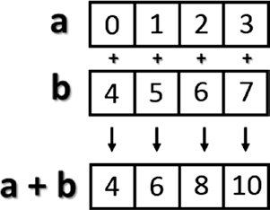

	
[*第三章: NumPy库*](./README.md)


# 3.4. 基本操作

到目前为止，您已经了解了如何创建一个新的NumPy数组以及如何在其中定义项。现在是时候看看如何对它们应用各种操作了。

## Arithmetic Operators
## 算术运算符

您将对数组执行的第一个操作是算术运算符。最明显的是用标量添加数组并将其乘以。
对数组执行的第一个操作是算术运算符。最明显的方法是将数组与标量相加和相乘。
```python
>>> a = np.arange(4)
>>> a
array([0, 1, 2, 3])

>>> a+4
array([4, 5, 6, 7])

>>> a*2
array([0, 2, 4, 6])
```

这些操作符也可以在两个数组之间使用。在NumPy中，这些操作是按元素进行的，也就是说，运算符仅在对应的元素之间应用。这些对象占据相同的位置，因此最终结果将是一个新数组，其中包含操作数相同位置的结果(参见图3-1)。
```python
>>> b = np.arange(4,8)
>>> b
array([4, 5, 6, 7])
>>> a + b
array([ 4,  6,  8, 10])
>>> a – b
array([–4, –4, –4, –4])
>>> a * b
array([ 0,  5, 12, 21])
```


>> 图3-1.元素级加法

此外，只要返回的值是NumPy数组，这些运算符也可用于函数。例如，可以将数组乘以数组b的元素的正弦或平方根。
```python
>>> a * np.sin(b)
array([–0.	, –0.95892427, –0.558831	,	1.9709598 ])
>>> a * np.sqrt(b)
array([ 0.	,	2.23606798,	4.89897949,	7.93725393])

```

接下来讨论多维的情况，即使在这里，算术运算符也继续按元素操作。
```python
>>> A = np.arange(0, 9).reshape(3, 3)
>>> A
array([[0, 1, 2],
       [3, 4, 5],
       [6, 7, 8]])
>>> B = np.ones((3, 3))
>>> B
array([[ 1.,  1.,  1.],
       [ 1.,  1.,  1.],
       [ 1.,  1.,  1.]])
>>> A * B
array([[ 0.,  1.,  2.],
       [ 3.,  4.,  5.],
       [ 6.,  7.,  8.]])
```


## 矩阵积

关于操作元素的选择， NumPy库有点特殊。在许多其他数据分析工具中，当将*运算符应用于两个矩阵时，它被理解为矩阵乘积。而使用NumPy，矩阵乘积由dot()函数表示。这个操作不是元素级的。
```python
>>> np.dot(A,B)
array([[  3.,   3.,   3.],
       [ 12.,  12.,  12.],
       [ 21.,  21.,  21.]])
```

在每个位置的结果是第一个矩阵对应行的每个元素与第二个矩阵对应列对应元素的乘积之和。图3-2说明了在矩阵乘积过程中执行的过程(运行两个元素)。


>> 图3-2.矩阵乘积的结果计算矩阵元素

写矩阵积的另一种方法是将dot()函数看作两个矩阵之一的对象函数。
```python
>>> A.dot(B)
array([[  3.,   3.,   3.],
       [ 12.,  12.,  12.],
       [ 21.,  21.,  21.]])
```

注意，由于矩阵乘积不是一个交换操作，操作数的顺序很重要。实际上，A * B不等于B * A。
```python
>>> np.dot(B,A)
array([[  9.,  12.,  15.],
       [  9.,  12.,  15.],
       [  9.,  12.,  15.]])

```


## 增减算子

--. To increase or decrease values, you have to use operators such as += and -=. These operators are not different from ones you saw earlier, except that instead of creating a new array with the results, they will reassign the results to the same array. 
实际上，Python中没有这样的操作符，因为没有称为++或--的操作符,要增加或减少值，您必须使用操作符，例如+=和-=。这些操作符与前面看到的操作符没有什么不同，只是它们不会使用结果创建一个新的数组，而是将结果重新分配给相同的数组。

```python
>>> a = np.arange(4)
>>> a
array([0, 1, 2, 3])
>>> a += 1
>>> a
array([1, 2, 3, 4])
>>> a -= 1
>>> a
array([0, 1, 2, 3])

```

因此，使用这些操作符比简单的增量操作符要广泛得多，这些操作符可以将值增加一个单位，并且可以在许多情况下应用。例如，每次在不生成新值的情况下更改数组中的值时。
```python
array([0, 1, 2, 3])
>>> a += 4
>>> a
array([4, 5, 6, 7])
>>> a *= 2
>>> a
array([ 8, 10, 12, 14])
```

## 通用函数(ufunc)

一个通用函数，通常称为ufunc，是一个按元素对数组进行操作的函数。这意味着它单独作用于输入数组的每个元素，以在新的输出数组中生成相应的结果。最后，您将获得与输入大小相同的数组。

有许多符合这个定义的数学和三角函数运算；例如，用sqrt()计算平方根，用log()计算对数，用sin()计算正弦。
```python
>>> a = np.arange(1, 5)
>>> a
array([1, 2, 3, 4])
>>> np.sqrt(a)
array([ 1.        ,  1.41421356,  1.73205081,  2.        ])
>>> np.log(a)
array([ 0.        ,  0.69314718,  1.09861229,  1.38629436])
>>> np.sin(a)
array([ 0.84147098,  0.90929743,  0.14112001, –0.7568025 ])

```

NumPy中已经实现了许多通用函数。


## 聚合函数

聚合函数对一组值(例如数组)执行操作，并生成单个结果。因此，数组中所有元素的和是一个聚合函数。ndarray类中实现了许多这类函数。
```python
>>> a = np.array([3.3, 4.5, 1.2, 5.7, 0.3])
>>> a.sum()
15.0
>>> a.min()
0.29999999999999999
>>> a.max()
5.7000000000000002
>>> a.mean()
3.0
>>> a.std()
2.0079840636817816
```

