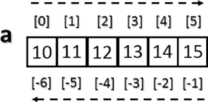
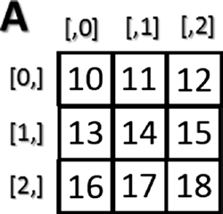

[*第三章:NumPy库*](./README.md)


# 3.5. 索引、切片和迭代

在前面的部分中，您了解了如何创建数组以及如何对数组执行操作。在本节中，您将看到如何操作这些对象。您将了解如何通过索引和切片来选择元素，以便获取它们中包含的值，或者进行赋值以更改它们的值。最后，您还将看到如何在其中进行迭代。


## 索引

数组索引总是使用方括号([])对数组的元素进行索引，这样就可以单独引用各种元素，例如提取值、选择项，甚至赋新值。

在创建新数组时，还会自动创建适当的比例索引(参见图3-3)。



>> 图3-3. 一维ndarray索引

为了访问数组的单个元素，可以引用它的索引。
```python
>>> a = np.arange(10, 16)
>>> a
array([10, 11, 12, 13, 14, 15])
>>> a[4]
14
```

NumPy数组也接受负索引。这些索引具有从0到-1、-2等相同的增量序列，但在实践中，它们会导致最终元素逐渐向初始元素移动，而初始元素将具有更向左索引。
```python
>>> a[-1]
15
>>> a[-6]
10
```

若要一次选择多个项，可以传递方括号中的索引数组。
```python
>>> a[[1, 3, 4]]
array([11, 13, 14])

```

接下来是二维情况，即矩阵，它们被表示为由行和列组成的矩形数组，由两个轴定义，其中轴0由行表示，轴1由列表示。因此，在这种情况下，索引由一对值表示：第一个值是行的索引，第二个是列的索引。因此，如果您想访问矩阵中的值或选择元素，您仍然将使用方括号，但这一次有两个值[row_index、column_index](参见图3-4)。


>> 图3-4.索引二维数组

```python
>>> A = np.arange(10, 19).reshape((3, 3))
>>> A
array([[10, 11, 12],
[13, 14, 15],
[16, 17, 18]])
```

If you want to remove the element of the third column in the second row, you have to insert the pair [1, 2].
如果你要移除第二行第三列的元素，你需要指定[1, 2]

```python
>>> A[1, 2]
15
```

## Slicing
## 切片

切片允许您提取数组的一部分以生成新的数组。当使用Python列表切片数组时，得到的数组是副本，但在NumPy中，数组是相同底层缓冲区的视图。

根据要提取(或视图)的数组部分，必须使用切片语法;也就是说，您将使用方括号内用冒号(:)分隔的数字序列。

如果要提取数组的一部分，例如从第二元素到第六元素的一部分，必须插入开始元素的索引，即1，最后元素的索引，即5，用':'分隔。
```python
>>> a = np.arange(10, 16)
>>> a
array([10, 11, 12, 13, 14, 15])
>>> a[1:5]
array([11, 12, 13, 14])
```

现在，如果您想从前面的部分提取一个项并跳过特定数量的项，然后提取下一个项并再次跳过，您可以使用第三个数字来定义元素序列中的间隙。例如，值为2时，数组将以交替方式接受元素。
```python
>>> a[1:5:2]
array([11, 13])
```

要更好地理解切片语法，还应该考虑不使用显式数值的情况。如果省略第一个数字，NumPy隐式地将这个数字解释为0(即，数组的初始元素)。如果省略第二个数字，这将被解释为数组的最大索引;如果你省略最后一个数字，它会被解释为1。所有的元素都将被考虑，没有间隔。

```python
>>> a[::2] array([10, 12, 14])
>>> a[:5:2] array([10, 12, 14])
>>> a[:5:]
array([10, 11, 12, 13, 14])
```

对于二维数组，切片语法仍然适用，但是它是为行和列分别定义的。例如，如果您只想提取第一行:
```python
>>> A = np.arange(10, 19).reshape((3, 3))
>>> A
array([[10, 11, 12],
[13, 14, 15],
[16, 17, 18]])
>>> A[0,:] array([10, 11, 12])
```

正如您在第二个索引中看到的，如果只留下冒号而不定义数字，那么您将选择所有列。相反，如果你想提取第一列的所有值，你必须写出列索引。
```python
>>> A[:,0]
 array([10, 13, 16])
```

相反，如果您想提取一个更小的矩阵，需要显式地用指定它们的索引定义所有的间隔。
```python
>>> A[0:2, 0:2]
array([[10, 11],
[13, 14]])
```

如果要提取的行或列的索引不是连续的，则可以指定索引数组。
```python
>>> A[[0,2], 0:2]
array([[10, 11],
[16, 17]])

```


## 遍历一个数组

在Python中，数组中项的迭代非常简单；只需使用for构造即可。
```python
>>> for i in a:
...	print(i)
... 10
11
12
13
14
15
```

当然，即使在这里，移动到二维情况下，您也可以考虑使用for结构应用两个嵌套循环的解决方案。第一个循环将扫描数组的行，第二个循环将扫描列。实际上，如果你对一个矩阵应用for循环，它总是会根据第一个轴进行扫描。
```python
>>> for row in A:
...	print(row)
...
[10 11 12]
[13 14 15]
[16 17 18]
```

如果您想要逐一个迭代元素，您可以使用下面的构造，使用A.flat上的for循环。
```python
>>> for item in A.flat:
...	print(item)
... 10
11
12
13
14
15
16
17
18
```

然而，尽管如此，NumPy提供了一个比for循环更好的替代解决方案。通常，您需要应用一个迭代来对行、列或单个项应用一个函数。如果您希望启动一个聚合函数，该函数返回为每一列或每一行计算的值，那么有一种最佳方法让NumPy管理迭代:apply_ along_axis()函数。

该函数有三个参数：聚合函数、应用迭代的轴和数组。如果选项轴等于0，则迭代将逐列计算元素，而如果轴等于1，则迭代将逐行计算元素。例如，可以先按列计算平均值，然后再按行计算平均值。
```python
>>> np.apply_along_axis(np.mean, axis=0, arr=A) 
array([ 13.,	14.,	15.])

>>> np.apply_along_axis(np.mean, axis=1, arr=A) 
array([ 11.,	14.,	17.])
```

在前一种情况下，您使用了NumPy库中已经定义的函数，但是没有什么可以阻止您定义自己的函数。您还使用了聚合函数。但是，没有什么可以禁止您使用ufunc。在这种情况下，按列和按行迭代会产生相同的结果。实际上，使用ufunc逐个元素执行一个迭代元素。
```python
>>> def foo(x):
...	return x/2
...
>>> np.apply_along_axis(foo, axis=1, arr=A) 
array([[5.,	5.5, 6. ],
        [6.5, 7.,	7.5],
        [8.,	8.5, 9. ]])
    
>>> np.apply_along_axis(foo, axis=0, arr=A) 
array([[5.,	5.5, 6.],
        [6.5, 7.,	7.5],
        [8.,	8.5, 9.]])

```

如您所见，ufunc函数将输入数组的每个元素的值减半，而不管迭代是按行执行还是按列执行。


