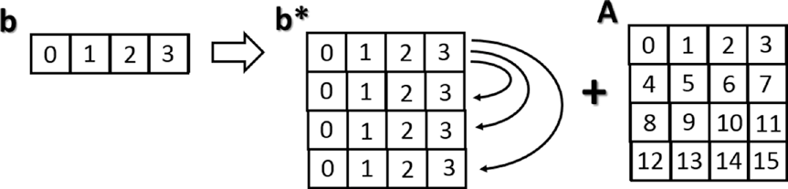

[*第三章:NumPy库*](./README.md)


# 3.9. 一般概念

本节描述NumPy库的一般概念。副本和视图之间的区别在于它们何时返回值。本节还讨论了在许多NumPy函数中隐式发生的广播机制。

您可能已经注意到了NumPy，尤其是在操作数组时，您可以返回数组的副本或视图。NumPy赋值不会生成数组的副本，也不会生成数组中包含的任何元素。

```python
>>> a = np.array([1, 2, 3, 4])
>>> b = a
>>> b
array([1, 2, 3, 4])
>>> a[2] = 0
>>> b
array([1, 2, 0, 4])
```

如果你将一个数组a赋给另一个数组b，你就不会复制它;数组b只是调用数组a的另一种方式，实际上，通过改变第三个元素的值，你也可以改变b的第三个值。在切片数组时，返回的对象是原始数组的视图。

```python
>>> c = a[0:2]
>>> c
array([1, 2])
>>> a[0] = 0
>>> c
array([0, 2])
```


## 对象的副本或视图

正如您所看到的，即使在切片时，您实际上是指向同一个对象。如果您想要生成一个完整而独特的数组，请使用copy()函数。

```python
>>> a = np.array([1, 2, 3, 4])
>>> c = a.copy()
>>> c
array([1, 2, 3, 4])
>>> a[0] = 0
>>> c
array([1, 2, 3, 4])
```

在这种情况下，即使更改数组a中的项，数组c也保持不变。


## 向量化

向量化和广播是NumPy内部实现的基础。向量化是在代码开发过程中没有显式的循环。这些循环实际上不能省略，但是在内部实现，然后被代码中的其他结构替换。向量化的应用导致了更简洁、更易读的代码，可以说，它更加`python化`。事实上，由于向量化，许多操作都采用了更数学化的表达方式。例如，NumPy允许您表示两个数组的乘法，如下所示:

```python
a * b
```

或者两个矩阵:

```python
A * B
```

在其他语言中，这样的操作将用许多嵌套循环和for构造来表示。例如，第一个操作将以下列方式表示：

```python

for (i = 0; i < rows; i++){
  c[i] = a[i]*b[i];
}
```

矩阵的乘积表示如下：

```python
for( i=0; i < rows; i++){
   for(j=0; j < columns; j++){
      c[i][j] = a[i][j]*b[i][j];
   }
}
```

可以看到，使用NumPy使代码更具可读性，也更具有数学性。

## 广播


广播允许操作员或函数对两个或多个数组进行操作，即使这些数组的形状不同。也就是说，并不是所有的维度都可以接受广播；它们必须符合某些规则。

您已经看到，使用NumPy，您可以通过一个表示每个维度元素长度的元组的形状对多维数组进行分类。

当两个阵列的所有尺寸都是相容的，即每个维的长度必须相等或其中一个必须等于1时，就可以进行广播。如果这两个条件都不满足，则会得到一个异常，说明这两个数组不兼容。

```python
>>> A = np.arange(16).reshape(4, 4)
>>> b = np.arange(4)
>>> A
array([[ 0,  1,  2,  3],
       [ 4,  5,  6,  7],
       [ 8,  9, 10, 11],
       [12, 13, 14, 15]])
>>> b
array([0, 1, 2, 3])
```

在本例中，您将获得两个数组:

```python
4 x 4
4
```

广播有两条规则。首先，必须向每个缺失的维度添加一个1。如果现在符合兼容性规则，则可以应用广播并移到第二条规则。例如：

```python
4 x 4
4 x 1
```
兼容性原则得到了满足。然后你可以转向广播的第二条规则。这条规则解释了如何扩展最小数组的大小，使其成为最大数组的大小，从而使用元素相关的函数或操作符。

第二个规则假定缺失的元素(大小、长度1)被扩展大小中包含的值的副本所填充(参见图3-5)。


>> 图3-5.应用第二广播规则

既然两个数组具有相同的维数，那么可以将其中的值相加。

```python
>>> A + b
array([[ 0,  2,  4,  6],
       [ 4,  6,  8, 10],
       [ 8, 10, 12, 14],
       [12, 14, 16, 18]])
```

这是一个简单的例子，其中一个数组比另一个数组小。在更复杂的情况下，这两个数组具有不同的形状，并且每个数组只在特定的维度上小于另一个数组。

```python
>>> m = np.arange(6).reshape(3, 1, 2)
>>> n = np.arange(6).reshape(3, 2, 1)
>>> m
array([[[0, 1]],
       [[2, 3]],
       [[4, 5]]])
>>> n
array([[[0],
        [1]],
       [[2],
        [3]],
       [[4],
        [5]]])
```

即使在这种情况下，通过分析这两个数组的形状，您可以看到它们是兼容的，因此可以应用广播规则。

```python
3 x 1 x 2
3 x 2 x 1
```
在这种情况下，两个数组都要进行维度扩展(广播)。

```python
m* = [[[0,1],             n* = [[[0,0],
       [0,1]],                   [1,1]],
      [[2,3],                   [[2,2],
       [2,3]],                   [3,3]],
      [[4,5],                   [[4,4],
       [4,5]]]                   [5,5]]]
```

然后可以应用诸如两个数组之间的加法之类的运算符操作元素。

```python
>>> m + n
array([[[ 0,  1],
        [ 1,  2]],
       [[ 4,  5],
        [ 5,  6]],
       [[ 8,  9],
        [ 9, 10]]])
```

