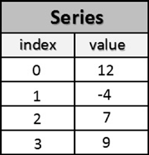
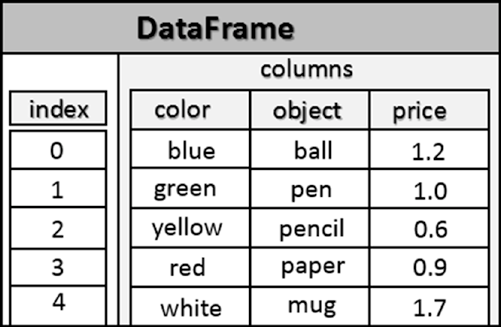

[*第四章：pandas库简介*](./README.md)

# 4.5. pandas数据结构简介


pandas的核心是两个主要数据结构，所有事务(通常在数据分析期间进行)都集中在这两个数据结构上:

* Series
* Dataframes

正如您将看到的，Series构成了设计用来容纳一维数据序列的数据结构，而dataframe，一个更复杂的数据结构，设计来包含具有多个维度的情形。

尽管这些数据结构并不是所有问题的通用解决方案，但它们确实为大多数应用程序提供了有效和健壮的工具。事实上，它们很容易理解和使用。此外，许多更复杂数据结构的情况仍然可以追溯到这两种简单的情况。

但是，它们的特性是基于索引对象和标签结构中的一个特殊特性—集成。您将看到，这个特性使这些数据结构易于操作。


## The Series

series是pandas库的对象，设计用于表示一维数据结构，类似于数组，但有一些附加特性。它的内部结构很简单(参见图4-1)，由两个相互关联的数组组成。主数组保存数据(任何NumPy类型的数据)，每个元素都与另一个名为索引的数组中的标签相关联。



>> 图4-1.series对象的结构

### 声明一个Series对象

要创建图4-1中指定的series，只需调用series()构造函数并作为参数传递一个数组，该数组中包含series对象要包含的值。

```python
>>> s = pd.Series([12,-4,7,9])
>>> s
0    12
1    -4
2     7
3     9
dtype: int64
```

从这个series的输出可以看到，左边是索引中的值，这是一series标签，右边是相应的值。

如果您在定义该series时没有指定任何索引，那么在默认情况下，panda将把从0开始递增的数值指定为标签。在本例中，标签对应于series对象中元素的索引(数组中的位置)。

然而，通常情况下，最好是使用有意义的标签创建一个series，以便区分和识别每个项目，而不管它们以何种顺序插入到series中。

在这种情况下，在构造函数调用期间，必须包含index选项并分配包含标签的字符串数组。

```python
>>> s = pd.Series([12,-4,7,9], index=['a','b','c','d'])
>>> s
a    12
b    -4
c     7
d     9
dtype: int64
```

如果希望单独看到构成此数据结构的两个数组，可以按如下方式调用该series的两个属性：index和value。

```python
>>> s.values
array([12, -4,  7,  9], dtype=int64)
>>> s.index
Index([u'a', u'b', u'c', u'd'], dtype='object')

```

### 选择内部元素

您可以选择单个元素作为普通的numpy数组，指定键。

```python
>>> s[2]
7
```

也可以指定与索引位置相对应的标签。

```python
>>> s['b']
-4
```

与在numpy数组中选择多个项的方式相同，您可以指定以下内容:

```python
>>> s[0:2]
a    12
b    -4
dtype: int64
```

在这种情况下，您可以使用相应的标签，但在数组中指定标签列表。

```python

>>> s[['b','c']]
b   -4
c    7
dtype: int64
```

### 为元素赋值

现在您已经了解了如何选择单个元素，也知道了如何为它们分配新值。实际上，您可以通过索引或标签选择值。

```python

>>> s[1] = 0
>>> s
a    12
b     0
c     7
d     9
dtype: int64

>>> s['b'] = 1
>>> s
a    12
b     1
c     7
d     9
dtype: int64

```

### 从NumPy数组和其他series中定义一个series

您可以使用NumPy数组或现有series定义一个新series。

```python
>>> arr = np.array([1,2,3,4])
>>> s3 = pd.Series(arr)
>>> s3
0    1
1    2
2    3
3    4
dtype: int64
>>> s4 = pd.Series(s)
>>> s4
a    12
b     4
c     7
d     9
dtype: int64
```
要始终记住，NumPy数组或原始series中包含的值不是复制的，而是通过引用传递的。也就是说，对象是在新series对象中动态插入的。如果它改变了，例如它的内部元素改变了值，那么这些改变也会出现在新的series对象中。

```python
>>> s3
0    1
1    2
2    3
3    4
dtype: int64

>>> arr[2] = -2
>>> s3
0    1
1    2
2   -2
3    4
dtype: int64
```

正如您在本例中看到的，通过更改arr数组的第三个元素，我们还修改了s3series中的相应元素。

### 过滤值

由于选择了NumPy库作为panda库的基础，因此，由于其数据结构，适用于NumPy数组的许多操作都扩展到了series。其中之一是通过条件过滤数据结构中包含的值。

例如，如果您需要知道series中的哪些元素大于8，您可以这样写:

```python

>>> s[s > 8]
a    12
d     9
dtype: int64
```

### 运算和数学函数

其他运算，如(+、-、*和/)和数学函数，适用于NumPy数组，可以扩展到series。

你可以简单地写出运算符的算术表达式。

```python

>>> s / 2
a    6.0
b   -2.0
c    3.5
d    4.5
dtype: float64
```

但是，对于NumPy数学函数，必须指定np引用的函数和作为参数传递的series实例。

```python

>>> np.log(s)
a    2.484907
b    0.000000
c    1.945910
d    2.197225
dtype: float64

```

### 求值

在一个series中经常有重复的值。然后，您可能需要有关于这些样本的更多信息，包括是否存在任何副本，以及series中是否存在某个值。

在这方面，您可以声明有许多重复值的series。

```python
>>> serd = pd.Series([1,0,2,1,2,3], index=['white','white','blue','green',' green','yellow'])
>>> serd
white     1
white     0
blue      2
green     1
green     2
yellow    3
dtype: int64
```

要知道series中包含的所有值(不包括重复值)，可以使用unique()函数。返回值是一个数组，其中包含series中的惟一值，尽管不一定是按顺序的。

```python

>>> serd.unique()
array([1, 0, 2, 3], dtype=int64)
```

与unique()类似的一个函数是value_counts()，它不仅返回唯一值，还计算series中出现的次数。

```python
>>> serd.value_counts()
2    2
1    2
3    1
0    1
dtype: int64
```

最后，isin()计算是否是其成员，即给定的值列表。这个函数告诉您数据结构中是否包含这些值。当在dataframe的series或列中过滤数据时，返回的布尔值非常有用。

```python

>>> serd.isin([0,3])
white     False
white      True
blue      False
green     False
green     False
yellow     True
dtype: bool
>>> serd[serd.isin([0,3])]
white     0
yellow    3
dtype: int64
```

### NaN值

正如您在前面的例子中看到的，我们尝试运行一个负数的对数，结果接收到NaN。在pandas数据结构中使用这个特定值NaN(不是一个数字)来表示空字段的存在或无法用数值定义的东西。

通常，这些NaN值是一个问题，必须以某种方式进行管理，特别是在数据分析期间。这些数据通常是在从有问题的源提取数据或源缺少数据时生成的。此外，正如您刚才看到的，NaN值也可以在特殊情况下生成，例如负数的对数计算，或者在执行某些计算或函数时出现异常。在后面的章节中，您将看到如何应用不同的策略来解决NaN值问题。

尽管存在问题，但是pandas允许您显式地定义NaNs并将它们添加到数据结构中，例如一个series。在包含值的数组中，输入np。无论你想在哪里定义缺失值。

```python

>>> s2 = pd.Series([5,-3,np.NaN,14])
>>> s2
0     5.0
1    -3.0
2   NaN
3    14.0
dtype: float64
```

isnull()和notnull()函数对于标识没有值的索引非常有用。

```python

>>> s2.isnull()
0    False
1    False
2     True
3    False
dtype: bool
>>> s2.notnull()
0     True
1     True
2    False
3     True
dtype: bool
```

实际上，这些函数返回两个具有布尔值的series，这些布尔值包含真值和假值，这取决于项是NaN值还是更少。isnull()函数在级数的NaN值处返回True;相反，如果notnull()函数不是NaN，则返回True。这些函数通常被放置在过滤器中以形成条件。

```python

>>> s2[s2.notnull()]
0     5.0
1    -3.0
3    14.0
dtype: float64

>>> s2[s2.isnull()]
2   NaN
dtype: float64
```

### series作为词典

另一种考虑series的方法是把它看作一个对象字典(dictionary)。在series对象的定义中也利用了这种相似性。实际上，您可以从前面定义的dict创建一个series。

```python

>>> mydict = {'red': 2000, 'blue': 1000, 'yellow': 500,
'orange': 1000}
>>> myseries = pd.Series(mydict)
>>> myseries
red       2000
blue      1000
yellow     500
orange    1000
dtype: int64
```

从这个示例中可以看到，索引数组中填充了键，而数据中填充了相应的值。还可以单独定义数组索引。在这种情况下，将运行dict键与索引标签数组之间的对应控制。如果不匹配，pandas会增加NaN值。

```python

>>> colors = ['red','yellow','orange','blue','green']
>>> myseries = pd.Series(mydict, index=colors)
>>> myseries
red       2000.0
yellow     500.0
orange    1000.0
blue      1000.0
green      NaN
dtype: float64

```
### series之间的操作

我们已经了解了如何在series和标量值之间执行算术运算。通过在两个series之间执行操作也可以实现相同的功能，但在这种情况下，甚至标签也会起作用。

事实上，这类数据结构的最大潜力之一是，series可以通过识别对应的标签，在它们之间以不同的方式处理数据。在下面的示例中，您将添加两个series，其中只有一些元素与标签相同。

```python
>>> mydict2 = {'red':400,'yellow':1000,'black':700}
>>> myseries2 = pd.Series(mydict2)
>>> myseries + myseries2
black      NaN
blue       NaN
green      NaN
orange     NaN
red       2400.0
yellow    1500.0
dtype: float64
```

您将得到一个新的对象series，其中只添加了具有相同标签的项。两个series中出现的所有其他标签仍然添加到结果中，但具有NaN值。


## DataFrame

dataframe是一个表格数据结构，非常类似于电子表格。该数据结构的设计是为了将序列扩展到多个维度。实际上，dataframe包含有序的列集合(参见图4-2)，每个列都可以包含不同类型的值(数值、字符串、布尔值等)。



>>图4-2.dataframe数据结构

不像series, series有一个包含与每个元素相关联的标签的索引数组，dataframe有两个索引数组。第一个与行相关联的索引数组具有与series索引数组非常相似的功能。实际上，每个标签都与行中的所有值相关联。第二个数组包含一series标签，每个标签都与特定列相关联。

dataframe也可以理解为series的dict，其中键是列名，值是将构成dataframe的列的series。此外，每个series中的所有元素都根据称为索引的标签数组进行映射。

### 定义一个Dataframe
 
创建新dataframe的最常见方法就是将dict对象传递给Dataframe()构造函数。这个dict对象包含要定义的每个列的键，以及每个列的值数组。

```python

>>> data = {'color' : ['blue','green','yellow','red','white'],
            'object' : ['ball','pen','pencil','paper','mug'],
            'price' : [1.2,1.0,0.6,0.9,1.7]}

>>> frame = pd.DataFrame(data)
>>> frame
    color  object price
0    blue    ball   1.2
1   green    pen   1.0
2  yellow  pencil   0.6
3     red   paper   0.9
4   white    mug   1.7
```

如果要创建dataframe的dict对象包含的数据多于感兴趣的数据，则可以进行选择。在dataframe的构造函数中，可以使用columns选项指定列series。列将按照顺序创建，而不管它们如何包含在dict对象中。

```python

>>> frame2 = pd.DataFrame(data, columns=['object','price'])
>>> frame2
   object price
0    ball   1.2
1     pen   1.0
2  pencil   0.6
3   paper   0.9
4     mug   1.7
```

即使对于dataframe对象，如果索引数组中没有显式指定标签，panda也会自动地从0开始分配一个数字序列。相反，如果要将标签分配给dataframe的索引，则必须使用index选项，并为其分配一个包含标签的数组。

```python

>>> frame2 = pd.DataFrame(data, index=['one','two','three','four','five'])
>>> frame2
        color  object  price
one      blue    ball    1.2
two     green     pen    1.0
three  yellow  pencil    0.6
four      red   paper    0.9
five    white     mug    1.7
```

现在我们已经介绍了两个新选项，分别是index和columns，很容易想象出一种定义dataframe的替代方法。与使用dict对象不同，您可以在构造函数中定义三个参数，按照以下顺序 —数据矩阵、包含分配给index选项的标签的数组和包含分配给columns选项的列名称的数组。

在许多示例中，正如您将在本书中看到的，要快速轻松地创建一个值矩阵，您可以使用np.arange(16). shaped(4,4))，它将生成一个从0到15的4x4数字矩阵。

```python

>>> frame3 = pd.DataFrame(np.arange(16).reshape((4,4)),
...                   index=['red','blue','yellow','white'],
...                   columns=['ball','pen','pencil','paper'])
>>> frame3
        ball  pen  pencil  paper
red        0    1    
2     3
blue       4    5       6     7
yellow     8    9      10     11
white     12   13      14     15

```
### 选择元素

如果想知道dataframe的所有列的名称，可以在dataframe对象实例上指定columns属性。

```python
>>> frame.columns
Index(['colors', 'object', 'price'], dtype='object')
```

类似地，要获得索引列表，您应该指定index属性。

```python
>>> frame.index
RangeIndex(start=0, stop=5, step=1)
```

您还可以使用values属性获得数据结构中包含的整个数据集。

```python
>>> frame.values
array([['blue', 'ball', 1.2],
       ['green', 'pen', 1.0],
       ['yellow', 'pencil', 0.6],
       ['red', 'paper', 0.9],
       ['white', 'mug', 1.7]], dtype=object)

```

或者，如果您只对选择列的内容感兴趣，您可以编写列的名称。

```python

>>> frame['price']
0    1.2
1    1.0
2    0.6
3    0.9
4    1.7
Name: price, dtype: float64
```

如您所见，返回值是一个series对象。另一种方法是使用列名作为dataframe实例的属性。

```python

>>> frame.price
0    1.2
1    1.0
2    0.6
3    0.9
4    1.7
Name: price, dtype: float64
```

对于dataframe中的行，可以使用loc属性和要提取的行的索引值。

```python

>>> frame.loc[2]
color     yellow
object    pencil
price        0.6
Name: 2, dtype: object
```
返回的对象又是一个列的名称成为数组索引的标签，值成为series的数据的序列。

To select multiple rows, you specify an array with the sequence of rows to insert:
要选择多个行，您需要指定一个数组，其中包含要插入的行序列:

```python

>>> frame.loc[[2,4]]
    color  object  price
2  yellow  pencil    0.6
4   white    mug    1.7
```

如果需要提取DataFrame的一部分，选择要提取的行，可以使用索引的引用号。实际上，您可以将一行看作是dataframe的一部分，dataframe的索引作为源(在下一个0中)，上面的行作为第二个值(下一个0中)。

```python

>>> frame[0:1]
  color object  price
0  blue   ball    1.2
```

如您所见，返回值是一个包含单个行的对象dataframe。如果需要多行，则必须扩展选择范围。

```python

>>> frame[1:3]
    color  object  price
1   green    pen    1.0
2  yellow  pencil    0.6
```

最后，如果您希望在dataframe中获得单个值，那么首先使用列的名称，然后使用索引或行的标签。

```python

>>> frame['object'][3]
'paper'
```
### 赋值

一旦了解了如何访问构成dataframe的各种元素，就可以按照相同的逻辑添加或更改其中的值。

例如，您已经看到在dataframe结构中，索引属性指定了索引数组，包含列名称的行使用columns属性指定。您还可以使用name属性为这两个子结构分配一个标签来标识它们。

```python
>>> frame.index.name = 'id'
>>> frame.columns.name = 'item'
>>> frame
item   color  object  price
id
0       blue    ball    1.2
1      green     pen    1.0
2     yellow  pencil    0.6
3        red   paper    0.9
4      white     mug    1.7
```

pandas数据结构的最佳特征之一是其高度的灵活性。事实上，您总是可以在任何级别进行干预，以更改内部数据结构。例如，一个非常常见的操作是添加一个新列。

您可以通过简单地为dataframe的实例分配一个值并指定一个新的列名来实现这一点。

```python
>>> frame['new'] = 12
>>> frame
   colors  object price  new
0    blue    ball   1.2   12
1   green    pen   1.0   12
2  yellow  pencil   0.6   12
3     red   paper   0.9   12
4   white    mug   1.7   12
```

从这个结果中可以看到，有一个名为new的新列，其每个元素的值都在12中复制。

但是，如果要更新列的内容，则必须使用数组。

```python

>>> frame['new'] = [3.0,1.3,2.2,0.8,1.1]
>>> frame
    color  object  price  new
0    blue    ball    1.2  3.0
1   green     pen    1.0  1.3
2  yellow  pencil    0.6  2.2
3     red   paper    0.9  0.8
4   white     mug    1.7  1.1
```

如果您想要更新整个列，可以使用类似的方法，例如，使用np.arange()函数来使用预定序列更新列的值。

dataframe的列也可以通过将一个series分配给其中一个来创建，例如通过使用np.arange()指定一个包含不断增加的值的series。

```python

>>> ser = pd.Series(np.arange(5))
>>> ser
0    0
1    1
2    2
3    3
4    4
dtype: int64
>>> frame['new'] = ser
>>> frame
    color  object  price  new
0    blue    ball    1.2    0
1   green    pen    1.0    1
2  yellow  pencil    0.6    2
3     red   paper    0.9    3
4   white    mug    1.7    4
```

最后，要更改单个值，只需选择项并给它赋新值。

```python
>>> frame['price'][2] = 3.3
```
### 值的隶属关系

您已经看到了将isin()函数应用到该series以确定一组值的隶属关系。这个特性也适用于dataframe对象。

```python

>>> frame.isin([1.0,'pen'])
   color object  price  new
0  False  False  False  False
1  False   True   True  True
2  False  False  False  False
3  False  False  False  False
4  False  False  False  False
```

您将得到一个包含布尔值的dataframe，其中True表示符合成员资格的值。如果您将返回的值作为条件传递，那么将得到一个新的dataframe，其中只包含满足条件的值。

```python

>>> frame[frame.isin([1.0,'pen'])]
  color object  price  new
0   NaN    NaN    NaN  NaN
1   NaN    pen    1.0  1.0
2   NaN    NaN    NaN  NaN
3   NaN    NaN    NaN  NaN
4   NaN    NaN    NaN  NaN
```

### 删除列

如果要删除整个列及其所有内容，请使用del命令。

```python

>>> del frame['new']
>>> frame
   colors  object price
0    blue    ball   1.2
1   green    pen   1.0
2  yellow  pencil   3.3
3     red   paper   0.9
4   white    mug   1.7
```

### 过滤

即使是dataframe，您也可以通过某些条件的应用应用过滤。例如，假设您希望所有值都小于某个数字，例如1.2。

```python
>>> frame[frame < 1.2]
>>> frame
   colors  object price
0    blue    ball   NaN
1   green    pen   1.0
2  yellow  pencil   NaN
3     red   paper   0.9
4   white    mug   NaN
```

您将得到一个值小于1.2的dataframe，保持其原始位置。其他的都将被NaN替换。
 
### 嵌套字典中的DataFrame

Python中使用的一种非常常见的数据结构是嵌套的dict，如下所示:

```python

nestdict = { 'red': { 2012: 22, 2013: 33 },
                     'white': { 2011: 13, 2012: 22, 2013: 16},
                     'blue': {2011: 17, 2012: 27, 2013: 18}}
```

当该数据结构作为参数直接传递给DataFrame()构造函数时，panda将把外键解释为列名，把内部键解释为索引的标签。

在解释嵌套结构时，可能不是所有字段都能找到成功的匹配。通过向缺失的值添加NaN值，pandas弥补了这种不一致。

```python

>>> nestdict = {'red':{2012: 22, 2013: 33},
...             'white':{2011: 13, 2012: 22, 2013: 16},
...             'blue': {2011: 17, 2012: 27, 2013: 18}}
>>> frame2 = pd.DataFrame(nestdict)
>>> frame2
      blue    red  white
2011    17    NaN     13
2012    27   22.0     22
2013    18   33.0     16
```


### Dataframe的转置

在处理表格数据结构时，您可能需要进行移位操作(即，列变成行，行变成列)。pandas能让你以一种非常简单的方式做到这一点。通过向其应用程序添加T属性，您可以得到dataframe的转置。

```python

>>> frame2.T
       2011  2012  2013
blue   17.0  27.0  18.0
red     NaN  22.0  33.0
white  13.0  22.0  16.0
```

## 索引对象

现在您已经知道了series和dataframe是什么，以及它们是如何构造的，您可能已经了解了这些数据结构的特性。实际上，它们的大多数优秀特性都是因为在这些数据结构中集成了索引对象。

索引对象负责轴上的标签和作为轴名的其他元数据。您已经看到了如何将包含标签的数组转换为索引对象，并且需要在构造函数中指定索引选项。

```python

>>> ser = pd.Series([5,0,3,8,4], index=['red','blue','yellow','white','green'])
>>> ser.index
Index(['red', 'blue', 'yellow', 'white', 'green'], dtype='object')
```

与panda数据结构中的所有其他元素(series和dataframe)不同，索引对象是不可变的。一旦声明，它们就无法更改。这确保了它们在各种数据结构之间的安全共享。

当您需要知道索引对象包含的值时，每个索引对象都有一些有用的方法和属性。

### 索引方法

对于索引，有一些特定的方法可以从数据结构中获取关于索引的信息。例如，idmin()和idmax()是两个函数，它们分别返回值最低的索引和值最高的索引。

```python

>>> ser.idxmin()
'blue'
>>> ser.idxmax()
'white'
```

### 带有重复标签的索引

到目前为止，您已经遇到了在单个数据结构中的索引具有唯一标签的所有情况。虽然很多函数都需要这个条件来运行，但是这个条件在pandas的数据结构上并不是强制性的。

举例来说，定义一个带有重复标签的series。

```python

>>> serd = pd.Series(range(6), index=['white','white','blue','green',
'green','yellow'])
>>> serd
white     0
white     1
blue      2
green     3
green     4
yellow    5
dtype: int64
```

关于数据结构中元素的选择，如果同一标签对应的值更多，您将得到一个series来代替单个元素。

```python

>>> serd['white']
white    0
white    1
dtype: int64
```


同样的逻辑也适用于dataframe，使用返回dataframe的重复索引。

对于小的数据结构，很容易识别任何重复的索引，但是如果结构逐渐变大，这就开始变得困难。在这方面，panda为您提供了属于索引对象的is_unique属性。这个属性将告诉您结构数据中是否有带有重复标签的索引(series和dataframe)。

```python

>>> serd.index.is_unique
False
>>> frame.index.is_unique
True
```

