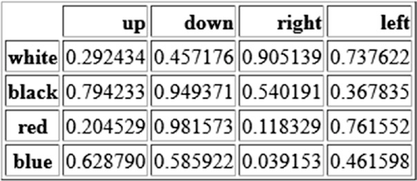

[*第五章：pandas：读写数据*](./README.md)


# 5.4. 读写HTML文件

pandasHTML格式提供了对应的一对I/O API函数。

* read_html()
* to_html()

这两个函数非常有用。您将欣赏将诸如dataframes之类的复杂数据结构直接转换为HTML表的能力，而不必在HTML中编写冗长的清单，尤其是在处理Web时。

逆向操作非常有用，因为现在数据的主要来源只是web世界。实际上，Internet上的许多数据并不总是具有打包在TXT或CSV文件中的随时可用格式。然而，数据通常作为web页面文本的一部分。所以有一个可用的读取函数也是非常有用的。

这种活动非常广泛，目前被称为web抓取。这个过程正在成为数据分析的第一部分:数据挖掘和数据准备中集成的一组过程的基本部分。

> 注意，许多网站已经采用了HTML5格式，以避免任何模块丢失和错误消息的问题。我强烈建议您安装模块html5lib。Anaconda指定:conda安装html5lib


## 将数据写入HTML

现在您知道了如何将dataframe转换为HTML表。dataframe的内部结构被自动转换为嵌套标记<th>, <tr>, <td>同时保持内部层次。使用这种函数不需要熟悉HTML。

因为作为dataframe的数据结构可能非常复杂和庞大，所以在需要开发web页面时，有这样的函数非常好。为了更好地理解这种潜能，这里有一个例子。您可以从定义一个简单的dataframe开始。

感谢to_html()函数，您可以直接将dataframe转换为HTML表。

```python
>>> frame = pd.DataFrame(np.arange(4).reshape(2,2))
```

由于I/O API函数是在pandas据结构中定义的，因此您可以直接在dataframe实例上调用to_html()函数。

```python
>>> print(frame.to_html())
<table border="1" class="dataframe">
  <thead>
    <tr style="text-align: right;">
      <th></th>
      <th>0</th>
      <th>1</th>
    </tr>
  </thead>
  <tbody>
   <tr>
      <th>0</th>
      <td> 0</td>
      <td> 1</td>
    </tr>
    <tr>
      <th>1</th>
      <td> 2</td>
      <td> 3</td>
    </tr>
  </tbody>
</table>
```

如您所见，为了保持dataframe的内部结构，正确生成了创建HTML表所需的HTML标记所形成的整个结构。

在下一个示例中，您将看到如何在HTML文件中自动生成表。在这方面，我们创建的dataframe比前一个要复杂一些，其中有索引和列名的标签。

```python
>>> frame = pd.DataFrame( np.random.random((4,4)),
...                    index = ['white','black','red','blue'],
...                    columns = ['up','down','right','left'])
>>> frame
             up      down     right      left
white  0.292434  0.457176  0.905139  0.737622
black  0.794233  0.949371  0.540191  0.367835
red    0.204529  0.981573  0.118329  0.761552
blue   0.628790  0.585922  0.039153  0.461598
```

现在您的重点是通过生成字符串来编写HTML页面。这是一个简单的小示例，但是在web浏览器上直接理解和测试pandas的功能是非常有用的。

首先，我们创建一个包含HTML页面代码的字符串。

```python
>>> s = ['<HTML>']
>>> s.append('<HEAD><TITLE>My DataFrame</TITLE></HEAD>')
>>> s.append('<BODY>')
>>> s.append(frame.to_html())
>>> s.append('</BODY></HTML>')
>>> html = ".join(s)
```

既然HTML页面的所有列表都包含在HTML变量中，那么您可以直接在名为myFrame.html的文件上进行编写:

```python
>>> html_file = open('myFrame.html','w')
>>> html_file.write(html)
>>> html_file.close()
```

现在，在您的工作目录中将有一个新的HTML文件，myFrame.html。双击它直接从浏览器打开它。左上角将出现一个HTML表，如图5-1所示。



>> 图5-1.数据文件显示为网页中的HTML表。


## 从HTML文件中读取数据

正如您刚才看到的，pandas以很容易地从dataframe开始生成HTML表。相反的过程也是可能的;函数read_html()将对查找HTML表的HTML页面执行解析。如果找到，它将把该表转换为对象dataframe，以便在数据分析中使用。

更准确地说，read_html()函数返回一个dataframes列表，即使只有一个表。将被解析的源可以是不同的类型。例如，您可能必须在任何目录中读取HTML文件。例如，您可以解析您在上一个示例中创建的HTML文件:

```python
>>> web_frames = pd.read_html('myFrame.html')
>>> web_frames[0]
  Unnamed: 0        up      down     right      left
0      white  0.292434  0.457176  0.905139  0.737622
1      black  0.794233  0.949371  0.540191  0.367835
2        red  0.204529  0.981573  0.118329  0.761552
3       blue  0.628790  0.585922  0.039153  0.461598
```

如您所见，所有与HTML表无关的标记都不被考虑在内。此外，web_frames是dataframe的列表，尽管在此示例中，提取的dataframe只有一个。但是，您可以选择要使用的列表中的项，以经典的方式调用它。在本例中，项是唯一的，因此索引将为0。

然而，有关read_html()函数最常用的模式是直接解析Web上的URL。这样，网络中的web页面就可以通过提取其中的表来直接解析。

例如，现在您将调用一个web页面，其中有一个HTML表，其中显示一个带有一些名字和成绩的排名列表。

```python
>>> ranking = pd.read_html('https://www.meccanismocomplesso.org/en/
meccanismo-complesso-sito-2/classifica-punteggio/')
>>> ranking[0]
    Member        points  levels  Unnamed: 3
0        1   BrunoOrsini    1075         NaN
1        2     Berserker     700         NaN
2        3  albertosallu     275         NaN
3        4         Mr.Y     180         NaN
4        5        
Jon     170         NaN
5        6  michele sisi     120         NaN
6        7  STEFANO GUST     120         NaN
7        8  Davide Alois     105         NaN
8        9  Cecilia Lala     105         NaN
...
```

相同的操作可以在具有一个或多个表的任何web页面上运行。


