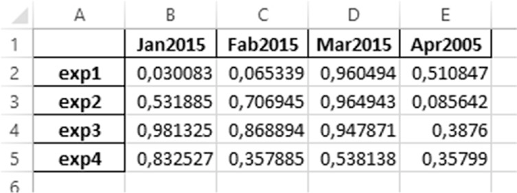

[*第五章：pandas：读写数据*](./README.md)


# 5.6. 读写MicrosoftExcel文件中的数据

在上一节中，您看到了如何从CSV文件轻松读取数据。然而，在Excel电子表格中以表格形式收集数据并不少见。

pandas为这种格式提供了特定的功能。您已经看到，I/O API为此提供了两个功能:

• to_excel()
• read_excel()

由于内部模块xlrd的集成, read_excel()函数可以读取Excel 2003(.xls)文件和Excel 2007(.xlsx)文件。

首先，打开一个Excel文件，输入如图5-2所示的数据。将数据复制到sheet1和sheet2中。然后将其保存为ch05_data.xlsx。


>> 图5-2.Excel文件的Sheet 1和Sheet 2中的两个数据集

要读取XLS文件中包含的数据并将其转换为dataframe，只需使用read_excel()函数。

```python
>>> pd.read_excel('ch05_data.xlsx')
   white  red  green  black
a     12   23     17     18
b     22   16     19     18
c     14   23     22     21
```

如您所见，默认情况下，返回的dataframe由第一个电子表格中列出的数据组成。但是，如果需要在第二个电子表格中加载数据，则必须指定表的名称或表(索引)的数量，就像第二个参数一样。

```python
>>> pd.read_excel('ch05_data.xlsx','Sheet2')
   yellow  purple  blue  orange
A      11      16    44      22
B      20      22    23      44
C      30      31    37      32
>>> pd.read_excel('ch05_data.xlsx',1)
   yellow  purple  blue  orange
A      11      16    44      22
B      20      22    23      44
C      30      31    37      32
```

写入也是如此。要将dataframe转换为Excel上的电子表格，必须编写以下代码。
```python
>>> frame = pd.DataFrame(np.random.random((4,4)),
...                      index = ['exp1','exp2','exp3','exp4'],
...                      columns = ['Jan2015','Fab2015','Mar2015','Apr2005'])
>>> frame
       Jan2015   Fab2015   Mar2015   Apr2005
exp1  0.030083  0.065339  0.960494  0.510847
exp2  0.531885  0.706945  0.964943  0.085642
exp3  0.981325  0.868894  0.947871  0.387600
exp4  0.832527  0.357885  0.538138  0.357990
>>> frame.to_excel('data2.xlsx')
```
在工作目录中，您将发现一个包含数据的新Excel文件，如图5-3所示。


>> 图5-3.Excel文件中的数据

