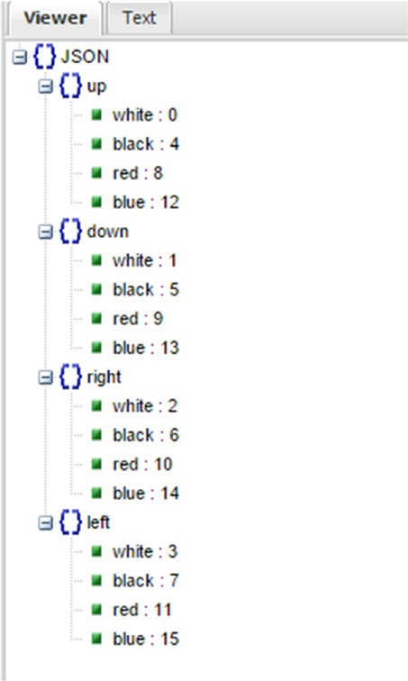

[*第五章：pandas：读写数据*](./README.md)


# 5.7. JSON数据

JSON(JavaScript对象表示法)已成为最常见的标准格式之一，尤其是用于在Web上传输数据。因此，如果您想在Web上使用数据，可以使用这种格式。

这种格式的特点是它具有很大的灵活性，尽管它的结构与你所熟悉的诸如表格之类大为不同。

在本节中，您将看到如何使用read_json()和to_json()函数来保持在本章讨论的I/O API函数中。但在第二部分中，您将看到另一个示例，其中您将处理JSON格式的结构化数据，这种格式更贴近实际情况。

在我看来，检查JSON格式的一个有用的在线应用程序是JSONViewer，可以在http://jsonviewer.stack.hu/上找到。一旦您以JSON格式输入或复制数据，这个web应用程序就允许您查看您输入的格式是否有效。此外，它还显示了树结构，以便您更好地理解它的结构(参见图5-4)。



>> 图5-4.JSONViewe

让我们从更有用的情况开始，即，当您有一个dataframe并且需要将其转换为JSON文件时。因此，定义一个dataframe，然后调用它的to_json()函数，作为参数传递您想要创建的文件的名称。

```python
>>> frame = pd.DataFrame(np.arange(16).reshape(4,4),
...                      index=['white','black','red','blue'],
...                      columns=['up','down','right','left'])
>>> frame.to_json('frame.json')
```
在工作目录中，您将发现一个新的JSON文件(参见清单5-12)，其中包含转换为JSON格式的dataframe数据。
```text
{"up":{"white":0,"black":4,"red":8,"blue":12},"down":{"white":1,"black":5,
"red":9,"blue":13},"right":{"white":2,"black":6,"red":10,"blue":14},
"left":{"white":3,"black":7,"red":11,"blue":15}}
```
>> 清单5-12。Fra.json

可以使用read_json()，并将文件的名称作为参数传递。可以进行反向操作。

```python
>>> pd.read_json('frame.json')
       down  left  right  up
black     5     7      6   4
blue     13    15     14  12
red       9    11     10   8
white     1     3      2   0
```

您看到的示例是一个相当简单的例子，其中JSON数据是表格形式的(因为文件frame.json来自dataframe)。但是，通常JSON文件没有表格结构。因此，您需要以某种方式将结构词典文件转换为表格形式。这个过程称为规范化。

库panda提供了一个名为json_normalize()的函数，它能够转换表中的dict或列表。首先，您必须导入函数:

```python
>>> from pandas.io.json import json_normalize
```

然后用任何文本编辑器编写JSON文件，如清单5-13所示。将其保存在工作目录中，命名为books.json。

```text
[{"writer": "Mark Ross",
"nationality": "USA",
"books": [
         {"title": "XML Cookbook", "price": 23.56},
         {"title": "Python Fundamentals", "price": 50.70},
         {"title": "The NumPy library", "price": 12.30}
             ]
},
{"writer": "Barbara Bracket",
"nationality": "UK",
"books": [
         {"title": "Java Enterprise", "price": 28.60},
         {"title": "HTML5", "price": 31.35},
         {"title": "Python for Dummies", "price": 28.00}
             ]
}]

```
>> 清单5-13。books.json

如您所见，文件结构不再是表格式的，而是更加复杂。然后，使用read_json()函数的方法不再有效。从这个示例中可以了解到，您仍然可以从这个结构中获得表格形式的数据。首先，必须加载JSON文件的内容并将其转换为字符串。

```python
>>> import json
>>> file = open('books.json','r')
>>> text = file.read()
text = json.loads(text)
```

现在可以应用json_normalize()函数了。例如，通过快速查看JSON文件中的数据内容，您可能希望提取包含所有图书的表。然后写书键作为第二个参数。

```python
>>> json_normalize(text,'books')
   price                title
0  23.56         XML Cookbook
1  50.70  Python Fundamentals
2  12.30    The NumPy library
3  28.60      Java Enterprise
4  31.35                HTML5
5  28.00   Python for Dummies
```

函数将读取以书籍为键的所有元素的内容。所有属性都将转换为嵌套的列名，而相应的值将填充dataframe。对于索引，函数将分配一系列递增的数字。

然而，您得到的dataframe仅包含一些内部信息。在同一级别上添加其他键的值是很有用的。在本例中，您可以通过插入键列表作为函数的第三个参数来添加其他列。

```python
>>> json_normalize(text,'books',['nationality','writer'])
   price                title nationality           writer
0  23.56         XML Cookbook         USA        Mark Ross
1  50.70  Python Fundamentals         USA        Mark Ross
2  12.30    The NumPy library         USA        Mark Ross
3  28.60      Java Enterprise          UK  Barbara Bracket
4  31.35                HTML5          UK  Barbara Bracket
5  28.00   Python for Dummies          UK  Barbara Bracket
```

现在，您可以从开始的树结构中得到一个dataframe。


