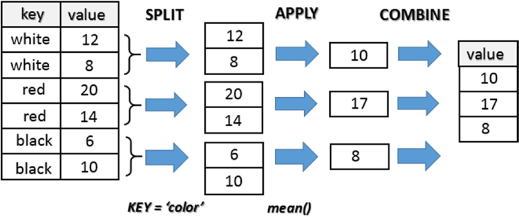

# 第六章：深入pandas：数据处理


# 6.7. 数据聚合

数据操作的最后一个阶段是数据聚合。数据聚合涉及到从数组中生成单个整数的转换。实际上，您已经进行了许多数据聚合操作，例如计算sum()、mean()和count()。实际上，这些函数对一组数据进行操作，并使用由单个值组成的一致结果执行计算。但是，在数据聚合中，一种更正式、更具有控制能力的方式是对集合进行分类。

对一组用于分组的数据进行分类往往是数据分析过程中的一个关键阶段。这是一个转换过程，因为在将数据划分成不同的组之后，您将应用一个函数，根据它们所属的组以某种方式转换或转换数据。通常，一个函数的分组和应用两个阶段是在一个步骤中执行的。

对于数据分析的这一部分，pandas供了一个非常灵活和高性能的工具:GroupBy。

同样，与JOIN一样，熟悉关系数据库和SQL语言的人可以找到相似之处。然而，当应用于组上的操作时，SQL等语言是非常有限的。事实上，考虑到像Python这样的编程语言的灵活性，所有可用的库，特别是pandas，您可以对组执行非常复杂的操作。


## 分组函数GroupBy

现在，您将详细分析GroupBy的过程以及它是如何工作的。一般说来，它指的是它的内部机制，称为分割-应用-组合过程.在其操作模式中，您可以将此过程分为三个阶段，由三个操作表示：

* 分割--划分成数据集组
* 应用--在每个组上应用一个函数
* 组合--将不同组所得到的结果进行组合


分析三个不同的阶段(见图6-1)。在第一个阶段，即分割阶段，数据结构中包含的数据，例如一个series或一个dataframe，根据给定的条件被分成几个组，这些组通常与索引或列中的某些值相链接。在SQL术语中，本列中包含的值被称为键。此外，如果您使用的是二维对象(如dataframe)，则可以将分组标准应用于该列(axis = 1)的直线(axis = 0)。



>> 图6-1. split-apply-combine机制

第二阶段，应用阶段，包括应用一个函数，或者更准确地用一个函数表示的计算，它会产生一个新的单一的值，这个值是特定于这个组的。

最后一个阶段，即组合阶段，将收集每组的所有结果，并将它们组合成一个新的对象。


## 一个实例

您刚才已经看到，pandas的数据聚合过程被分为不同的阶段，称为分应用-组合。对于这些pandas，不会像您期望的那样用函数显式地表示，而是通过生成groupby对象的groupby()函数表示，这是整个过程的核心。

为了更好地理解这种机制，让我们切换到一个实际的例子。首先定义一个包含数字和字符串值的dataframe。

```python
>>> frame = pd.DataFrame({ 'color': ['white','red','green','red','green'],
...                     'object': ['pen','pencil','pencil','ashtray','pen'],
...                     'price1' : [5.56,4.20,1.30,0.56,2.75],
...                     'price2' : [4.75,4.12,1.60,0.75,3.15]})
>>> frame
   color   object  price1  price2
0  white      pen    5.56    4.75
1    red   pencil    4.20    4.12
2  green   pencil    1.30    1.60
3    red  ashtray    0.56    0.75
4  green      pen    2.75    3.15
```

假设您想使用颜色列中列出的组标签计算price1列的平均值。有几种方法可以做到这一点。例如，您可以访问price1列并使用color列调用groupby()函数。

```python
>>> group = frame['price1'].groupby(frame['color'])
>>> group
<pandas.core.groupby.SeriesGroupBy object at 0x00000000098A2A20>
```
我们得到的对象是GroupBy对象。在你刚刚做的操作中，没有任何计算;这里只收集了计算平均值所需的所有信息。所做的是分组，其中所有具有相同颜色值的行被分组到单个项中。

要详细分析dataframe如何划分行组，需要调用属性groups的GroupBy对象。

```python
>>> group.groups
{'green': Int64Index([2, 4], dtype='int64'),
'red': Int64Index([1, 3], dtype='int64'),
'white': Int64Index([0], dtype='int64')}
```

如您所见，列出了每个组，并显式地指定了分配给每个组的dataframe的行。现在，在组上应用操作就足以获得每个单独组的结果。

```python
>>> group.mean()
color
green    2.025
red      2.380
white    5.560
Name: price1, dtype: float64
>>> group.sum()
color
green    4.05
red      4.76
white    5.56
Name: price1, dtype: float64
```

## 分层分组

您已经了解了如何根据列的值对数据进行分组，这是一个关键的选择。同样的东西可以扩展到多个列，即，将多个键按层次进行分组。

```python
>>> ggroup = frame['price1'].groupby([frame['color'],frame['object']])
>>> ggroup.groups
{('green', 'pen'): Int64Index([4], dtype='int64'),
('green', 'pencil'): Int64Index([2], dtype='int64'),
('red', 'ashtray'): Int64Index([3], dtype='int64'),
('red', 'pencil'): Int64Index([1], dtype='int64'),
('white', 'pen'): Int64Index([0], dtype='int64')}
>>> ggroup.sum()
color  object
green  pen        2.75
       pencil     1.30
red    ashtray    0.56
       pencil     4.20
white  pen        5.56
Name: price1, dtype: float64
```

到目前为止，您已经将分组应用于单个数据列，但实际上它可以扩展到多个列或整个dataframe。另外，如果不需要多次重用对象GroupBy，那么在一次传递要完成的所有分组和计算时，可以方便地组合在一起，而无需定义任何中间变量。

```python
>>> frame[['price1','price2']].groupby(frame['color']).mean()
       price1  price2
color
green   2.025   2.375
red     2.380   2.435
white   5.560   4.750
>>> frame.groupby(frame['color']).mean()
       price1  price2
color
green   2.025   2.375
red     2.380   2.435
white   5.560   4.750
```


