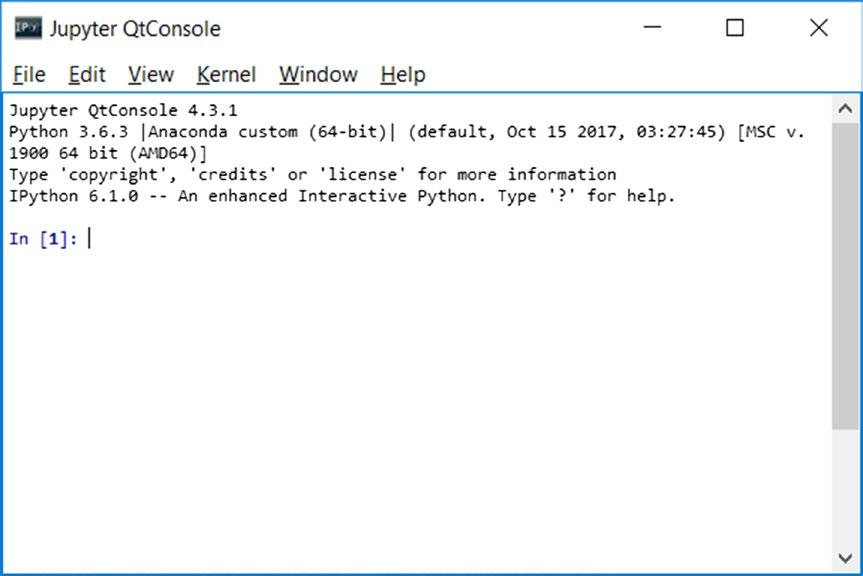

[*第7章：使用matplotlib进行数据可视化*](./README.md)


# 7.3. IPython和IPython QtConsole

为了熟悉Python世界提供的所有工具，我选择从终端和QtConsole中使用IPython。这是因为IPython允许您利用其增强终端的交互性，正如您将看到的，IPython QtConsole还允许您直接在控制台内集成图形。

要运行IPython会话，只需运行以下命令:
```commandline
ipython
Python 3.6.3 (default, Oct  15 2017, 03:27:45) [MSC v.1900 64 bit (AMD64)]
Type "copyright", "credits" or "license" for more information.
IPython 3.6.3 -- An enhanced Interactive Python. Type '?' for help.
In [1]:
```

如果您想运行Jupyter QtConsole，并且能够在会话的行命令中显示图形，您可以使用:

```commandline
jupyter qtconsole
```

一个带有新打开的IPython会话的窗口将立即出现在屏幕上，如图7-1所示。


>> Figure 7-1. The IPython QtConsole
>> 图7-1. IPython QtConsole

但是，如果您想继续使用标准的Python会话，您当然可以这样做。如果您不喜欢使用IPython，并且希望继续从终端使用Python，那么本章中的所有示例仍然有效。


