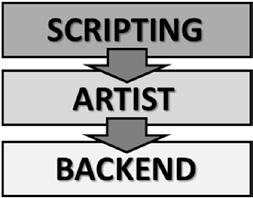
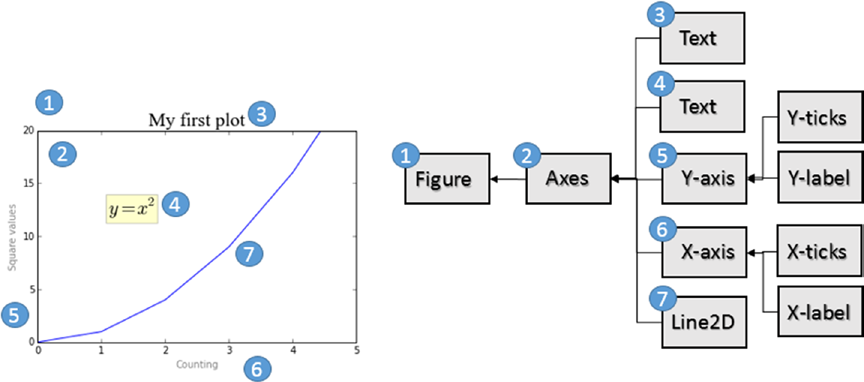
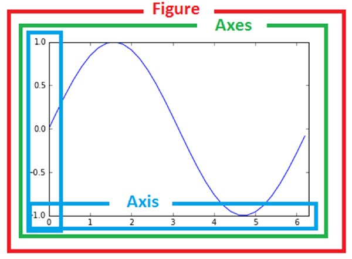

[*第7章：使用matplotlib进行数据可视化*](./README.md)


# 7.4. matplotlib架构

matplotlib必须承担的关键任务之一是提供一组函数和工具，这些函数和工具允许对Figure(主要对象)进行表示和操作，以及组成Figure的所有内部对象。然而，matplotlib不仅处理图形，而且还提供了事件处理和动画图形的所有工具。因此，由于有了这些额外的特性，matplotlib可以根据键盘上或鼠标移动时触发的事件生成交互式图表。

matplotlib的体系结构逻辑上分为三个层，它们被放置在三个不同的级别(参见图7-2)。通信是单向的，即每一层都可以与底层通信，而底层不能与上层通信。


>> 图7-2. Matplotlib体系结构的三层

这三个层次如下：

* 脚本(Scripting)层
* 画家(Artist)层
* 后端(Backend)层


## 后端(Backend) 层

在matplotlib体系结构的图中，在最低级别工作的层是Backend层。这一层包含matplotlib api，这是一组类，在底层扮演图形元素实现的角色。

* FigureCanvas(画布)是体现绘画领域概念的对象。
* Renderer(渲染器)是在FigureCanvas上绘制的对象。
* Event(事件)是处理用户输入(键盘和鼠标事件)的对象。

## 画家(Artist)层

作为中间层，我们有一个叫做`Artist`的层。构成图表的所有元素，如标题、轴标签、标记等，都是Artist对象的实例。这些实例都在层次结构中发挥作用(如图7-3所示)。


>> 图7-3.图表的每个元素对应于一个层次结构中的Artist实例

有两个Artist类：原始型和复合型。

* 原始型Artist类是构成图形表现的基本元素的单个对象，例如Line2D，或者是像矩形或圆圈这样的几何图形，甚至是文字片段。


* 复合型Artist是由几个基本元素组成的图表中的图形元素(即原始Artist)。例如坐标轴(Axis)、坐标刻度(Ticks)、坐标系(Axes)和图形(Figure)(见图7-4)。

通常，在这一层工作时，您将不得不经常处理更高层次结构中的对象，如图形(Figure)、坐标系(Axes)和坐标轴(Axis)。因此，充分理解这些对象是什么以及它们在图形表示中的作用是很重要的。图7-4显示了在这一层执行的所有实现中通常使用的三个主要Artist对象(组合Artist)。


>> 图7-4.Artist层次结构中的三个主要Artist对象

* Figure是层次结构中最高层次的对象。它对应于整个图形表示，通常可以包含多个坐标系(Axes)。

* Axex通常指的是绘图或图表。每个Axes对象只属于一个Figure，其特征是由两个坐标轴(Axis)(在三维情况下为三个)组合而成。其他对象，如标题、x标签和y标签，属于这个复合Artist对象。

* Axis对象涉及到要在轴上表示的数值，定义限制并管理刻度(轴上的标记)和刻度标签(每个刻度上表示的标签文本)。标记的位置由一个名为Locator的对象调整，而格式化标记标签由一个名为Formatter的对象调整。

## 脚本层(pyplot)

Artist类及其相关函数(matplotlib API)特别适合所有开发人员，尤其是那些在web应用服务器上工作或开发GUI的开发人员。但是对于计算，特别是对于数据的分析和可视化，脚本层是最好的。这个层由一个叫做pyplot的接口组成。


## pylab和pyplot

通常有关于pylab和pyplot的讨论。但是这两个包有什么区别呢?Pylab是与matplotlib一起安装的模块，pyplot是matplotlib的内部模块。通常您会找到对其中一种方法的引用。

```python
from pylab import *
```
和
```python
import matplotlib.pyplot as plt
import numpy as np
```

Pylab将pyplot的功能与NumPy的功能结合在一个命名空间中，因此不需要单独导入NumPy。此外，如果您导入pylab, pyplot和NumPy函数可以直接调用，而不需要引用任何模块(命名空间)，这使得环境更类似于MATLAB。

```python
plot(x,y)
array([1,2,3,4])
Instead of
plt.plot()
np.array([1,2,3,4]
```

pyplot包提供了用于编程matplotlib库的经典Python接口，它有自己的命名空间，并且需要单独导入NumPy包。本书选择了这种方法; 这是本章的主题;它将被用于本书的其余部分。事实上，大多数Python开发人员都共享并批准了这种选择。

