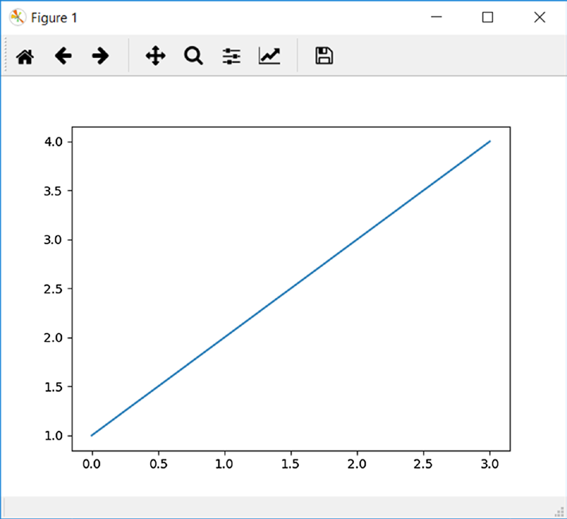

[*第7章：使用matplotlib进行数据可视化*](./README.md)


# 7.5. pyplot

pyplot模块是命令样式函数的集合，允许您像MATLAB一样使用matplotlib。每一个pyplot函数都会对图形对象进行操作或进行一些更改，例如，图形本身的创建、绘图区域的创建、线条的表示、带有标签的图形装饰等。

pyplot也是有状态的，因为它跟踪当前图形及其绘图区域的状态。操作函数作用于当前图形上。

## 一个简单的交互式图表

为了熟悉matplotlib库以及Pyplot的特殊方式，您将开始创建一个简单的交互式图表。使用matplotlib，这个操作非常简单;实际上，只需要三行代码就可以实现。

但首先需要导入pyplot包并将其重命名为plt。

```python
In [1]: import matplotlib.pyplot as plt
```

在Python中，构造函数通常是不必要的;一切都已经隐式定义了。实际上，当您导入包时，带有所有图形功能的plt对象已经被实例化，可以使用了。实际上，您只需使用plot()函数传递要绘制的值。

因此，您可以简单地传递您想要表示为整数序列的值。

```python
In [2]: plt.plot([1,2,3,4])
Out[2]: [<matplotlib.lines.Line2D at 0xa3eb438>]
```

如您所见，已经生成了一个Line2D对象。对象是一条线，表示图表中各点的线性趋势。

现在一切就绪，只需使用show()函数命令显示绘图。

```python
In [3]: plt.show()
```
结果将如图7-5所示。它看起来就像一个窗口，叫做绘图窗口，有一个工具栏，里面有绘图，就像MATLAB一样。


>> 图7-5.绘图窗口

