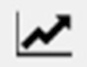
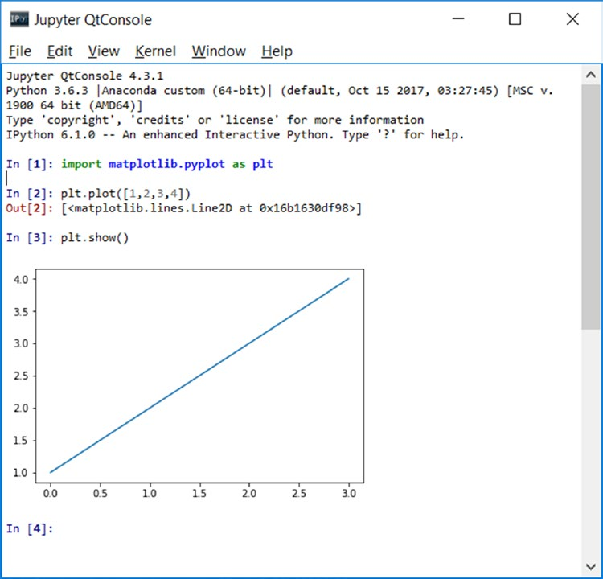
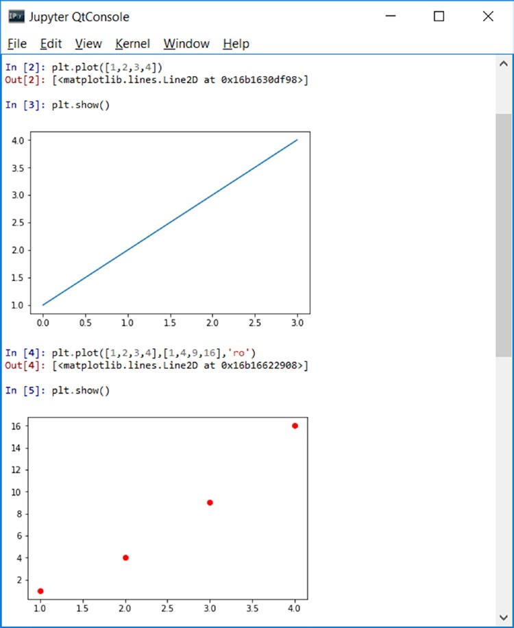
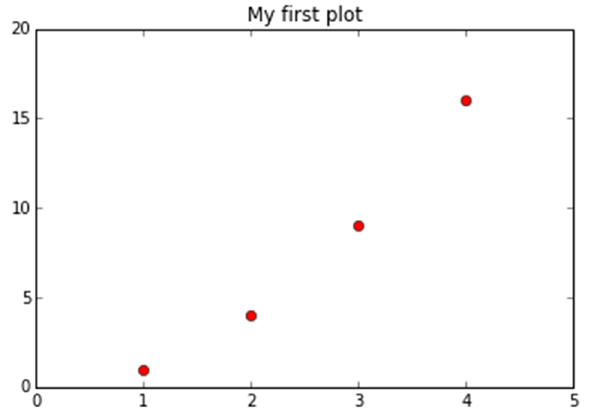
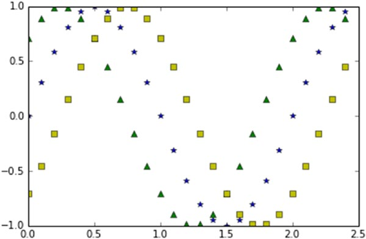
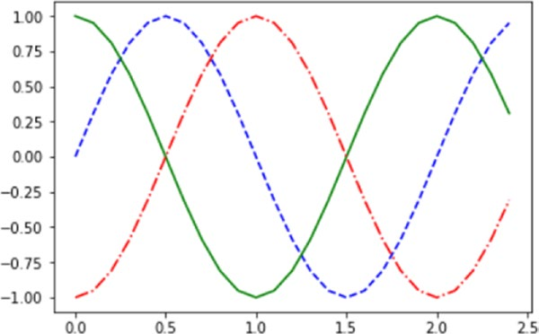

[*第7章：使用matplotlib进行数据可视化*](./README.md)


# 7.6. 绘图窗口

绘图窗口的特征是顶部有一个工具栏，其中有一系列按钮。
*  Resets the original view
*  Goes to the previous/next view
*  Pans axes with left mouse, zoom with right
*  Zooms to rectangle
*  Configures subplots
*  Saves/exports the figure
*  Edits the axis, curve, and image parameters

输入到IPython控制台的代码对应于Python控制台中的以下一系列命令:

```python
>>> import matplotlib.pyplot as plt
>>> plt.plot([1,2,3,4])
[<matplotlib.lines.Line2D  at 0x0000000007DABFD0>]
>>> plt.show()
```

如果您正在使用IPython QtConsole，您可能已经注意到，在调用plot()函数之后，图表将直接显示，而不显式调用show()函数(参见图7-6)。


>> 图7-6.QtConsole将图表直接显示为输出

如果您只向plt.plot()函数传递一个数字列表或数组，matplotlib假设它是图表的y值序列，并将它们与x的自然序列相关联:0,1,2,3，…。

通常，绘图表示值对(x, y)，因此如果想正确定义图表，必须定义两个数组，第一个数组包含x轴上的值，第二个数组包含y轴上的值。此外，plot()函数可以接受第三个参数，该参数描述了在图表中表示该点的具体方式。

## 设置绘图的属性

如图7-6所示，这些点用蓝色线条表示。实际上，如果您没有指定其他属性，则会考虑pl .plot()函数的默认配置:

* 轴的大小与输入数据的范围完全匹配
* 既没有标题也没有轴标签。
* 没有图例
* 画一条蓝色线条把这些点连接起来

因此，您需要更改此表示，以得到一个真实的绘图，其中每对值(x, y)由一个红点表示(参见图7-7)。

如果您正在使用IPython，请关闭窗口以返回到输入新命令的活动提示符。然后您必须调用show()函数来观察对t图表所做的更改。

```python
In [4]: plt.plot([1,2,3,4],[1,4,9,16],'ro')
Out[4]: [<matplotlib.lines.Line2D at 0x93e6898>]
In [5]: plt.show()
```

相反，如果您正在使用Jupyter QtConsole，则会看到每个新命令的不同图表。


>> 图7-7.(x，y)值的对在图中用红色圆表示。

> 注意，在本书的这一点上，您已经对不同环境之间的差异有了非常清晰的认识。为了避免混淆，我将把IPython QtConsole视为惟一的开发环境。

通过定义列表的详细信息[xmin, xmax, ymin, ymax]，然后将其作为参数传递给axis()函数，您可以在x轴和y轴上定义范围。

> 注意，在IPython QtConsole中，为了生成图表，有时需要输入更多行命令。为了避免每次按下Enter(开始新行)和丢失之前指定的设置时生成图表，必须按Ctrl+Enter。当您想最终生成图表时，只需按回车键两次。

您可以设置几个属性，其中一个是可以使用title()函数输入的标题。

```python
In [4]:
   ...:
   ...:
Out[4]:
plt.axis([0,5,0,20])
plt.title('My first plot')
plt.plot([1,2,3,4],[1,4,9,16],'ro')
[<matplotlib.lines.Line2D at 0x97f1c18>]
```

在图7-8中，您可以看到新设置如何使绘图更具有可读性。事实上，数据集的端点现在是在图中表示的，而不是在边缘。同样，这个图表的标题现在可以在顶部看到。


>> 图7-8.属性设置后的绘图

## Matplotlib和NumPy

即使是matplot库，尽管是一个完全图形化的库，它的基础也是NumPy库。实际上，到目前为止，您已经看到了如何将列表作为参数传递，既可以表示数据，也可以设置坐标轴的极端值。实际上，这些列表是在NumPy数组中内部转换的。

因此，您可以直接输入NumPy数组作为输入数据。这些数据由pandas处理过，可以直接使用matplotlib，无需进一步处理。

作为一个示例，您可以看到如何在同一块图中绘制三个不同的趋势(参见图7-9)。在本例中，您可以选择属于math模块的sin()函数。因此需要导入它。要生成遵循正弦趋势的点，您将使用NumPy库。使用arange()函数在x轴上生成一系列点，而对于y轴上的值，您将使用map()函数在数组的所有项上应用sin()函数(不使用for循环)。

```python
In [5]: import math
In [6]: import numpy as np
In [7]: t = np.arange(0,2.5,0.1)
   ...: y1 = np.sin(math.pi*t)
   ...: y2 = np.sin(math.pi*t+math.pi/2)
   ...: y3 = np.sin(math.pi*t-math.pi/2)
In [8]: plt.plot(t,y1,'b*',t,y2,'g^',t,y3,'ys')
Out[8]:
[<matplotlib.lines.Line2D at 0xcbd2e48>,
<matplotlib.lines.Line2D at 0xcbe10b8>,
<matplotlib.lines.Line2D at 0xcbe15c0>]
```


>> 图7-9.π/4表示的三种正弦趋势相移

> 注意，如果您没有使用带有matplotlib内联的IPython QtConsole集，或者您是在一个简单的Python会话上实现此代码，请在代码末尾插入plt.show()命令，以获得如图7-10所示的图表。

如图7-9所示，这个图用三种不同的颜色和标记表示了三种不同的时间趋势。在这些情况下，当函数的趋势如此明显时，plot可能不是最合适的呈现方式，最好使用线条(参见图7-10)。要将这三种趋势与颜色以外的东西区分开来，您可以使用由`.`和`-`的不同组合组成的模式。

```python
In [9]: plt.plot(t,y1,'b--',t,y2,'g',t,y3,'r-.')
Out[9]:
[<matplotlib.lines.Line2D at 0xd1eb550>,
<matplotlib.lines.Line2D at 0xd1eb780>,
<matplotlib.lines.Line2D at 0xd1ebd68>]
```

> 注意，如果不使用matplotlib内联的IPython QtConsole集，或者在一个简单的Python会话中实现此代码，请在代码末尾插入pl.show()命令，以获得图7-10所示的图表。


>> 图7-10.这张图用彩色线表示三个正弦波图案。

