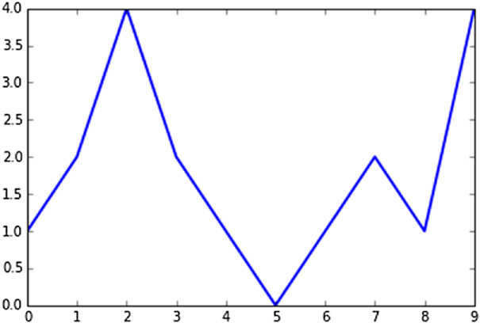
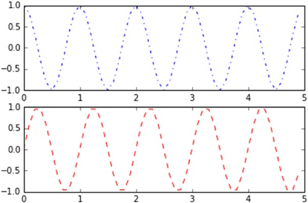
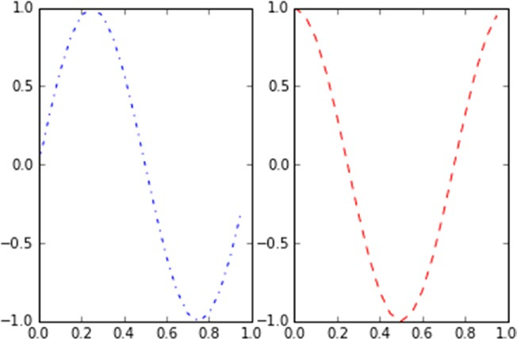

[*第7章：使用matplotlib进行数据可视化*](./README.md)


# 7.7. 使用关键字参数

组成图表的对象有许多特征。这些属性都是默认值，但是可以通过使用关键字args(通常称为kwargs)来设置。

这些关键字作为参数传递给函数。在matplotlib库的各种函数的参考文档中，总是会发现它们在最后一个位置被称为kwargs。例如，在这些示例中使用的plot()函数将以以下方式引用。
```python
matplotlib.pyplot.plot(*args, **kwargs)
```

对于一个实际示例，如果您设置linewidth关键字(参见图7-11)，则可以更改线的厚度。
```python
In [10]: plt.plot([1,2,4,2,1,0,1,2,1,4],linewidth=2.0)
Out[10]: [<matplotlib.lines.Line2D at 0xc909da0>]
```


>> 图7-11.线的粗细可以直接从plot()函数中设置。


## 处理多个图形(Figure)和坐标系(Axes)

到目前为止，您已经看到了如何将所有pyplot命令路由到单个图形的显示。实际上，matplotlib允许您同时管理多个图形，在每个图形中，它提供了查看定义为子图的不同图形的能力。

因此，当您使用pyplot时，必须始终牢记当前图形(Figure)和当前坐标系(Axes)的概念(即图中显示的图形)。现在您将看到一个示例，其中两个子图在一个图中表示。subplot()函数除了在不同的绘图区域中细分图形外，还用于将命令聚焦在特定的子图上。

传递给subplot()函数的参数设置了subdivision的模式，并确定了哪个是当前的subplot。只有当前子图受命令影响。subplot()函数的参数由三个整数组成。第一个数字定义了图形垂直分割成多少部分。第二个数字定义了图形被水平分割成多少部分。第三个数字确定哪一个是当前可以操作的子图。

现在，您将显示两个正弦趋势(正弦和余弦)，最好的方法是将画布垂直划分为两个水平子图(如图7-12所示)。因此，要传递的参数是数字211和212。

```python
In [11]: t = np.arange(0,5,0.1)
   ... : y1 = np.sin(2*np.pi*t)
   ... : y2 = np.sin(2*np.pi*t)
In [12]: plt.subplot(211)
    ...: plt.plot(t,y1,'b-.')
    ...: plt.subplot(212)
    ...: plt.plot(t,y2,'r--')
Out[12]: [<matplotlib.lines.Line2D at 0xd47f518>]
```


>> 图7-12.这个图表被分成两个垂直排列的横向子图。

现在，通过将图形分成两个垂直子图来做同样的事情。要作为参数传递给subplot()函数的数字是121和122(如图7-13所示)。

```python
In [ ]: t = np.arange(0.,1.,0.05)
   ...: y1 = np.sin(2*np.pi*t)
   ...: y2 = np.cos(2*np.pi*t)
In [ ]: plt.subplot(121)
   ...: plt.plot(t,y1,'b-.')
   ...: plt.subplot(122)
   ...: plt.plot(t,y2,'r--')
Out[94]: [<matplotlib.lines.Line2D at 0xed0c208>]
```


>> 图7-13.这个图表被分成两个水平排列的垂直子图。

