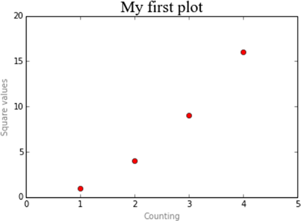

[*第7章：使用matplotlib进行数据可视化*](./README.md)


# 7.8. 向图表中添加元素

为了使图表更具信息性，很多时候使用行或标记来表示数据并使用两个轴分配值范围是不够的。事实上，还有许多其他元素可以添加到图表中，以便用更多的信息丰富图表。

在本节中，您将看到如何向图表添加元素，如文本标签、图例等等。

## 添加文本

您已经看到了如何使用title()函数将标题添加到图表中。可以添加axis标签的其他两个文本标记。这可以通过使用另外两个特定函数实现，即xlabel()和ylabel()。这些函数将字符串作为参数，字符串就是显示的文本。

注意，组成表示图表的代码行数量正在增加。您不需要每次重写所有命令，但是使用键盘上的箭头键，您可以调用之前传递的命令列表，并通过添加新行来编辑它们(在文本中以粗体显示)。

现在向图表添加两个轴标签。它们将描述分配给每个轴的值的类型(如图7-14所示)。

```python
In [10]: plt.axis([0,5,0,20])
   ...: plt.title('My first plot')
   ...: plt.xlabel('Counting')
   ...: plt.ylabel('Square values')
   ...: plt.plot([1,2,3,4],[1,4,9,16],'ro')
Out[10]: [<matplotlib.lines.Line2D at 0x990f3c8>]
```


>> 图7-14. 通过添加轴标签，绘图内容更丰富。

由于关键字参数，您可以更改文本的特征。例如，您可以通过更改字体和增加字符的大小来修改标题。您还可以修改axis标签的颜色，以突出显示绘图的标题(如图7-15所示)。

```python
In [ ]: plt.axis([0,5,0,20])
   ...: plt.title('My first plot',fontsize=20,fontname='Times New Roman')
   ...: plt.xlabel('Counting',color='gray')
   ...: plt.ylabel('Square values',color='gray')
   ...: plt.plot([1,2,3,4],[1,4,9,16],'ro')
Out[116]: [<matplotlib.lines.Line2D at 0x11f17470>]
```


>> 图7-15. 通过设置关键字来修改文本。

但是matplotlib并不局限于此:pyplot允许向图表中的任何位置添加文本。该特性由一个名为text()的特定函数执行。

```python
text(x,y,s, fontdict=None, **kwargs)
```

前两个参数是放置文本位置的坐标。s是要添加的文本字符串，fontdict(可选)是要使用的字体。最后，您可以添加关键字。

将标签添加到绘图的各点。因为text()函数的前两个参数是图形的坐标，所以必须使用在y轴上稍微移动一点的图的四个点的坐标。

```python
In [ ]: plt.axis([0,5,0,20])
   ...: plt.title('My first plot',fontsize=20,fontname='Times New Roman')
   ...: plt.xlabel('Counting',color='gray')
   ...: plt.ylabel('Square values',color='gray')
   ...: plt.text(1,1.5,'First')
   ...: plt.text(2,4.5,'Second')
   ...: plt.text(3,9.5,'Third')
   ...: plt.text(4,16.5,'Fourth')
   ...: plt.plot([1,2,3,4],[1,4,9,16],'ro')
Out[108]: [<matplotlib.lines.Line2D at 0x10f76898>]
```

如图7-16所示，现在图中的每个点都有一个标签。


>> 图7-16.情节的每一点都有一个信息丰富的标签。

因为matplotlib是一个设计用于科学领域的图形库，它必须能够充分挖掘科学语言的潜力，包括数学表达式。matplotlib提供了集成LaTeX表达式的可能性，从而允许您在图表中插入数学表达式。

为此，可以向文本添加LaTeX表达式，将其封装在两个$字符之间。解释器将识别它们为LaTeX表达式，并将它们转换为相应的图形，可以是数学表达式、公式、数学字符或希腊字母。通常，为了避免意外的转义序列，必须在包含LaTeX表达式的字符串前面加上`r`, r表示原始文本。

在这里，您还可以使用关键字来进一步丰富图中显示的文本。因此，作为一个示例，您可以添加描述趋势的公式，并将其包含在一个彩色边框中(参见图7-17)。

```python
In [ ]: plt.axis([0,5,0,20])
    ...: plt.title('My first plot',fontsize=20,fontname='Times New Roman')
    ...: plt.xlabel('Counting',color='gray')
    ...: plt.ylabel('Square values',color='gray')
    ...: plt.text(1,1.5,'First')
    ...: plt.text(2,4.5,'Second')
    ...: plt.text(3,9.5,'Third')
    ...: plt.text(4,16.5,'Fourth')
    ...: plt.text(1.1,12,r'$y = x^2$',fontsize=20,bbox={'facecolor':'yellow', 'alpha':0.2})
    ...: plt.plot([1,2,3,4],[1,4,9,16],'ro')
Out[130]: [<matplotlib.lines.Line2D at 0x13920860>]
```


>> 图7-17.任何数学表达式都可以在图表的上下文中看到。

To get a complete view on the potential offered by LaTeX, consult Appendix A of this book.
要全面了解LaTeX所提供的潜力，请参阅本书附录a。


## 添加网格

可以添加到绘图中的另一个元素是网格。为了更好地理解图表上每个点所占的位置，通常需要添加它。

向图表添加网格是一个非常简单的操作:只需添加grid()函数，将True作为参数传递(参见图7-18)。

```python
In [ ]: plt.axis([0,5,0,20])
...: plt.title('My first plot',fontsize=20,fontname='Times New Roman')
...: plt.xlabel('Counting',color='gray')
...: plt.ylabel('Square values',color='gray')
...: plt.text(1,1.5,'First')
...: plt.text(2,4.5,'Second')
...: plt.text(3,9.5,'Third')
...: plt.text(4,16.5,'Fourth')
...: plt.text(1.1,12,r'$y = x^2$',fontsize=20,bbox={'facecolor':'yellow', 'alpha':0.2})
...: plt.grid(True)
...: plt.plot([1,2,3,4],[1,4,9,16],'ro')
Out[108]: [<matplotlib.lines.Line2D at 0x10f76898>]
```

>> 图7-18.网格使得读取图表上表示的数据点的值更容易。


## 添加图例

另一个应该出现在任何图表中的非常重要的组成部分是图例。pyplot还为这种类型的对象提供了一个特定的函数:legend()。

使用legend()函数和一个字符串将图例添加到图表中，该字符串指示要显示该序列的单词。在本例中，将第一个序列名称分配给输入数据数组(参见图7-19)。

```python
In [ ]: plt.axis([0,5,0,20])
...: plt.title('My first plot',fontsize=20,fontname='Times New Roman')
...: plt.xlabel('Counting',color='gray')
...: plt.ylabel('Square values',color='gray')
...: plt.text(2,4.5,'Second')
...: plt.text(3,9.5,'Third')
...: plt.text(4,16.5,'Fourth')
...: plt.text(1.1,12,'$y = x^2$',fontsize=20,bbox={'facecolor':'yellow', 'alpha':0.2})
...: plt.grid(True)
...: plt.plot([1,2,3,4],[1,4,9,16],'ro')
...: plt.legend(['First series'])
Out[156]: <matplotlib.legend.Legend at 0x16377550>
```


>> 图7-19。默认情况下，在右上角添加图例

如图7-19所示，默认情况下，图例是在右上角添加的。同样，如果您想改变这种行为，您需要添加一些kwargs。例如，通过向loc kwarg分配从0到10的数字，可以设置legend所在的位置。每一个数字都代表图表的一个角落(见表7-1)。默认值为1，即右上角。在下一个示例中，您将在左上角移动图例，以便它不会与图中表示的点重叠。

Location Code	| Location String 
| :------- :    |  ------------- |
0   |  best
1   |  upper-right
2   |  upper-left
3   |  lower-right
4   |  lower-left
5   |  right
6   |   center-left
7   |  center-right
8   |  lower-center
9   |   upper-center
10  |   center

>> 表7-1. loc关键字的可能值

在开始修改代码以移动图例之前，我想指明一点。通常，图例被用来通过与颜色相关的标签和/或标识符来向读者表示序列的定义。到目前为止，在这些示例中使用一个序列，该序列由单个plot()函数表示。现在，您必须关注一个更一般的情况，在这种情况下，同一图表中同时显示多个序列。图表中的每个序列都将以特定的颜色和特定的标记来描述(见图7-20)。相反，在代码方面，每个序列的特征都是对plot()函数的调用，它们的顺序将对应于作为参数传递给legend()函数的文本标签的顺序。

```python
In [ ]: import matplotlib.pyplot as plt
...: plt.axis([0,5,0,20])
...: plt.title('My first plot',fontsize=20,fontname='Times New Roman')
...: plt.xlabel('Counting',color='gray')
...: plt.ylabel('Square values',color='gray')
...: plt.text(1,1.5,'First')
...: plt.text(2,4.5,'Second')
...: plt.text(3,9.5,'Third')
...: plt.text(4,16.5,'Fourth')
...: plt.text(1.1,12,'$y = x^2$',fontsize=20,bbox={'facecolor':'yellow', 'alpha':0.2})
...: plt.grid(True)
...: plt.plot([1,2,3,4],[1,4,9,16],'ro')
...: plt.plot([1,2,3,4],[0.8,3.5,8,15],'g^')
...: plt.plot([1,2,3,4],[0.5,2.5,4,12],'b*')
...: plt.legend(['First series','Second series','Third series'],loc=2)
Out[170]: <matplotlib.legend.Legend at 0x1828d7b8>
```


>> 图7-20. 在每一个多序列图表中都需要一个图例

