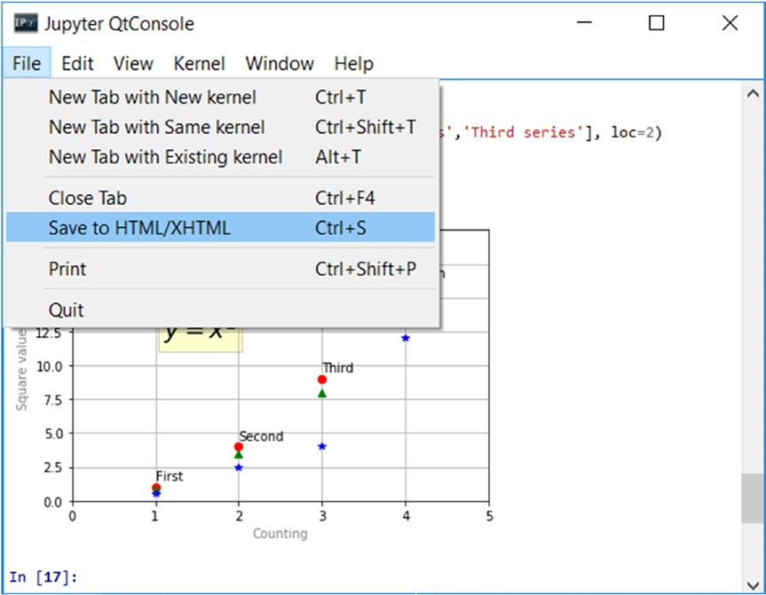
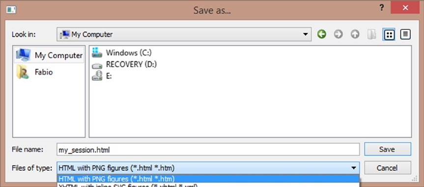
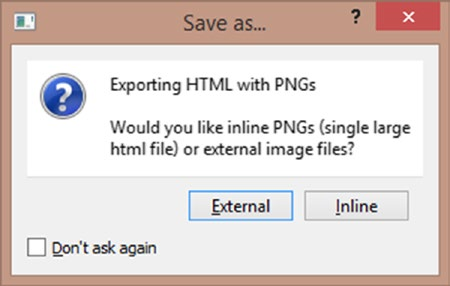

[*第7章：使用matplotlib进行数据可视化*](./README.md)


# 7.9. 保存图表

在本节中，您将学习如何根据需要以不同的方式保存图表。如果需要在不同的NoteBook或Python会话中重现图表，或者在将来的项目中重用它们，保存Python代码是一个很好的实践。另一方面，如果你需要做报表或演示文稿，把你的图表保存成图片是非常有用的。此外，还可以将图表保存为HTML页面，这在需要在Web上共享工作时非常有用。

## 保存代码

正如您从前面章节中的示例中可以看到的那样，有关单个图表表示的代码正在增长到相当多的行数。一旦您认为您在开发过程中达到了一个好的点，您就可以选择将所有行代码保存在一个.py文件中，您可以随时重新使用这些代码。

您可以使用magic命令save%，后面跟着要保存的文件的名称，后面跟着包含要保存的代码行的输入提示数。如果所有代码都是在一个提示符中编写的，就像您的情况一样，您必须只添加它的编号;否则，如果您想保存在许多提示符中编写的代码，例如从10到20，那么您必须用两个用`-`分隔的数字表示这个范围，即10-20。

在您的示例中，您将保存包含在输入提示符中的第一个图表的表示形式的Python代码，其编号为171。

```python
In [171]: import matplotlib.pyplot as plt
...
```

需要插入以下命令将代码保存到新的.py文件中。

```python
%save my_first_chart 171
```

启动命令后，您将在工作目录中找到my_first_chart.py文件(请参见清单7-1)。

```text
# coding: utf-8
import matplotlib.pyplot as plt
plt.axis([0,5,0,20])
plt.title('My first plot',fontsize=20,fontname='Times New Roman')
plt.xlabel('Counting',color='gray')
plt.ylabel('Square values',color='gray')
plt.text(1,1.5,'First')
plt.text(2,4.5,'Second')
plt.text(3,9.5,'Third')
plt.text(4,16.5,'Fourth')
plt.text(1.1,12,'$y = x^2$',fontsize=20,bbox={'facecolor':'yellow', 'alpha':0.2})
plt.grid(True)
plt.plot([1,2,3,4],[1,4,9,16],'ro')
plt.plot([1,2,3,4],[0.8,3.5,8,15],'g^')
plt.plot([1,2,3,4],[0.5,2.5,4,12],'b*')
plt.legend(['First series','Second series','Third series'],loc=2)
```

>> 清单7-1。我的第一个图表
-------------------------------

稍后，当您打开一个新的IPython会话时，您将拥有您的图表，并通过输入以下命令开始修改保存它的代码:

```python
ipython qtconsole --matplotlib inline -m my_first_chart.py
```

或者您可以使用magic命令%load在QtConsole中的一个提示符中重新加载整个代码。

```python
%load my_first_chart.py
```
或者您可以使用magic命令%run在会话期间运行它。

```python
%run my_first_chart.py
```

>> 注意，在我的系统中，这个命令只有在启动前两个命令之后才能工作。

## 将会话转换为HTML文件

使用IPython QtConsole，您可以将当前会话中出现的所有代码和图形转换为HTML页面。从菜单中选择File—>Save to HTML/XHTML(如图7-21所示)。


>> 图7-21.可以将当前会话保存为网页

您将被要求以两种不同的格式保存会话:HTML和XHMTL。这两种格式的区别是基于图像转换类型。如果选择HTML作为输出文件格式，会话中包含的图像将转换为PNG格式。如果您选择XHTML作为输出文件格式，则图像将转换为SVG格式。

在本例中，将会话保存为HTML文件，并将其命名为my_session。html，如图7-22所示。


>> 图7-22.您可以在HTML和XHTML之间选择文件类型

此时，您将被询问是否要将图像保存在外部目录或内联目录中(参见图7-23)。


>> 图7-23. 您可以在创建外部图像文件和嵌入之间进行选择。

通过选择外部选项，PNG格式直接进入HTML页面，图像将被收集到一个名为my_session_files的目录中。通过选择内联，图像的图形信息被嵌入到HTML代码中。

## 将图表直接保存为图像

如果您只希望将图表的图形保存为图像文件，而忽略在会话期间编写的所有代码，那么这也是可能的。实际上，由于有了savefig()函数，您可以直接将图表以PNG格式保存，尽管您应该小心地将此函数添加到同一系列命令的末尾(否则您将得到一个空白的PNG文件)。

```python
In [ ]: plt.axis([0,5,0,20])
...: plt.title('My first plot',fontsize=20,fontname='Times New Roman')
...: plt.xlabel('Counting',color='gray')
...: plt.ylabel('Square values',color='gray')
...: plt.text(1,1.5,'First')
...: plt.text(2,4.5,'Second')
...: plt.text(3,9.5,'Third')
...: plt.text(4,16.5,'Fourth')
...: plt.text(1.1,12,'$y = x^2$',fontsize=20,bbox={'facecolor':'yellow', 'alpha':0.2})
...: plt.grid(True)
...: plt.plot([1,2,3,4],[1,4,9,16],'ro')
...: plt.plot([1,2,3,4],[0.8,3.5,8,15],'g^')
...: plt.plot([1,2,3,4],[0.5,2.5,4,12],'b*')
...: plt.legend(['First series','Second series','Third series'],loc=2)
...: plt.savefig('my_chart.png')
```

执行前面的代码，将在工作目录中创建一个新文件。这个文件将命名为my_chart。将包含您的图表的图像。

