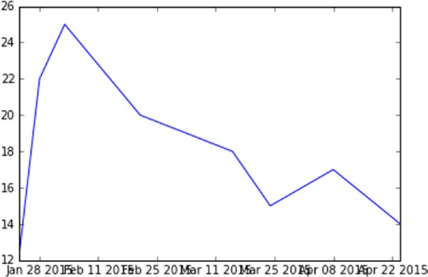

[*第7章：使用matplotlib进行数据可视化*](./README.md)


# 7.10. 处理日期值

在进行数据分析时，最常见的问题之一是处理日期-时间类型的数据。沿着轴(通常是x轴)显示数据可能会有问题，特别是在管理刻度时(参见图7-24)。

例如，显示一个带有8个点数据集的线性图表，其中必须用以下格式在x轴上表示日期值:`日-月-年`。

```python
In [ ]: import datetime
...: import numpy as np
...: import matplotlib.pyplot as plt
...: events = [datetime.date(2015,1,23),datetime. date(2015,1,28),datetime.date(2015,2,3),datetime. date(2015,2,21),datetime.date(2015,3,15),datetime. date(2015,3,24),datetime.date(2015,4,8),datetime.date(2015,4,24)]
...: readings = [12,22,25,20,18,15,17,14]
...: plt.plot(events,readings)
Out[83]: [<matplotlib.lines.Line2D at 0x12666400>]
```


>> 图7-24.如果不处理，则显示日期时间值可能会出现问题。

如图7-24所示，坐标刻度的自动管理，尤其是刻度的标签，可能是一场灾难。以这种方式表示的日期很难读懂，在一点和另一点之间没有明确的时间间隔，也有重叠。

因此，为了管理日期，建议使用适当的对象来定义时间尺度。首先需要导入matplotlib.date，专门用于这类数据的模块。然后，通过MonthLocator()函数定义时间尺度，在本例中为day和一个月的尺度。在这些情况下，格式也非常重要，为了避免重叠或不必要的引用，您必须将tick标签限制为基本标签，在本例中是`年-月`。这种格式可以作为参数传递给DateFormatter()函数。

在定义了天数和月份的两个刻度之后，可以使用xaxis对象上的set_major_locator()和set_minor_locator()函数在x轴上设置两种不同的刻度。相反，要设置引用月份的tick标签的文本格式，需要使用set_major_formatter()函数。

更改所有这些设置，最终得到如图7-25所示的图形。

```python
In [ ]: import datetime
...: import numpy as np
...: import matplotlib.pyplot as plt
...: import matplotlib.dates as mdates
...: months = mdates.MonthLocator()
...: days = mdates.DayLocator()
...: timeFmt = mdates.DateFormatter('%Y-%m')
...: events = [datetime.date(2015,1,23),datetime. date(2015,1,28),datetime.date(2015,2,3),datetime. date(2015,2,21),datetime.date(2015,3,15),datetime. date(2015,3,24),datetime.date(2015,4,8),datetime.date(2015,4,24)]
...: readings = [12,22,25,20,18,15,17,14]
...: fig, ax = plt.subplots()
...: plt.plot(events,readings)
...: ax.xaxis.set_major_locator(months)
...: ax.xaxis.set_major_formatter(timeFmt)
...: ax.xaxis.set_minor_locator(days)
```


>> 图7-25.现在，x轴的刻度只引用月份，使绘图更具可读性。


