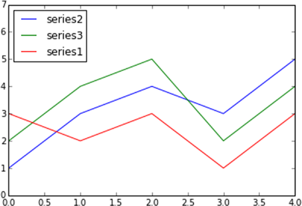

[*第7章：使用matplotlib进行数据可视化*](./README.md)


# 7.12. 线型图

在所有的图表类型中，线型图表是最简单的。折线图是由一条直线连接的数据点序列。每个数据点由一对值(x,y)组成，将根据两个轴(x,y)的大小在图表中表示。

通过示例，可以开始绘制由数学函数生成的点。然后，可以考虑这样一个通用的数学函数:

```python
y = sin (3 * x) / x
```

因此，如果要创建数据点序列，需要创建两个NumPy数组。首先创建一个数组，其中包含要引用到x轴的x值。为了定义一个递增的值序列，您将使用np.arange()函数。由于函数是正弦函数，所以应该引用希腊字母pi (np.pi)的倍数和因数。然后，使用这些值序列，您可以直接将np.sin()函数应用于这些值，从而获得y值(多亏有NumPy!)。

在所有这些之后，您只需通过调用plot()函数来绘制它们。您将得到一个折线图，如图7-26所示。

```python
In [ ]: import matplotlib.pyplot as plt
...: import numpy as np
...: x = np.arange(-2*np.pi,2*np.pi,0.01)
...: y = np.sin(3*x)/x
...: plt.plot(x,y)
Out[393]: [<matplotlib.lines.Line2D at 0x22404358>]
```


>> 图7-26。在线图中表示的数学函数

现在，您可以扩展显示一系列函数的情况，如下所示：

```python
y = sin (n * x) / x
```
改变参数n。

```python
In [ ]: import matplotlib.pyplot as plt
...: import numpy as np
...: x = np.arange(-2*np.pi,2*np.pi,0.01)
...: y = np.sin(3*x)/x
...: y2 = np.sin(2*x)/x
...: y3 = np.sin(3*x)/x
...: plt.plot(x,y)
...: plt.plot(x,y2)
...: plt.plot(x,y3)
```

如图7-27所示，每一行都会自动分配不同的颜色。所有的图都以相同的比例表示;也就是说，每个级数的数据点都指向相同的x轴和y轴。这是因为plot()函数的每次调用都考虑到对相同函数的前一次调用，因此图中应用了保持前一次命令内存不变的更改，直到图没有显示(使用Python使用show()并使用IPython QtConsole输入)。


>> 图7-27.三个不同的系列在相同的图表中用不同的颜色绘制。

在前面的部分中,可以看到无论默认设置,您可以选择笔划的类型,颜色,等等。作为plot()函数的第三个参数可以指定一些代码,对应颜色(见表7-2)和其他编码,对应线风格,都包括在相同的字符串。另一种可能是分别使用两个kwargs, color来定义颜色，linestyle来定义笔画(参见图7-28)。

```python
In [ ]: import matplotlib.pyplot as plt
...: import numpy as np
...: x = np.arange(-2*np.pi,2*np.pi,0.01)
...: y = np.sin(3*x)/x
...: y2 = np.sin(2*x)/x
...: y3 = np.sin(3*x)/x
...: plt.plot(x,y,'k--',linewidth=3)
...: plt.plot(x,y2,'m-.')
...: plt.plot(x,y3,color='#87a3cc',linestyle='--')
```


>> 图7-28.可以使用字符代码定义颜色和线条样式。

Code	|  Color
代码 | 颜色
| ----  | ------ |
b	 | blue
b |蓝色
g	 | green
g |绿色
r    | red
r |红色
c	 | cyan
c |青色
m	 | magenta
m |洋红色
y	 | yellow
y |黄色
k	 | black
k |黑色
w	 | white
w |白

>> 表7-2。颜色代码

您刚刚在x轴上定义了从-2π到2π的范围，但在默认情况下，刻度值以数字形式显示。因此，您需要用π的倍数替换数值。你也可以替换y轴上的刻度。为此，必须使用xticks()和yticks()函数，将两个值列表传递给每个函数。第一个列表包含对应于放置刻度位置的值，第二个列表包含刻度标签。在这种情况下，您必须使用包含LaTeX格式的字符串才能正确显示符号π。记住在两个$字符中定义它们，并添加一个r作为前缀。

```python
In [ ]: import matplotlib.pyplot as plt
...: import numpy as np
...: x = np.arange(-2*np.pi,2*np.pi,0.01)
...: y = np.sin(3*x)/x
...: y2 = np.sin(2*x)/x
...: y3 = np.sin(x)/x
...: plt.plot(x,y,color='b')
...: plt.plot(x,y2,color='r')
...: plt.plot(x,y3,color='g')
...: plt.xticks([-2*np.pi, -np.pi, 0, np.pi, 2*np.pi], [r'$-2\pi$',r'$-\pi$',r'$0$',r'$+\pi$',r'$+2\pi$'])
...: plt.yticks([-1,0,1,2,3], [r'$-1$',r'$0$',r'$+1$',r'$+2$',r'$+3$'])
Out[423]:
([<matplotlib.axis.YTick at 0x26877ac8>,
<matplotlib.axis.YTick at 0x271d26d8>,
<matplotlib.axis.YTick at 0x273c7f98>,
<matplotlib.axis.YTick at 0x273cc470>,
<matplotlib.axis.YTick at 0x273cc9e8>],
<a list of 5 Text yticklabel objects>)
```

最后，将得到一个显示希腊字符的整洁而愉快的折线图，如图7-29所示。


>> 图7-29.可以改进刻度标签，添加带有LaTeX格式的文本。

在您目前看到的所有线性图表中，x轴和y轴总是放在图形的边缘(对应于边界框的边)。另一种显示轴的方法是让两个轴通过原点(0,0)，即两个笛卡尔坐标轴。

为此，必须首先通过gca()函数捕获Axes对象。然后通过这个对象，您可以选择构成边框的四个边中的每一个，为每个边指定其位置:右、左、底和顶。使用set_color()函数裁剪不匹配任何轴(右和底部)的边，并为颜色指示none。然后，用set_position()函数将x轴和y轴对应的边通过原点(0,0)。

```python
In [ ]: import matplotlib.pyplot as plt
...: import numpy as np
...: x = np.arange(-2*np.pi,2*np.pi,0.01)
...: y = np.sin(3*x)/x
...: y2 = np.sin(2*x)/x
...: y3 = np.sin(x)/x
...: plt.plot(x,y,color='b')
...: plt.plot(x,y2,color='r')
...: plt.plot(x,y3,color='g')
...: plt.xticks([-2*np.pi, -np.pi, 0, np.pi, 2*np.pi], [r'$-2\pi$',r'$-\pi$',r'$0$',r'$+\pi$',r'$+2\pi$'])
...: plt.yticks([-1,0,+1,+2,+3], [r'$-1$',r'$0$',r'$+1$',r'$+2$',r'$+3$'])
...: ax = plt.gca()
...: ax.spines['right'].set_color('none')
...: ax.spines['top'].set_color('none')
...: ax.xaxis.set_ticks_position('bottom')
...: ax.spines['bottom'].set_position(('data',0))
...: ax.yaxis.set_ticks_position('left')
...: ax.spines['left'].set_position(('data',0))
```

现在，图表将显示图中两个相交的坐标轴，也就是笛卡尔坐标轴的原点，如图7-30所示。


>> 图7-30.这张图显示了两个笛卡尔坐标轴。

通常，能够使用符号指定直线的某个特定点，并可选择添加箭头以更好地指示该点的位置，这是非常有用的。例如，这个符号可能是LaTeX表达式，例如函数sinx/x在x趋于0时的极限公式。

在这方面，matplotlib提供了一个名为annotate()的函数，这在这些情况下特别有用，即使获得好的结果所需的大量kwargs可能会使其设置非常复杂。第一个参数是表示包含LaTeX的表达式的字符串;然后可以添加各种kwarg。要注意的图表点由一个列表表示，该列表包含传递给xy kwarg的点[x, y]的坐标。文本符号与要突出显示的点之间的距离由xytext kwarg定义，用一个弯曲的箭头表示，其特征在arrowprops kwarg中定义。

```python
In [ ]: import matplotlib.pyplot as plt
...: import numpy as np
...: x = np.arange(-2*np.pi,2*np.pi,0.01)
...: y = np.sin(3*x)/x
...: y2 = np.sin(2*x)/x
...: y3 = np.sin(x)/x
...: plt.plot(x,y,color='b')
...: plt.plot(x,y2,color='r')
...: plt.plot(x,y3,color='g')
...: plt.xticks([-2*np.pi, -np.pi, 0, np.pi, 2*np.pi], [r'$-2\pi$',r'$-\pi$',r'$0$',r'$+\pi$',r'$+2\pi$'])
...: plt.yticks([-1,0,+1,+2,+3], [r'$-1$',r'$0$',r'$+1$',r'$+2$',r'$+3$'])
...: plt.annotate(r'$\lim_{x\to 0}\frac{\sin(x)}{x}= 1$',	xy=[0,1], xycoords='data',xytext=[30,30],fontsize=16,textcoords='offset points', arrowprops=dict(arrowstyle="->",connectionstyle="arc3,rad=.2"))
...: ax = plt.gca()
...: ax.spines['right'].set_color('none')
...: ax.spines['top'].set_color('none')
...: ax.xaxis.set_ticks_position('bottom')
...: ax.spines['bottom'].set_position(('data',0))
...: ax.yaxis.set_ticks_position('left')
...: ax.spines['left'].set_position(('data',0))
```

运行这段代码，您将得到带有极限数学符号的图表，这是图7-31中箭头所示的点。


>> 图7-31.可以将数学表达式添加到带有注释()函数的图表中


## pandas数据的折线图

现在转向更实际的情况，或者至少与数据分析更密切相关的情况，现在是时候看看将matplotlib库应用到pandas库的数据爆炸是多么容易了。将dataframe中的数据可视化为线性图表是一个非常简单的操作。将dataframe作为参数传递给plot()函数就足够了，可以获得多系列线性图表(参见图7-32)。

```python
In [ ]: import matplotlib.pyplot as plt
...: import numpy as np
...: import pandas as pd
...: data = {'series1':[1,3,4,3,5],
'series2':[2,4,5,2,4],
'series3':[3,2,3,1,3]}
...: df = pd.DataFrame(data)
...: x = np.arange(5)
...: plt.axis([0,5,0,7])
...: plt.plot(x,df)
...: plt.legend(data, loc=2)
```


>> 图7-32.多系列线图显示pandas数据中的数据。


