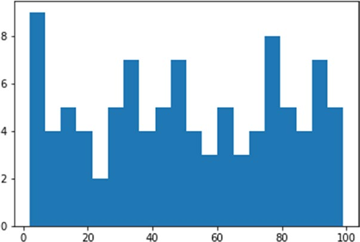

[*第7章：使用matplotlib进行数据可视化*](./README.md)


# 7.13. 直方图

直方图由在x轴上建立的相邻矩形组成，分割成离散的间隔称为箱子，面积与箱子出现的频率成正比。这种可视化通常用于样本分布的统计研究。

为了表示直方图，pyart提供了一个名为hist()的专门函数。此图形功能还具有生成图表的其他函数所没有的功能。hist()函数除了绘制直方图外，还返回一个值元组，这些值是直方图计算的结果。实际上hist()函数还可以实现直方图的计算，即提供一系列的值样本作为参数和要划分的箱数，它将负责将样本的范围划分为多个区间(箱体)，然后计算每个箱体的出现情况。此操作的结果，除了以图形形式显示(请参见图7-33)外，还将以元组的形式返回。
```python
(n, bins, patches)
```
要理解这个操作，最好是一个实际的例子。然后，您可以使用random.randint()函数生成100个随机值，从0到100。

```python
In [ ]: import matplotlib.pyplot as plt
   ...: import numpy as np
   ...: pop = np.random.randint(0,100,100)
   ...: pop
Out[ ]:
array([32, 14, 55, 33, 54, 85, 35, 50, 91, 54, 14, 30, 80, 70,  6, 37, 62, 68,
      65, 86, 29, 99, 15, 48, 67, 96, 81, 49, 43, 93, 63, 26,  4, 21, 19, 64,
      6, 33, 92, 44, 23, 11, 61, 40,  5, 70, 84, 95, 46, 81, 27,  6, 83,  9,
      54, 44, 88,  4, 34, 43, 16, 47, 91, 34, 79, 39, 74, 77,  6, 35, 97, 50,
      41, 21, 79, 57,  5, 12, 58, 48, 75, 90, 77, 94, 77, 74,  2, 85, 19, 90, 96,
      56, 68, 28,  7, 75, 10, 39, 77, 29])
 ``` 

现在，通过将hist()函数作为参数传递来创建这些示例的直方图。例如，您希望在20个容器中划分出现的情况(如果没有指定，默认值是10个容器)，为此您必须使用关键字参数bin(如图7-33所示)。

```python
In [ ]: n,bins,patches = plt.hist(pop,bins=20)
```


>> 图7-33。直方图显示每个箱体出现的情况。


