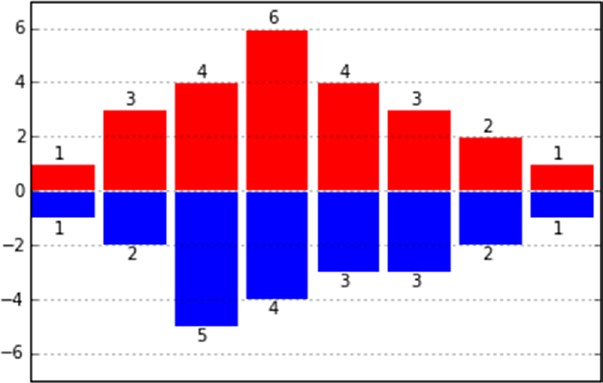

[*第7章：使用matplotlib进行数据可视化*](./README.md)


# 7.14. 柱状图

另一种很常见的图表类型是柱状图。它非常类似于直方图，但在这种情况下，x轴不是用来参考数值而是类别。使用matplotlib，使用bar()函数实现柱状图非常简单。

```python
In [ ]: import matplotlib.pyplot as plt
...: index = [0,1,2,3,4]
...: values = [5,7,3,4,6]
...: plt.bar(index,values)
Out[15]: <Container object of 5 artists>
```

通过这几行代码，您将获得如图7-34所示的条形图。


>> 图7-34.使用matplotlib的最简单的条形图

如果你看一看图7-34，你会发现指数都画在x轴上，在每条横线的开头。实际上，因为每个bar对应于一个类别，所以最好通过tick标签指定类别，该标签由传递给xticks()函数的字符串列表定义。至于这些tick标签的位置，您必须传递一个列表，其中包含与它们在x轴上的位置相对应的值，作为xticks()函数的第一个参数。最后你会得到一个条形图，如图7-35所示。

```python
In [ ]: import numpy as np
...: index = np.arange(5)
...: values1 = [5,7,3,4,6]
...: plt.bar(index,values1)
...: plt.xticks(index+0.4,['A','B','C','D','E'])
```

>> 图7-35.x轴上有类别的简单条形图

实际上，您还可以采取许多其他步骤来进一步细化条形图。通过在bar()函数中添加一个特定的关键字作为参数来设置每一个完成。例如，您可以通过yerr关键字参数 添加条形图的标准差值，以及包含标准差的列表。这个关键字参数通常与另一个名为error_kw的关键字参数组合在一起，而这个关键字参数反过来又接受其他专门表示错误条的关键字参数。在本例中使用的两个非常具体的关键字参数是eColor，它指定了错误栏的颜色，而capsize则定义了标记错误栏末端的横线的宽度。

另一个可以使用的关键字参数是alpha，它表示颜色条的透明度。是一个从0到1的值。当该值为0时，对象完全透明，随着值的增加逐渐变得更显著，直到达到1，此时颜色被完全表示出来。

与往常一样，建议使用图例，因此在本例中，您应该使用名为label的关键字参数来标识所代表的系列。

最后，您将得到一个带有错误条的条形图，如图7-36所示。

```python
In [ ]: import numpy as np
...: index = np.arange(5)
...: values1 = [5,7,3,4,6]
...: std1 = [0.8,1,0.4,0.9,1.3]
...: plt.title('A Bar Chart')
...: plt.bar(index,values1,yerr=std1,error_kw={'ecolor':'0.1', 'capsize':6},alpha=0.7,label='First')
...: plt.xticks(index+0.4,['A','B','C','D','E'])
...: plt.legend(loc=2)
```


>> 图7-36.带有错误条的条形图


## 水平条形图

到目前为止，你已经看到了垂直方向的柱状图。还有水平方向的条形图。这种模式由一个名为barh()的特殊函数实现。对bar()函数有效的参数和关键字参数对于这个函数保持不变。唯一需要考虑的变化是坐标轴的作用是颠倒的。现在，类别在y轴上表示，数值在x轴上显示(参见图7-37)。

```python
In [ ]: import matplotlib.pyplot as plt
...: import numpy as np
...: index = np.arange(5)
...: values1 = [5,7,3,4,6]
...: std1 = [0.8,1,0.4,0.9,1.3]
...: plt.title('A Horizontal Bar Chart')
...: plt.barh(index,values1,xerr=std1,error_kw={'ecolor':'0.1', 'capsize':6},alpha=0.7,label='First')
...: plt.yticks(index+0.4,['A','B','C','D','E'])
...: plt.legend(loc=5)
```


>> 图7-37.简单的水平条形图


## 多列条形图

作为折线图，条形图通常也被用来同时显示更大系列的值。但在这种情况下，有必要对如何构造多系列条形图做一些澄清。到目前为止，您已经定义了一系列索引，每个索引对应于一个bar，并将其分配给x轴。这些索引应该表示类别。但是，在这种情况下，您有更多的必须共享同一类别的条。

解决这个问题的一种方法是，将索引占用的空间(为了方便起见，其宽度为1)划分为共享该索引并希望显示的条形图的所有部分。此外，建议添加空格，这将作为一个间隔来分隔一个类别与下一个类别(如图7-38所示)。

```python
In [ ]: import matplotlib.pyplot as plt
...: import numpy as np
...: index = np.arange(5)
...: values1 = [5,7,3,4,6]
...: values2 = [6,6,4,5,7]
...: values3 = [5,6,5,4,6]
...: bw = 0.3
...: plt.axis([0,5,0,8])
...: plt.title('A Multiseries Bar Chart',fontsize=20)
...: plt.bar(index,values1,bw,color='b')
...: plt.bar(index+bw,values2,bw,color='g')
...: plt.bar(index+2*bw,values3,bw,color='r')
...: plt.xticks(index+1.5*bw,['A','B','C','D','E'])
```


>> 图7-38.显示三个系列的多系列条形图

对于多列水平条形图(见图7-39)，情况非常相似。您必须用相应的barh()函数替换bar()函数，并记住用yticks()函数替换xticks()函数。您需要逆转axis()函数中的坐标轴所涵盖的范围。

```python
In [ ]: import matplotlib.pyplot as plt
...: import numpy as np
...: index = np.arange(5)
...: values1 = [5,7,3,4,6]
...: values2 = [6,6,4,5,7]
...: values3 = [5,6,5,4,6]
...: bw = 0.3
...: plt.axis([0,8,0,5])
...: plt.title('A Multiseries Horizontal Bar Chart',fontsize=20)
...: plt.barh(index,values1,bw,color='b')
...: plt.barh(index+bw,values2,bw,color='g')
...: plt.barh(index+2*bw,values3,bw,color='r')
...: plt.yticks(index+0.4,['A','B','C','D','E'])
```


>> 图7-39.多系列水平条形图

## pandas数据格式的多系列条形图

正如您在线图中看到的，matplotlib库还提供了以条形图的形式直接表示包含数据分析结果的dataframe对象的能力。即使在这里，它也能快速、直接、自动地完成。惟一需要做的是使用应用于dataframe对象的plot()函数，并在名为kind的关键字参数中指定要表示的图表类型，在本例中为bar。因此，无需指定任何其他设置，您将得到如图7-40所示的条形图。

```python
In [ ]: import matplotlib.pyplot as plt
...: import numpy as np
...: import pandas as pd
...: data = {'series1':[1,3,4,3,5],
'series2':[2,4,5,2,4],
'series3':[3,2,3,1,3]}
...: df = pd.DataFrame(data)
...: df.plot(kind='bar')
```

>> 图7-40.数据文件中的值可以直接显示为条形图。

但是，如果您希望获得更多的控制，或者您的情况需要，您仍然可以将dataframe的一些部分提取为NumPy数组，并使用它们，如本节前面的示例所示。也就是说，通过将它们分别作为参数传递给matplotlib函数。

此外，对于水平条形图，可以应用相同的规则，但要记住将barh设置为关键字参数类型的值。您将得到一个多列水平条形图，如图7-41所示。


>> 图7-41.水平条形图可能是可视化数据格式值的有效替代方法

## 多列堆叠条形图

表示多系列条形图的另一种形式是堆叠形式，在这种形式中，条形图是相互堆叠的。当您想要显示由所有条形码之和获得的总价值时，这尤其有用。

要将简单的多列条形图转换为堆叠的条形图，需要向每个bar()函数添加bottom关键字参数。每个系列必须分配到相应的bottom关键字参数。最后您将得到堆叠的条形图，如图7-42所示。

```python
In [ ]: import matplotlib.pyplot as plt
...: import numpy as np
...: series1 = np.array([3,4,5,3])
...: series2 = np.array([1,2,2,5])
...: series3 = np.array([2,3,3,4])
...: index = np.arange(4)
...: plt.axis([-0.5,3.5,0,15])
...: plt.title('A Multiseries Stacked Bar Chart')
...: plt.bar(index,series1,color='r')
...: plt.bar(index,series2,color='b',bottom=series1)
...: plt.bar(index,series3,color='g',bottom=(series2+series1))
...: plt.xticks(index+0.4,['Jan18','Feb18','Mar18','Apr18'])
```


>> 图7-42.多列堆叠条形图

在这里，为了创建等效的水平堆叠条形图，需要将bar()函数替换为barh()函数，同时还要小心地更改其他参数。实际上，应该用yticks()函数替换xticks()函数，因为分类的标签现在必须在y轴上表示。完成所有这些更改后，您将得到水平堆叠的条形图，如图7-43所示。

```python
In [ ]: import matplotlib.pyplot as plt
...: import numpy as np
...: index = np.arange(4)
...: series1 = np.array([3,4,5,3])
...: series2 = np.array([1,2,2,5])
...: series3 = np.array([2,3,3,4])
...: plt.axis([0,15,-0.5,3.5])
...: plt.title('A Multiseries Horizontal Stacked Bar Chart')
...: plt.barh(index,series1,color='r')
...: plt.barh(index,series2,color='g',left=series1)
...: plt.barh(index,series3,color='b',left=(series1+series2))
...: plt.yticks(index+0.4,['Jan18','Feb18','Mar18','Apr18'])
```


>> 图7-43。多列水平堆叠条形图

到目前为止，不同的系列都是通过使用不同的颜色来区分的。不同系列之间的另一种区分方式是使用hatch关键字参数，允许你用不同的笔画来填充不同的线条。要做到这一点,你有第一栏的颜色设置为白色,然后你必须使用hatch关键字参数来定义如何设置hatch。各种hatch中代码区分这些字符(|, /, -, \, *, -))对应于线条样式填写。一个符号复制得越多，形成hatch的线条就越密集。例如，///比//更密集，//比/更密集(参见图7-44)。

```python
In [ ]: import matplotlib.pyplot as plt
...: import numpy as np
...: index = np.arange(4)
...: series1 = np.array([3,4,5,3])
...: series2 = np.array([1,2,2,5])
...: series3 = np.array([2,3,3,4])
...: plt.axis([0,15,-0.5,3.5])
...: plt.title('A Multiseries Horizontal Stacked Bar Chart')
...: plt.barh(index,series1,color='w',hatch='xx')
...: plt.barh(index,series2,color='w',hatch='///', left=series1)
...: plt.barh(index,series3,color='w',hatch='\\\\\\',left=(series1+series2))
...: plt.yticks(index+0.4,['Jan18','Feb18','Mar18','Apr18']) Out[453]:
([<matplotlib.axis.YTick at 0x2a9f0748>,
<matplotlib.axis.YTick at 0x2a9e1f98>,
<matplotlib.axis.YTick at 0x2ac06518>,
<matplotlib.axis.YTick at 0x2ac52128>],
<a list of 4 Text yticklabel objects>)
```


>> 图7-44.堆叠的条可以用它们的hatch关键字参数来区分。


## pandas Dataframe的堆叠条形图

对于堆叠的条形图，使用plot()函数直接表示dataframe对象中包含的值非常简单。只要将stacked关键字参数设置为True作为参数传递给plot()函数(参见图7-45)。

```python
In [ ]: import matplotlib.pyplot as plt
...: import pandas as pd
...: data = {'series1':[1,3,4,3,5],
'series2':[2,4,5,2,4],
'series3':[3,2,3,1,3]}
...: df = pd.DataFrame(data)
...: df.plot(kind='bar', stacked=True)
Out[5]: <matplotlib.axes._subplots.AxesSubplot at 0xcda8f98>
```


>> 图7-45.Dataframe数据的值可以直接显示为堆叠条形图。

## 其他条形图表示法

另一种非常有用的表示形式是用于比较的条形图，其中共享相同类别的两个系列值通过沿着y轴将条形图放置在相反的方向进行比较。为了做到这一点，你必须把这两个系列中的一个的y值以负值的形式表示。在本例中，您还将看到以不同的方式对条形图的内部颜色进行着色的可能性。实际上，您可以通过在特定的关键字参数:facecolor上设置两种不同的颜色来做到这一点。

此外，在本例中，您将看到如何在每个栏的末尾添加带有标签的y值。这可能有助于提高条形图的可读性。您可以使用一个for循环，其中text()函数将显示y值。您可以使用称为ha和va的两个关键字参数来调整标签位置，这两个关键字参数分别控制水平和垂直对齐。结果将如图7-46所示。

```python
In [ ]: import matplotlib.pyplot as plt
...: x0 = np.arange(8)
...: y1 = np.array([1,3,4,6,4,3,2,1])
...: y2 = np.array([1,2,5,4,3,3,2,1])
...: plt.ylim(-7,7)
...: plt.bar(x0,y1,0.9,facecolor='r')
...: plt.bar(x0,-y2,0.9,facecolor='b')
...: plt.xticks(())
...: plt.grid(True)
...: for x, y in zip(x0, y1):
plt.text(x + 0.4, y + 0.05, '%d' % y, ha='center', va= 'bottom')
...:
...: for x, y in zip(x0, y2):
plt.text(x + 0.4, -y - 0.05, '%d' % y, ha='center', va= 'top')
```



>> 图7-46. 用这种条形图可以比较两个系列。

