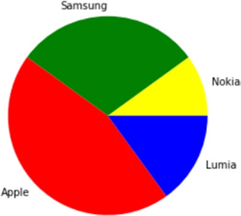
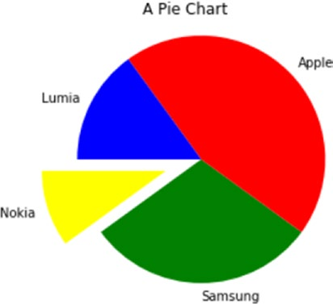
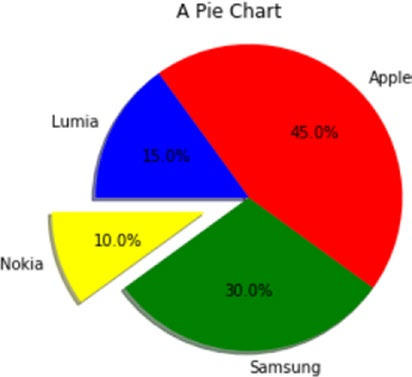
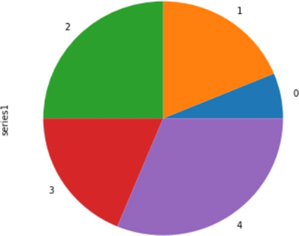

[*第7章：使用matplotlib进行数据可视化*](./README.md)


# 7.15. 饼图

将数据显示到条形图的另一种方法是饼图，使用pie()函数很容易获得。

即使对于这种类型的函数，您也要向主参数传递一个包含要显示的值的列表。我选择了百分比(它们的和是100)，但是您可以使用任何类型的值。应该由pie()函数内在地计算每个值所占的百分比。

同样，对于这种类型的表示，需要使用关键字参数定义一些关键特性。例如，如果您想定义颜色的序列，它将相应地分配给输入值的序列，那么您必须使用colors 关键字参数。因此，您必须分配一个字符串列表，每个字符串都包含所需颜色的名称。另一个重要的特性是向饼图的每个部分添加标签。要做到这一点，您必须使用标签关键字参数，您将为其分配一个字符串列表，其中包含按顺序显示的标签。

此外，为了以一种完美的球形方式绘制饼图，您必须在末尾添加axis()函数，指定字符串`equal`作为参数。您将得到如图7-47所示的饼图。

```python
In [ ]: import matplotlib.pyplot as plt
...: labels = ['Nokia','Samsung','Apple','Lumia']
...: values = [10,30,45,15]
...: colors = ['yellow','green','red','blue']
...: plt.pie(values,labels=labels,colors=colors)
...: plt.axis('equal')
```


>> 图7-47. 一个非常简单的饼图

为了增加饼图的复杂性，您可以使用从饼图中提取的切片来绘制它。这通常是在您想要关注一个特定的切片时完成的。例如，在本例中，您将突出显示涉及到诺基亚的部分。为了做到这一点，有一个特殊的关键字参数叫做爆炸式增长。它只是一个浮点值为0或1的序列，其中1对应于完全扩展的切片，0对应于饼图中完全的切片。所有中间值都对应于中等程度的提取(参见图7-48)。

您还可以使用title()函数向饼图添加标题。您还可以通过添加startangle 关键字参数来调整饼图的旋转角度，它取0到360之间的整数值，这是精确的旋转度(0是默认值)。

修改后的图表如图7-48所示。

```python
In [ ]: import matplotlib.pyplot as plt
...: labels = ['Nokia','Samsung','Apple','Lumia']
...: values = [10,30,45,15]
...: colors = ['yellow','green','red','blue']
...: explode = [0.3,0,0,0]
...: plt.title('A Pie Chart')
...:plt.pie(values,labels=labels,colors=colors,explode=explode, startangle=180)
...: plt.axis('equal')
```


>> 图7-48. 更高级的饼图

但是，您可以在饼图中插入的可能添加的内容并不在此结束。例如，饼图没有带有刻度的轴，因此很难想象每个片所代表的完美百分比。要克服这一点，可以使用autopct 关键字参数，它向每个切片的中心添加一个文本标签，显示相应的值。

如果你想让它成为一个更吸引人的图像，你可以添加一个阴影，阴影关键字参数设置为True。最后会得到一个饼图，如图7-49所示。

```python
In [ ]: import matplotlib.pyplot as plt
...: labels = ['Nokia','Samsung','Apple','Lumia']
...: values = [10,30,45,15]
...: colors = ['yellow','green','red','blue']
...: explode = [0.3,0,0,0]
...: plt.title('A Pie Chart')
...: plt.pie(values,labels=labels,colors=colors,explode=explode, shadow=True,autopct='%1.1f%%',startangle=180)
...: plt.axis('equal')
```


>> 图7-49。更高级的饼图

## pandas Datafram数据格式的饼图

即使对于饼图，您也可以表示dataframe对象中包含的值。然而，在本例中，饼图一次只能表示一个系列，因此在本例中，您将只显示指定df['series1']的第一个系列的值。您必须通过plot()函数中的类关键字参数指定要表示的图表类型，在本例中是pie。此外，因为您希望将饼图表示为完美的圆形，所以有必要添加figsize 关键字参数。最后，您将得到如图7-50所示的饼图。

```python
In [ ]: import matplotlib.pyplot as plt
...: import pandas as pd
...: data = {'series1':[1,3,4,3,5],
'series2':[2,4,5,2,4],
'series3':[3,2,3,1,3]}
...: df = pd.DataFrame(data)
...: df['series1'].plot(kind='pie',figsize=(6,6))
Out[14]: <matplotlib.axes._subplots.AxesSubplot at 0xe1ba710>
```


>> 图7-50.pandas数据中的值可以直接绘制成饼图。

