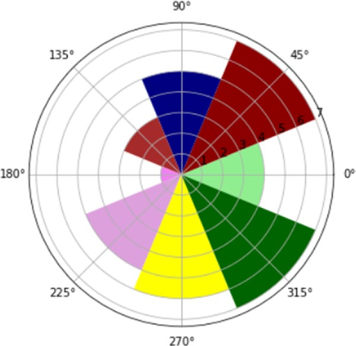

[*第7章：使用matplotlib进行数据可视化*](./README.md)


# 7.16. 高级图表

除了经典的图表(如柱状图或饼状图)之外，您可能还希望以另一种方式表示结果。在互联网上和各种出版物上都有许多例子，其中讨论和提出了许多可供选择的图形解决方案，其中一些非常出色和迷人。本节仅显示一些图形表示;关于这个话题的更详细的讨论超出了本书的目的。您可以使用本节介绍一个不断扩展的世界: 数据可视化。

## 等高线的绘制

在科学界，等高线图是一种很常见的图表类型。这种可视化实际上适用于通过由闭合曲线组成的等高线图来显示三维表面，这些曲线显示的是位于同一水平面上的点或具有相同z值的点。

虽然等高线图在视觉上是一个非常复杂的结构，但是由于matplotlib库，它的实现并不困难。首先，你需要函数z = f(x, y)来生成一个三维曲面。然后，一旦您定义了一个值范围x, y，它将定义要显示的映射的面积，您可以计算每对(x, y)的z值，应用刚刚定义的函数f(x, y)来获得一个z值矩阵。最后，借助contour()函数，您可以生成该曲面的等高线映射。通常需要在等高线映射的基础上添加彩色映射。也就是说，由水平曲线划分的区域由颜色渐变填充，颜色渐变由颜色映射定义。例如，如图7-51所示，你可以用越来越深的蓝色来表示负值，然后随着正值的增加，你可以用黄色来表示，然后用红色来表示。

```python
In [ ]: import matplotlib.pyplot as plt
   ...: import numpy as np
   ...: dx = 0.01; dy = 0.01
   ...: x = np.arange(-2.0,2.0,dx)
   ...: y = np.arange(-2.0,2.0,dy)
   ...: X,Y = np.meshgrid(x,y)
   ...: def f(x,y):
           return (1 - y**5 + x**5)*np.exp(-x**2-y**2)
 ...: C = plt.contour(X,Y,f(X,Y),8,colors='black')
   ...: plt.contourf(X,Y,f(X,Y),8)
   ...: plt.clabel(C, inline=1, fontsize=10)
```


>> 图7-51.等高线图可以描述曲面的z值。

标准颜色梯度(颜色图)如图7-51所示。实际上，您可以通过cmap 关键字参数指定大量可用的彩色映射。

此外，当您必须处理这种表示时，添加一个颜色刻度作为对图边的引用几乎是必须的。这可以通过在代码末尾添加colorbar()函数来实现。在图7-52中，您可以看到颜色映射的另一个示例，它从黑色开始，穿过红色，然后变成黄色，直到达到白色的最大值。这张彩色映射很流行。

```python
In [ ]: import matplotlib.pyplot as plt
...: import numpy as np
...: dx = 0.01; dy = 0.01
...: x = np.arange(-2.0,2.0,dx)
...: y = np.arange(-2.0,2.0,dy)
...: X,Y = np.meshgrid(x,y)
...: def f(x,y):
return (1 - y**5 + x**5)*np.exp(-x**2-y**2)
...: C = plt.contour(X,Y,f(X,Y),8,colors='black')
...: plt.contourf(X,Y,f(X,Y),8,cmap=plt.cm.hot)
...: plt.clabel(C, inline=1, fontsize=10)
...: plt.colorbar()
```


>> 图7-52.`热`彩色映射梯度给出了一个吸引人的外观等高线映射。

## 极坐标图

另一种流行的高级图表是极坐标图。这种类型的图表的特点是一系列的扇形扩展;每一个区域都会占据一定的角度。因此你可以显示两个不同的值分配他们描述极图的大小:半径r和θ角的扩展的领域。这些实际上是极坐标(r,θ),另一个坐标轴代表函数的方式。从图形的角度来看，你可以把它想象成一种具有饼图和条形图特征的图表。事实上，正如饼图，每个部门的角度给出了该类别相对于总数的百分比信息。对于柱状图，径向扩展是该类别的数值。

到目前为止，我们已经使用了使用单个字符作为颜色代码的标准颜色集(例如，r表示红色)。事实上，你可以使用任何你想要的颜色序列。您必须定义一个字符串值列表，其中包含与您想要的颜色相对应的#rrggbb格式的RGB代码。

奇怪的是，要获得极坐标图，必须使用bar()函数，并传递包含角度θ和每个扇区径向扩展的列表。结果将是一个极坐标图，如图7-53所示.

```python
In [ ]: import matplotlib.pyplot as plt
...: import numpy as np
...: N = 8
...: theta = np.arange(0.,2 * np.pi, 2 * np.pi / N)
...: radii = np.array([4,7,5,3,1,5,6,7])
...: plt.axes([0.025, 0.025, 0.95, 0.95], polar=True)
...: colors = np.array(['#4bb2c5', '#c5b47f', '#EAA228', '#579575', '#839557', '#958c12', '#953579', '#4b5de4'])
...: bars = plt.bar(theta, radii, width=(2*np.pi/N), bottom=0.0, color=colors)
```


>> 图7-53。极坐标图

在本例中，您已经使用格式#rrggbb定义了颜色序列，但是您也可以使用它们的实际名称将颜色序列指定为字符串(参见图7-54)。

```python
In [ ]: import matplotlib.pyplot as plt
...: import numpy as np
...: N = 8
...: theta = np.arange(0.,2 * np.pi, 2 * np.pi / N)
...: radii = np.array([4,7,5,3,1,5,6,7])
...: plt.axes([0.025, 0.025, 0.95, 0.95], polar=True)
...: colors = np.array(['lightgreen', 'darkred', 'navy', 'brown', 'violet', 'plum', 'yellow', 'darkgreen'])
...: bars = plt.bar(theta, radii, width=(2*np.pi/N), bottom=0.0, color=colors)
```


>> 图7-54。另一组颜色的极坐标图

