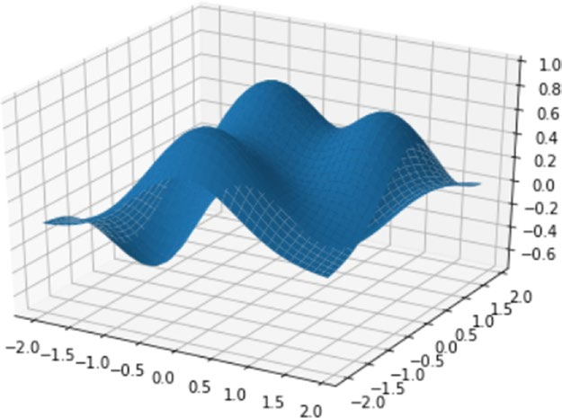
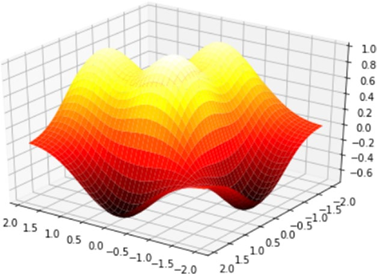
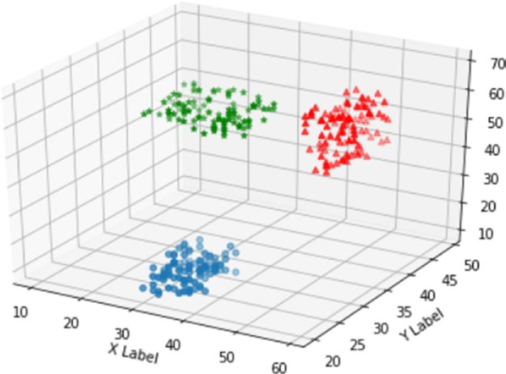
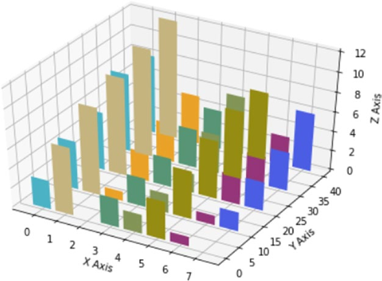

[*第7章：使用matplotlib进行数据可视化*](./README.md)


# 7.17. mplot3d工具包

mplot3d工具包包含在matplotlib的所有标准安装中，并允许您将可视化功能扩展到3D数据。如果图形显示在单独的窗口中，则可以使用鼠标旋转三维表示的轴。

在这个包中，您仍然使用Figure对象，只是您将定义一种新的对象，称为Axes3D，而不是Axes对象，并由这个工具包导入。

因此，如果您想使用Axes3D对象，您需要向代码添加一个新的导入。从mpl_toolkits.mplot3d import Axes3D

## 三维曲面

在前一节中，您使用等高线图通过水平线表示三维表面。使用mplot3D包，可以直接在3D中绘制表面。在本例中，您将使用与等值线图中使用的相同的函数z = f(x, y)。

计算完网格网格之后，可以使用plot_ surface()函数查看表面。会出现一个三维的蓝色表面，如图7-55所示。

```python
In [ ]: from mpl_toolkits.mplot3d import Axes3D
   ...: import matplotlib.pyplot as plt
   ...: fig = plt.figure()
   ...: ax = Axes3D(fig)
   ...: X = np.arange(-2,2,0.1)
   ...: Y = np.arange(-2,2,0.1)
   ...: X,Y = np.meshgrid(X,Y)
   ...: def f(x,y):
   ...:    return (1 - y**5 + x**5)*np.exp(-x**2-y**2)
   ...: ax.plot_surface(X,Y,f(X,Y), rstride=1, cstride=1)
```



>> 图7-55.三维曲面可以用mplot3d工具包表示。

通过改变颜色映射，例如通过设置cmap kwarg, 3D曲面会突出显示。还可以使用view_init()函数旋转表面。事实上，这个函数调整了你所看到的表面的视点，改变了被称为elev和azim的两个关键字参数。通过他们的组合，你可以从任何角度得到表面显示。第一个关键字参数调整表面的高度，而azim调整表面的旋转角度。

例如，您可以使用plt.cm更改颜色映射。热和移动视点到列夫=30和azim=125。结果如图7-56所示。

```python
In [ ]: from mpl_toolkits.mplot3d import Axes3D
   ...: import matplotlib.pyplot as plt
   ...: fig = plt.figure()
   ...: ax = Axes3D(fig)
   ...: X = np.arange(-2,2,0.1)
   ...: Y = np.arange(-2,2,0.1)
   ...: X,Y = np.meshgrid(X,Y)
   ...: def f(x,y):
    return (1 - y**5 + x**5)*np.exp(-x**2-y**2)
   ...: ax.plot_surface(X,Y,f(X,Y), rstride=1, cstride=1, cmap=plt.cm.hot)
   ...: ax.view_init(elev=30,azim=125)
```


>> 图7-56.三维表面可以从更高的角度旋转和观察。

## 三维散点图

所有3D视图中最常用的模式仍然是3D散点图。使用这种类型的可视化，您可以确定这些点是否遵循特定的趋势，但最重要的是它们是否趋向于集群。

在本例中，您将使用scatter()函数作为2D用例，但应用于Axes3D对象。通过这样做，您可以可视化不同的系列，通过对scatter()函数的调用来表示，它们都以相同的3D表示(参见图7-57)。

```python
In [ ]: import matplotlib.pyplot as plt
...: import numpy as np
...: from mpl_toolkits.mplot3d import Axes3D
...: xs = np.random.randint(30,40,100)
...: ys = np.random.randint(20,30,100)
...: zs = np.random.randint(10,20,100)
...: xs2 = np.random.randint(50,60,100)
...: ys2 = np.random.randint(30,40,100)
...: zs2 = np.random.randint(50,70,100)
...: xs3 = np.random.randint(10,30,100)
...: ys3 = np.random.randint(40,50,100)
...: zs3 = np.random.randint(40,50,100)
...: fig = plt.figure()
...: ax = Axes3D(fig)
...: ax.scatter(xs,ys,zs)
...: ax.scatter(xs2,ys2,zs2,c='r',marker='^')
...: ax.scatter(xs3,ys3,zs3,c='g',marker='*')
...: ax.set_xlabel('X Label')
...: ax.set_ylabel('Y Label')
...: ax.set_zlabel('Z Label')
Out[34]: <matplotlib.text.Text at 0xe1c2438>
```


>> 图7-57.这个三维散点图显示了三个不同的星系团。


## 三维条形图

另一种广泛用于数据分析的三维图形是三维条形图。在本例中，还使用了应用于Axes3D对象的bar()函数。如果定义了多个系列，就可以在同一个3D可视化中积累对bar()函数的几次调用(参见图7-58)。

```python
In [ ]: import matplotlib.pyplot as plt
...: import numpy as np
...: from mpl_toolkits.mplot3d import Axes3D
...: x = np.arange(8)
...: y = np.random.randint(0,10,8)
...: y2 = y + np.random.randint(0,3,8)
...: y3 = y2 + np.random.randint(0,3,8)
...: y4 = y3 + np.random.randint(0,3,8)
...: y5 = y4 + np.random.randint(0,3,8)
...: clr = ['#4bb2c5', '#c5b47f', '#EAA228', '#579575', '#839557', '#958c12', '#953579', '#4b5de4']
...: fig = plt.figure()
...: ax = Axes3D(fig)
...: ax.bar(x,y,0,zdir='y',color=clr)
...: ax.bar(x,y2,10,zdir='y',color=clr)
...: ax.bar(x,y3,20,zdir='y',color=clr)
...: ax.bar(x,y4,30,zdir='y',color=clr)
...: ax.bar(x,y5,40,zdir='y',color=clr)
...: ax.set_xlabel('X Axis')
...: ax.set_ylabel('Y Axis')
...: ax.set_zlabel('Z Axis')
...: ax.view_init(elev=40)
```


>> 图7-58。三维条形图

