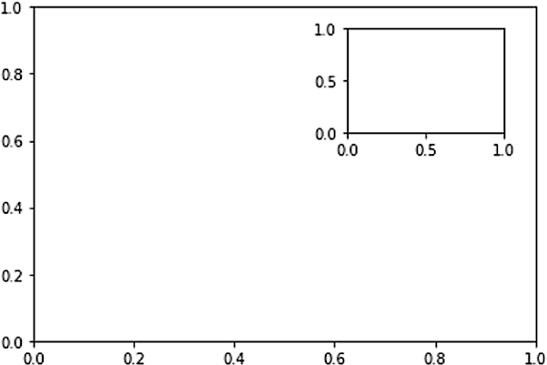
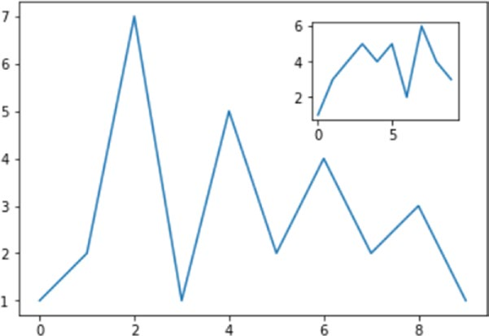
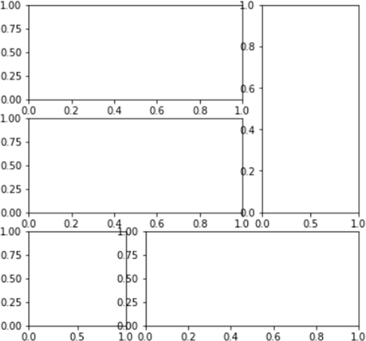
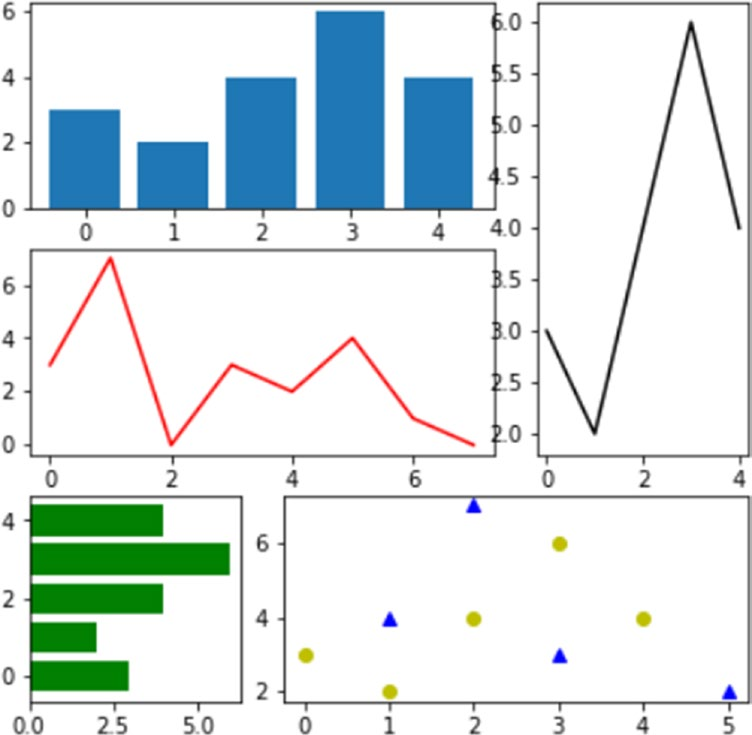

[*第7章：使用matplotlib进行数据可视化*](./README.md)


# 7.18. 多面板图

到目前为止，您已经有机会看到通过图表表示数据的不同方法。你看到了如何在同一个图形中看到更多的图表，方法是用子图将它们分开。在本节中，您将通过分析更复杂的案例来加深对本主题的理解。

## 在其他子图中显示子图

现在，我们将解释一种更高级的方法：在其他的框架中查看图表的能力。由于我们讨论的是框架，即Axes对象，您需要将主Axes(即一般图表)与要添加的框架分离，这将是Axes的另一个实例。要做到这一点，您可以使用figures()函数来获取图对象，在该对象上使用add_axes()函数定义两个不同的Axis对象。参见图7-59中这个示例的结果。

```python
In [ ]: import matplotlib.pyplot as plt
...: fig = plt.figure()
...: ax = fig.add_axes([0.1,0.1,0.8,0.8])
...: inner_ax = fig.add_axes([0.6,0.6,0.25,0.25])
```


>> 图7-59。一个子图显示在另一个图中。

为了更好地理解这种显示模式的效果，可以用实际数据填充前面的轴，如图7-60所示。

```python
In [ ]: import matplotlib.pyplot as plt
...: import numpy as np
...: fig = plt.figure()
...: ax = fig.add_axes([0.1,0.1,0.8,0.8])
...: inner_ax = fig.add_axes([0.6,0.6,0.25,0.25])
...: x1 = np.arange(10)
...: y1 = np.array([1,2,7,1,5,2,4,2,3,1])
...: x2 = np.arange(10)
...: y2 = np.array([1,3,4,5,4,5,2,6,4,3])
...: ax.plot(x1,y1)
...: inner_ax.plot(x2,y2)
Out[95]: [<matplotlib.lines.Line2D at 0x14acf6d8>]
```


>> 图7-60.更真实地显示另一个图表中的子图

## 子图网格

你已经看到了如何生成子图。使用subplots()函数并将一个图划分成扇区，添加子图非常简单。matplotlib允许您使用另一个名为GridSpec()的函数来管理更复杂的案例。这个细分允许将绘图区域划分为一个子区域网格，您可以将其中一个或多个子区域分配到每个子图中，这样最终您可以获得大小和方向不同的子图，如图7-61所示。

```python
In [ ]: import matplotlib.pyplot as plt
...: gs = plt.GridSpec(3,3)
...: fig = plt.figure(figsize=(6,6))
...: fig.add_subplot(gs[1,:2])
...: fig.add_subplot(gs[0,:2])
...: fig.add_subplot(gs[2,0])
...: fig.add_subplot(gs[:2,2])
...: fig.add_subplot(gs[2,1:])
Out[97]: <matplotlib.axes._subplots.AxesSubplot at 0x12717438>
```


>> 图7-61.不同大小的子图可以定义在子区域的网格上。

现在，您已经清楚了如何通过将各个扇区分配给子图来管理网格，现在是时候看看如何使用这些子图了。实际上，您可以使用每个add_subplot()函数返回的Axes对象来调用plot()函数来绘制相应的plot(参见图7-62)。

```python
In [ ]: import matplotlib.pyplot as plt
...: import numpy as np
...: gs = plt.GridSpec(3,3)
...: fig = plt.figure(figsize=(6,6))
...: x1 = np.array([1,3,2,5])
...: y1 = np.array([4,3,7,2])
...: x2 = np.arange(5)
...: y2 = np.array([3,2,4,6,4])
...: s1 = fig.add_subplot(gs[1,:2])
...: s1.plot(x,y,'r')
...: s2 = fig.add_subplot(gs[0,:2])
...: s2.bar(x2,y2)
...: s3 = fig.add_subplot(gs[2,0])
...: s3.barh(x2,y2,color='g')
...: s4 = fig.add_subplot(gs[:2,2])
...: s4.plot(x2,y2,'k')
...: s5 = fig.add_subplot(gs[2,1:])
...: s5.plot(x1,y1,'b^',x2,y2,'yo')
```


>> 图7-62。一个子图网格可以同时显示多个图。


