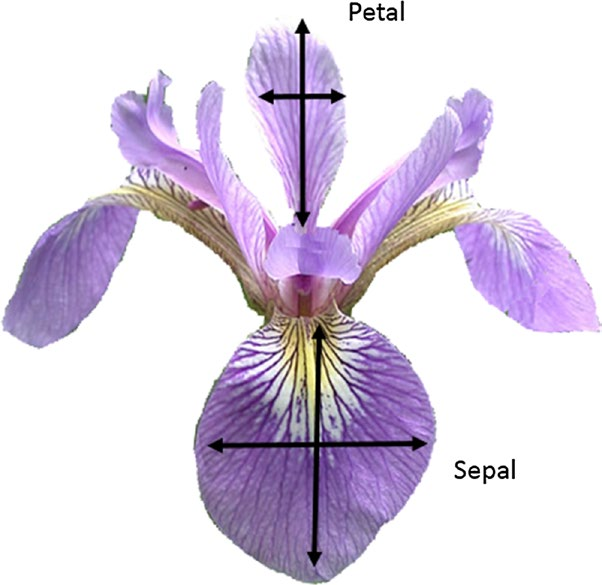
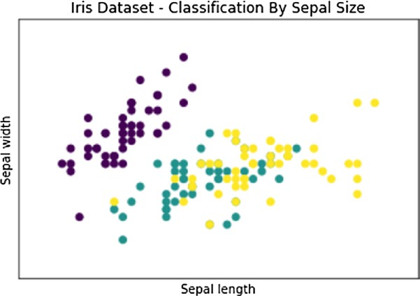
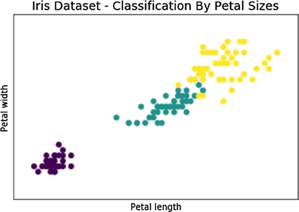
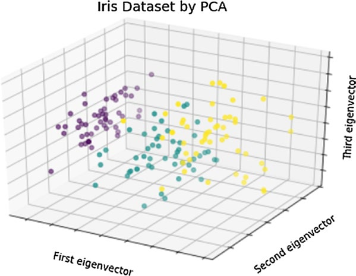

# 第8章：机器学习与科学工具包scikit-learn


# 8.4. 鸢尾花数据集

Iris Flower数据集是Ronald Fisher爵士在1936年首次使用的数据集。这通常也被称为安德森鸢尾数据集，以直接测量鸢尾花各个部分大小的人命名。在这个数据集中，收集了三种不同种类的鸢尾(丝鸢尾、弗吉尼亚鸢尾和蝴蝶花)的数据，这些数据对应于萼片的长度和宽度以及花瓣的长度和宽度(见图8-1)。


>> 图8-1. 蝴蝶花和花瓣及萼片的宽度和长度

这个数据集目前正被用作许多类型分析的好例子，特别是分类问题，可以通过机器学习方法来解决。这个数据集作为一个150x4 NumPy数组与scikit-learn库一起提供，这并不是巧合。

现在，将详细研究这个数据集，在IPythonQtConsole或普通Python会话中导入它。


```python
In [ ]: from sklearn import datasets
...: iris = datasets.load_iris()
```

通过这种方式，您可以加载Iris变量中有关Iris数据集的所有数据和元数据。为了查看在其中收集的数据的值，调用变量iris的data属性就足够了。

```python
In [ ]: iris.data 
Out[ ]:
    array([[ 5.1, 3.5, 1.4, 0.2],
        [ 4.9, 3. , 1.4, 0.2], 
        [ 4.7, 3.2, 1.3, 0.2],
        [ 4.6, 3.1, 1.5, 0.2],
...

```

如您所见，您将得到一个由150个元素组成的数组，每个元素包含四个数值：分别是萼片和花瓣的大小。

要知道每一件物品属于哪种花，可以参考target属性。

```python
In [ ]: iris.target 
Out[ ]:
    array([0, 0, 0, 0, 0, 0, 0, 0, 0, 0, 0, 0, 0, 0, 0, 0, 0, 0, 0, 0, 0, 0, 0, 0, 0, 0, 0, 0, 0, 0, 0, 0, 0, 0, 0, 0, 0, 0, 0, 0, 0, 0, 0, 0, 0, 0, 0, 0, 0, 0, 1, 1, 1, 1, 1, 1, 1, 1, 1, 1, 1, 1, 1, 1, 1, 1, 1, 1, 1, 1, 1, 1, 1, 1, 1, 1, 1, 1, 1, 1, 1, 1, 1, 1, 1, 1, 1, 1, 1, 1, 1, 1, 1, 1, 1, 1, 1, 1, 1, 1, 2, 2, 2, 2, 2, 2, 2, 2, 2, 2, 2, 2, 2, 2, 2, 2, 2, 2, 2, 2, 2, 2, 2, 2, 2, 2, 2, 2, 2, 2, 2, 2, 2, 2, 2, 2, 2, 2, 2, 2, 2, 2, 2, 2, 2, 2, 2, 2, 2, 2])
    
```

您将获得150个条目，其中包含三个可能的整数值(0、1和2)，它们对应于三种鸢尾。要知道物种和数字之间的对应关系，必须调用target_names属性。

```python
In [ ]: iris.target_names 
Out[ ]:
    array(['setosa', 'versicolor', 'virginica'], dtype='|S10')
```

为了更好地理解这个数据集，您可以使用matplotlib库，使用您在第7章学到的技术。因此，创建一个散点图，以三种不同的颜色显示这三种不同的物种。x轴代表萼片的长度，y轴代表萼片的宽度。

```python
In [ ]: import matplotlib.pyplot as plt
...: import matplotlib.patches as mpatches
...: from sklearn import datasets
...:
...: iris = datasets.load_iris()
...: x = iris.data[:,0]	#X-Axis - sepal length
...: y = iris.data[:,1]	#Y-Axis - sepal length
...: species = iris.target	#Species
...:
...: x_min, x_max = x.min() - .5,x.max() + .5
...: y_min, y_max = y.min() - .5,y.max() + .5
...:
...: #SCATTERPLOT
...: plt.figure()
...: plt.title('Iris Dataset - Classification By Sepal Sizes')
...: plt.scatter(x,y, c=species)
...: plt.xlabel('Sepal length')
...: plt.ylabel('Sepal width')
...: plt.xlim(x_min, x_max)
...: plt.ylim(y_min, y_max)
...: plt.xticks(())
...: plt.yticks(())
...: plt.show()
```

因此，您将得到如图8-2所示的散点图。蓝色的是鸢尾花，绿色的是蝴蝶花，红色的是弗吉尼亚鸢尾。

从图8-2可以看出，鸢尾花的特征与其他两种不同，形成了一簇与其他两种不同的蓝点。


>> 图8-2. 不同种类的鸢尾花以不同的颜色显示。

试着遵循同样的程序，但是这次使用另外两个变量，那就是花瓣的长度和宽度。您可以使用相同的代码，只更改一些值。

```python
In [ ]: import matplotlib.pyplot as plt
...: import matplotlib.patches as mpatches
...: from sklearn import datasets
...:
...: iris = datasets.load_iris()
...:  x = iris.data[:,2]	#X-Axis - petal length
...:  y = iris.data[:,3]	#Y-Axis - petal length
...: species = iris.target	#Species
...:
...: x_min, x_max = x.min() - .5,x.max() + .5
...: y_min, y_max = y.min() - .5,y.max() + .5
...: #SCATTERPLOT
...: plt.figure()
...: plt.title('Iris Dataset - Classification By Petal Sizes', size=14)
...: plt.scatter(x,y, c=species)
...: plt.xlabel('Petal length')
...: plt.ylabel('Petal width')
...: plt.xlim(x_min, x_max)
...: plt.ylim(y_min, y_max)
...: plt.xticks(())
...: plt.yticks(())
```

结果是散点图，如图8-3所示。在这种情况下，这三个物种之间的划分更加明显。可以看到，有三个不同的簇。


>> 图8-3.不同种类的鸢尾以不同的颜色显示。


## PCA分解

考虑到花瓣和萼片大小的四种测量值，你已经看到了这三个物种的特征。我们表示了两个散点，一个是花瓣，一个是萼片，但如何才能将整个事物统一起来呢? 四维是一个3D散点图无法解决的问题。

在这方面，一种称为主成分分析(PCA)的特殊技术。这种技术允许您降低系统的维数，以保存用于描述各个点的所有信息，生成的新维称为主分量。在我们的例子中，您可以将系统从4维缩小到3维，然后在3D散点图中绘制结果。这样，您就可以使用萼片和花瓣的度量来描述数据集中测试元素的不同种类的鸢尾。

允许进行维度缩减的scikit-learn函数是fit_transform()函数。它属于PCA对象。为了使用它，首先需要导入PCA sklearn.decomposition模块。然后，必须使用PCA()定义对象构造函数，并将新维度(主组件)的数量定义为n_components选项的值。在你的例子中，是3。最后，通过将四维Iris数据集作为参数传递来调用fit_transform()函数。

```python
from sklearn.decomposition import PCA
x_reduced = PCA(n_components=3).fit_transform(iris.data)
```

此外，为了可视化新的值，您将使用mpl_toolkit使用3D散点图。matplotlib的mplot3d模块。如果你不记得怎么做，请看第7章的散点图3D部分。

```python
import matplotlib.pyplot as plt
from mpl_toolkits.mplot3d import Axes3D 
from sklearn import datasets
from sklearn.decomposition import PCA

iris = datasets.load_iris() 
species = iris.target	#Species
x_reduced = PCA(n_components=3).fit_transform(iris.data) 

#SCATTERPLOT 3D
fig = plt.figure() 
ax = Axes3D(fig)
ax.set_title('Iris Dataset by PCA', size=14) 
ax.scatter(x_reduced[:,0],x_reduced[:,1],x_reduced[:,2], c=species) 
ax.set_xlabel('First eigenvector')
ax.set_ylabel('Second eigenvector') 
ax.set_zlabel('Third eigenvector')
ax.w_xaxis.set_ticklabels(()) 
ax.w_yaxis.set_ticklabels(()) 
ax.w_zaxis.set_ticklabels(())
```

结果将是如图8-4所示的散点图。这三种鸢尾彼此间具有很好的特征，形成一个簇。


>> 图8-4. 三簇代表每种鸢尾的三维散点图

