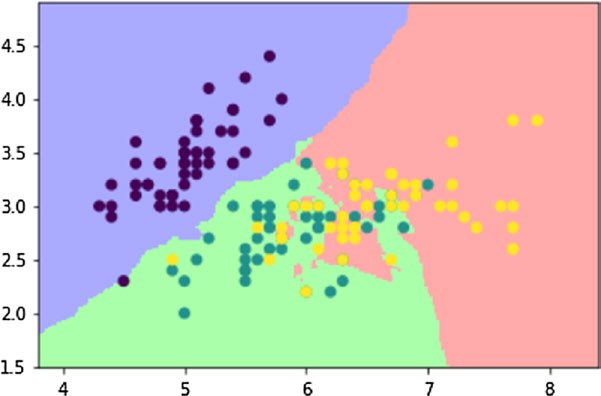
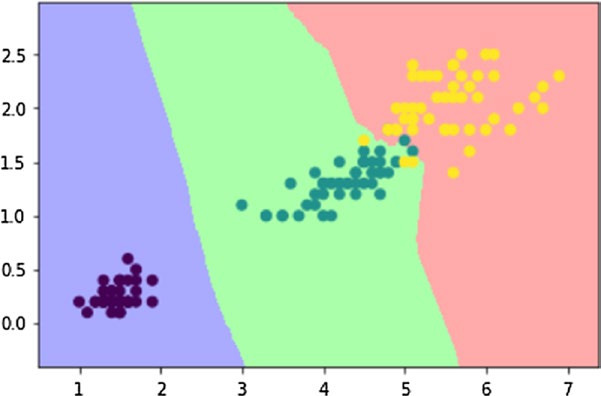

# 第8章：机器学习与科学工具包scikit-learn


# 8.5. K-近邻分类器

现在，您将执行一个分类，要使用scikit-learn库执行此操作，您需要一个分类器。

给鸢尾花一种新的测量方法，分类器的任务是找出它属于哪一种。最简单的分类器是k-近邻分类器。该算法将在训练集中搜索最接近新测试样本的观察结果。

在这一点上需要考虑的一件非常重要的事情是训练集和测试集的概念(已经在第1章中看到了)。为此，将数据集的元素分为两部分，一部分用于训练算法，另一部分用于验证算法。

因此，在进一步进行之前，您必须将鸢尾数据集分成两部分。然而，明智的做法是随机混合数组元素，然后进行除法。事实上，数据通常是按照特定的顺序收集的，在您的例子中，Iris数据集包含按物种排序的项。因此，为了混合数据集的元素，您将使用一个称为random.permutation()的NumPy函数。混合数据集由150个不同的观测数据组成;前140个将作为训练集，其余10个作为测试集。

```python
import numpy as np
from sklearn import datasets
np.random.seed(0)
iris = datasets.load_iris()
x = iris.data
y = iris.target
i = np.random.permutation(len(iris.data))
x_train = x[i[:-10]]
y_train = y[i[:-10]]
x_test = x[i[-10:]]
y_test = y[i[-10:]]
```

现在你可以应用k近邻算法。导入KNeighborsClassifier，调用分类器的构造函数，然后用fit()函数对其进行训练。
```python
from sklearn.neighbors import KNeighborsClassifier
knn = KNeighborsClassifier()
knn.fit(x_train,y_train)
Out[86]:
KNeighborsClassifier(algorithm='auto', leaf_size=30, metric='minkowski',
           metric_params=None, n_neighbors=5, p=2, weights='uniform')
```

现在你有了一个由knn分类器组成的预测模型，通过140次观察训练，你会发现它是如何有效的。分类器应正确预测测试集10个观测值的鸢尾种类。为了获得预测，必须使用predict()函数，该函数将直接应用于预测模型knn。最后，将预测的结果与y_test中实际观察到的结果进行比较。

```python
knn.predict(x_test)
Out[100]: array([1, 2, 1, 0, 0, 0, 2, 1, 2, 0])
y_test
Out[101]: array([1, 1, 1, 0, 0, 0, 2, 1, 2, 0])
```

你可以看到你得到了10%的误差。现在，您可以在由萼片的2D散点图表示的空间中使用决策边界来可视化所有这些。

```python
import numpy as np
import matplotlib.pyplot as plt
from matplotlib.colors import ListedColormap
from sklearn import datasets
from sklearn.neighbors import KNeighborsClassifier

iris = datasets.load_iris()
x = iris.data[:,:2]      #X-Axis - sepal length-width
y = iris.target          #Y-Axis - species
x_min, x_max = x[:,0].min() - .5,x[:,0].max() + .5
y_min, y_max = x[:,1].min() - .5,x[:,1].max() + .5
#MESH
cmap_light = ListedColormap(['#AAAAFF','#AAFFAA','#FFAAAA'])
h = .02
xx, yy = np.meshgrid(np.arange(x_min, x_max, h), np.arange(y_min, y_max, h))
knn = KNeighborsClassifier()
knn.fit(x,y)
Z = knn.predict(np.c_[xx.ravel(),yy.ravel()])
Z = Z.reshape(xx.shape)
plt.figure()
plt.pcolormesh(xx,yy,Z,cmap=cmap_light)
#Plot the training points
plt.scatter(x[:,0],x[:,1],c=y)
plt.xlim(xx.min(),xx.max())
plt.ylim(yy.min(),yy.max())
Out[120]: (1.5, 4.900000000000003)

```
你会得到一个细分的决策边界的散点图,如图8-5。



>> 图8-5.这三个决策边界由三种不同的颜色表示。

你也可以考虑花瓣的大小。

```python
import numpy as np
import matplotlib.pyplot as plt
from matplotlib.colors import ListedColormap
from sklearn import datasets
from sklearn.neighbors import KNeighborsClassifier
iris = datasets.load_iris()
x = iris.data[:,2:4]      #X-Axis - petals length-width
y = iris.target           #Y-Axis - species
x_min, x_max = x[:,0].min() - .5,x[:,0].max() + .5
y_min, y_max = x[:,1].min() - .5,x[:,1].max() + .5
#MESH
cmap_light = ListedColormap(['#AAAAFF','#AAFFAA','#FFAAAA'])
h = .02
xx, yy = np.meshgrid(np.arange(x_min, x_max, h), np.arange(y_min, y_max, h))
knn = KNeighborsClassifier()
knn.fit(x,y)
Z = knn.predict(np.c_[xx.ravel(),yy.ravel()])
Z = Z.reshape(xx.shape)
plt.figure()
plt.pcolormesh(xx,yy,Z,cmap=cmap_light)
#Plot the training points
plt.scatter(x[:,0],x[:,1],c=y)
plt.xlim(xx.min(),xx.max())
plt.ylim(yy.min(),yy.max())
Out[126]: (-0.40000000000000002, 2.9800000000000031)
```

如图8-6所示，考虑到花瓣的大小，对于鸢尾花的特征，将有相应的决策边界。



>> 图8-6。描述花瓣大小的二维散点图的决策边界


