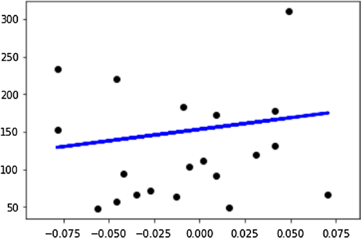
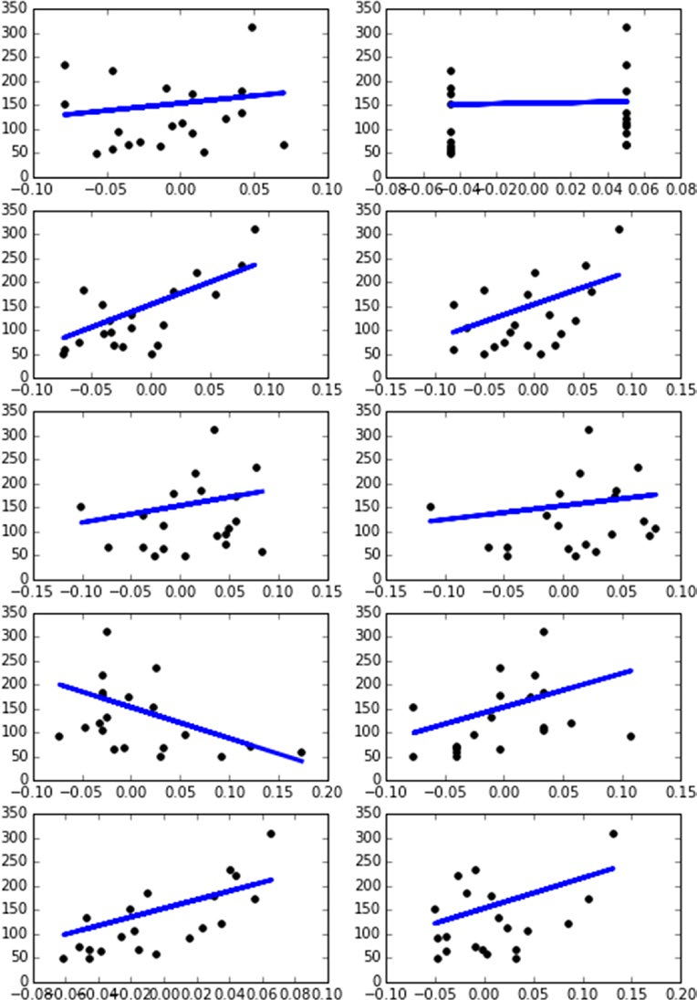

# 第8章：机器学习与科学工具包scikit-learn


# 8.7. 线性回归: 最小二乘回归


线性回归是利用训练集中包含的数据建立线性模型的过程。最简单的方法是用两个参数a和b的矩形方程来表示它。将计算这些参数，以便使残差的平方之和尽可能小。
```python
y = a*x + c
```

式中，x为训练集，y为目标，b为斜率，c为模型所表示的矩形的截距。在scikit-learn中，要使用线性回归的预测模型，必须导入linear_model模块，然后使用manufacturer LinearRegression()构造函数来创建预测模型，我们将其称为linreg。

```python
from sklearn import linear_model
linreg = linear_model.LinearRegression()
```

要使用线性回归示例进行实践，可以使用前面描述的糖尿病数据集。首先，您需要将442名患者分为训练组(由前422名患者组成)和测试组(最后20名患者)。

```python
from sklearn import datasets
diabetes = datasets.load_diabetes()
x_train = diabetes.data[:-20]
y_train = diabetes.target[:-20]
x_test = diabetes.data[-20:]
y_test = diabetes.target[-20:]
```

现在，通过使用fit()函数将训练集应用于预测模型。

```python
linreg.fit(x_train,y_train)
Out[ ]: LinearRegression(copy_X=True, fit_intercept=True, normalize=False)
Once the model is trained you can get the 10 b coefficients calculated for each
physiological variable, using the coef_ attribute of the predictive model.
linreg.coef_
Out[164]:
array([  3.03499549e-01,  -2.37639315e+02,   5.10530605e+02,
         3.27736980e+02,  -8.14131709e+02,   4.92814588e+02,
         1.02848452e+02,   1.84606489e+02,   7.43519617e+02,
         7.60951722e+01])
```

如果您将测试集应用到linreg预测模型中，您将得到一系列目标，并与实际观察到的值进行比较。

```python
linreg.predict(x_test)
Out[ ]:
array([ 197.61846908,  155.43979328,  172.88665147,  111.53537279,
        164.80054784,  131.06954875,  259.12237761,  100.47935157,
        117.0601052 ,  124.30503555,  218.36632793,   61.19831284,
        132.25046751,  120.3332925 ,   52.54458691,  194.03798088,
        102.57139702,  123.56604987,  211.0346317 ,   52.60335674])
y_test
Out[ ]:
array([ 233.,   91.,  111.,  152.,  120.,   67.,  310.,   94.,  183.,
         66.,  173.,   72.,   49.,   64.,   48.,  178.,  104.,  132.,
        220.,   57.])

```
然而，什么预测是完美的一个很好的指标是方差。方差越接近1，预测越完美。

```python
linreg.score(x_test, y_test)
Out[ ]: 0.58507530226905713
Now you will start with the linear regression, taking into account a single
physiological factor, for example, you can start from age.
import numpy as np
import matplotlib.pyplot as plt
from sklearn import linear_model
from sklearn import datasets
diabetes = datasets.load_diabetes()
x_train = diabetes.data[:-20]
y_train = diabetes.target[:-20]
x_test = diabetes.data[-20:]
y_test = diabetes.target[-20:]
x0_test = x_test[:,0]
x0_train = x_train[:,0]
x0_test = x0_test[:,np.newaxis]
x0_train = x0_train[:,np.newaxis]
linreg = linear_model.LinearRegression()
linreg.fit(x0_train,y_train)
y = linreg.predict(x0_test)
plt.scatter(x0_test,y_test,color='k')
plt.plot(x0_test,y,color='b',linewidth=3)
Out[230]: [<matplotlib.lines.Line2D at 0x380b1908>]
```

图8-7所示蓝色线表示患者年龄与病情进展的线性关系。


>> 图8-7.线性回归表示特征与目标之间的线性相关性。

实际上，在糖尿病数据集中有10个生理因素。因此，为了对所有训练集有一个更完整的了解，您可以对每个生理特征进行线性回归，创建10个模型，并通过线性图表看到每个模型的结果。

```python
import numpy as np
import matplotlib.pyplot as plt
from sklearn import linear_model
from sklearn import datasets
diabetes = datasets.load_diabetes()
x_train = diabetes.data[:-20]
y_train = diabetes.target[:-20]
x_test = diabetes.data[-20:]
y_test = diabetes.target[-20:]
plt.figure(figsize=(8,12))
for f in range(0,10):
   xi_test = x_test[:,f]
   xi_train = x_train[:,f]
   xi_test = xi_test[:,np.newaxis]
   
xi_train = xi_train[:,np.newaxis]
linreg.fit(xi_train,y_train)
y = linreg.predict(xi_test)
plt.subplot(5,2,f+1)
plt.scatter(xi_test,y_test,color='k')
plt.plot(xi_test,y,color='b',linewidth=3)
```

图8-8显示了10个线性图，每个图都表示生理因素与糖尿病进展之间的关系。


>> 图8-8.10个线性图表显示生理因素与糖尿病进展的相关性


