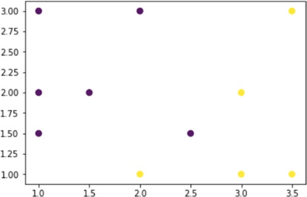
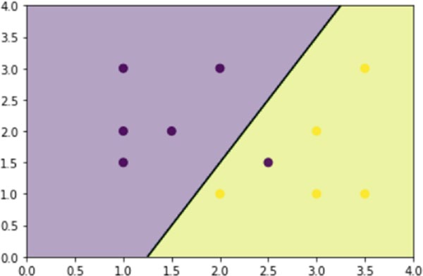
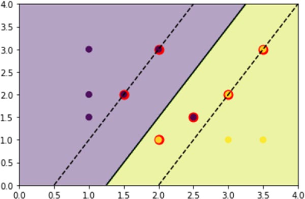
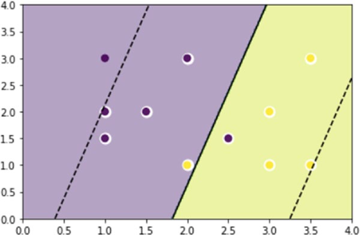
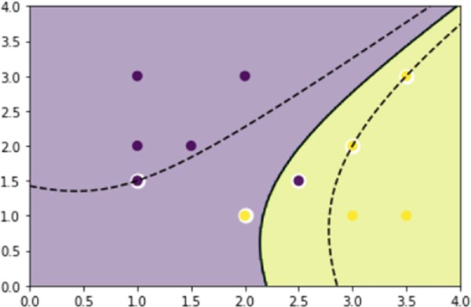
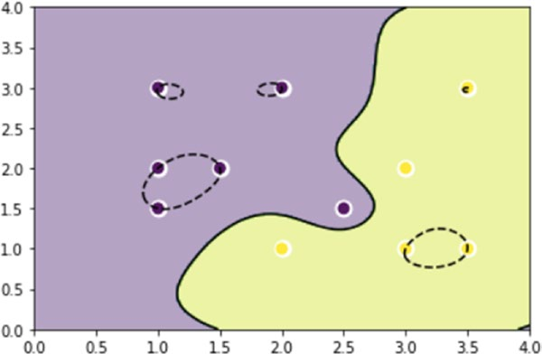
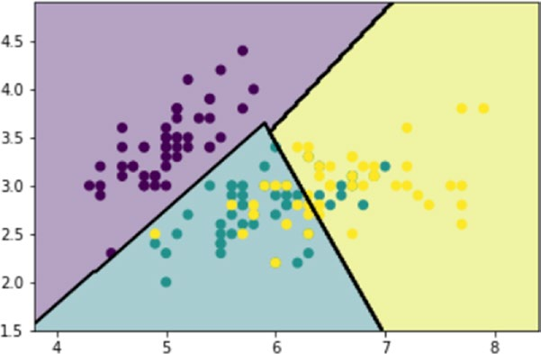
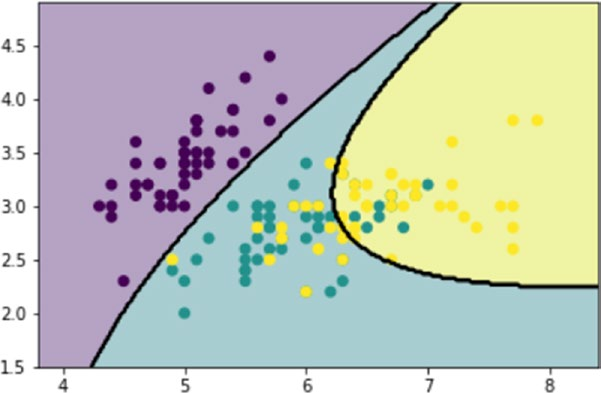

# 第8章：机器学习与科学工具包scikit-learn


# 8.8. 支持向量机(SVMs)

支持向量机是一种机器学习技术，最早是由美国电话电报公司的Vapnik和他的同事在90年代早期在实验室中开发出来的。这类程序的基础实际上是一种叫做支持向量的算法，它是对之前一种叫做广义肖像的算法的推广，这种算法是由Vapnik于1963年在俄罗斯开发的。

简单地说，支持向量机分类器是二进制或判别模型，处理两类微分。他们的主要任务基本上是区别对待两个类别之间的新观测值。在学习阶段，这些分类器将观察结果投射到一个叫做决策空间的多维空间中，并建立一个叫做决策边界的分离面，将这个空间划分为两个归属区域。在最简单的情况下，即线性情况下，决策边界将用平面(3D)或直线(2D)表示。在更复杂的情况下，分离表面是具有越来越多铰接形状的弯曲形状。

支持向量机既可以用于支持向量回归(SVR)，也可以用于支持向量分类(SVC)。

## 支持向量分类(SVC)

如果你想更好地理解这个算法是如何工作的，你可以从最简单的情况开始，那就是线性2D的情况，在这种情况下，决策边界将是一条直线，将决策区域分成两部分。以一个简单的训练集为例，其中一些分数被分配到两个不同的班级。训练集将包含11个点(观察值)，有两个不同的属性，值在0到4之间。这些值将包含在一个名为x的NumPy数组中，它们属于两个类中的一个，由另一个名为y的数组中的0或1个值定义。

使用散点图将这些点在空间中的分布可视化，然后将其定义为决策空间(参见图8-9)。

```python
import numpy as np
import matplotlib.pyplot as plt
from sklearn import svm
x = np.array([[1,3],[1,2],[1,1.5],[1.5,2],[2,3],[2.5,1.5],
     [2,1],[3,1],[3,2],[3.5,1],[3.5,3]])
y = [0]*6 + [1]*5
plt.scatter(x[:,0],x[:,1],c=y,s=50,alpha=0.9)
Out[360]: <matplotlib.collections.PathCollection at 0x545634a8>
```


>> 图8-9.训练集的散点图显示决策空间。

既然已经定义了训练集，就可以应用SVC(支持向量分类)算法了。该算法将创建一条线(决策边界)以决定区域划分为两个部分(见图8 - 10),这条直线将被放置以最大化其距离最近的观察包含在训练集。这种情况将产生两个不同的部分,所有相同的类应该包含的点。

然后将SVC算法应用到训练集，为此，首先使用SVC()构造函数将内核定义为线性的来定义模型。(内核是用于模式分析的一类算法。)然后将fit()函数与训练集一起用作参数。一旦模型得到训练，您就可以使用decision_function()函数绘制决策边界。然后绘制散点图，并为决策空间的两个部分提供不同的颜色。

```python
import numpy as np
import matplotlib.pyplot as plt
from sklearn import svm
x = np.array([[1,3],[1,2],[1,1.5],[1.5,2],[2,3],[2.5,1.5],
     [2,1],[3,1],[3,2],[3.5,1],[3.5,3]])
y = [0]*6 + [1]*5
svc = svm.SVC(kernel='linear').fit(x,y)
X,Y = np.mgrid[0:4:200j,0:4:200j]
Z = svc.decision_function(np.c_[X.ravel(),Y.ravel()])
Z = Z.reshape(X.shape)
plt.contourf(X,Y,Z > 0,alpha=0.4)
plt.contour(X,Y,Z,colors=['k'], linestyles=['-'],levels=[0])
plt.scatter(x[:,0],x[:,1],c=y,s=50,alpha=0.9)
Out[363]: <matplotlib.collections.PathCollection at 0x54acae10>
```

在图8-10中，您可以看到包含两个类的两个部分。除了红色部分的一个蓝点外，可以说除法是成功的。



>> 图8-10.决策区域被分成两部分。

因此，一旦模型得到训练，就很容易理解预测是如何运作的。从图形上看，根据新观察所占的位置，您将在这两个类中的一个中知道其对应的成员关系。

相反，从更程序化的角度来看，predict()函数将返回相应的归属类的数量(蓝色的类0，红色的类1)。

```python
svc.predict([[1.5,2.5]])
Out[56]: array([0])
svc.predict([[2.5,1]])
Out[57]: array([1])
```

与SVC算法相关的一个概念是正则化。设定的参数C:一个小C值意味着利润率计算使用许多或所有的观测线的分离(更正规化),而C的一个较大的值意味着利润率计算观测线附近(低正规化)分离。除非另有说明，否则C的默认值为1。您可以突出显示参与保证金计算的点，通过support_vectors数组识别它们。

```python
import numpy as np
import matplotlib.pyplot as plt
from sklearn import svm
x = np.array([[1,3],[1,2],[1,1.5],[1.5,2],[2,3],[2.5,1.5],
     [2,1],[3,1],[3,2],[3.5,1],[3.5,3]])
y = [0]*6 + [1]*5
svc = svm.SVC(kernel='linear',C=1).fit(x,y)
X,Y = np.mgrid[0:4:200j,0:4:200j]
Z = svc.decision_function(np.c_[X.ravel(),Y.ravel()])
Z = Z.reshape(X.shape)
plt.contourf(X,Y,Z > 0,alpha=0.4)
plt.contour(X,Y,Z,colors=['k','k','k'], linestyles=['--','-','--'],
levels=[-1,0,1])
plt.scatter(svc.support_vectors_[:,0],svc.support_vectors_[:,1],s=120,
facecolors='r')
plt.scatter(x[:,0],x[:,1],c=y,s=50,alpha=0.9)
Out[23]: <matplotlib.collections.PathCollection at 0x177066a0>
```

这些点在散点图中用边缘圆表示。此外，它们将位于分隔线附近的评估区域(参见图8-11中的虚线)。



>> 图8-11.计算中涉及的点数取决于C参数


要查看对决策边界的影响，可以将该值限制为C = 0.1。让我们看看要考虑多少点。

```python
import numpy as np
import matplotlib.pyplot as plt
from sklearn import svm
x = np.array([[1,3],[1,2],[1,1.5],[1.5,2],[2,3],[2.5,1.5],
     [2,1],[3,1],[3,2],[3.5,1],[3.5,3]])
y = [0]*6 + [1]*5
svc = svm.SVC(kernel='linear',C=0.1).fit(x,y)
X,Y = np.mgrid[0:4:200j,0:4:200j]
Z = svc.decision_function(np.c_[X.ravel(),Y.ravel()])
Z = Z.reshape(X.shape)
plt.contourf(X,Y,Z > 0,alpha=0.4)
plt.contour(X,Y,Z,colors=['k','k','k'], linestyles=['--','-','--
'],levels=[-1,0,1])
plt.scatter(svc.support_vectors_[:,0],svc.support_vectors_
[:,1],s=120,facecolors='w')
plt.scatter(x[:,0],x[:,1],c=y,s=50,alpha=0.9)
Out[24]: <matplotlib.collections.PathCollection at 0x1a01ecc0>
```
考虑的点增加了，因此分离线(决策边界)改变了方向。但是现在有两个点在错误的决策区域(参见图8-12)。


>> 图8-12.计算中涉及的点数随着C的减少而增加。

## 非线性SVC

到目前为止，您已经看到SVC线性算法定义了一条分隔线，用于分隔这两个类。还有一些更复杂的SVC算法，它们可以基于最大化离曲面最近点之间距离的相同原则建立曲线(2D)或曲面(3D)。我们来看看这个系统用多项式核。

顾名思义，您可以定义一条多项式曲线，将面积决策分为两部分。多项式的度可以用度选项来定义。即使在这种情况下，C也是正则化系数。所以尝试应用一个SVC算法，它的多项式核为三次，C系数为1。

```python
import numpy as np
import matplotlib.pyplot as plt
from sklearn import svm
x = np.array([[1,3],[1,2],[1,1.5],[1.5,2],[2,3],[2.5,1.5],
[2,1],[3,1],[3,2],[3.5,1],[3.5,3]])
y = [0]*6 + [1]*5
svc = svm.SVC(kernel='poly',C=1, degree=3).fit(x,y)
X,Y = np.mgrid[0:4:200j,0:4:200j]
Z = svc.decision_function(np.c_[X.ravel(),Y.ravel()])
Z = Z.reshape(X.shape)
plt.contourf(X,Y,Z > 0,alpha=0.4)
plt.contour(X,Y,Z,colors=['k','k','k'], linestyles=['--','-','-- '],levels=[-1,0,1])
plt.scatter(svc.support_vectors_[:,0],svc.support_vectors_ [:,1],s=120,facecolors='w')
plt.scatter(x[:,0],x[:,1],c=y,s=50,alpha=0.9)

Out[34]: <matplotlib.collections.PathCollection at 0x1b6a9198>
```
如图8-13所示。


>> 图8-13.具有多项式核的SVC决策空间

另一种非线性核是径向基函数(RBF)。在这种情况下，分离曲线倾向于根据训练集的观察点以径向的方式定义区域。

```python
import numpy as np
import matplotlib.pyplot as plt
from sklearn import svm
x = np.array([[1,3],[1,2],[1,1.5],[1.5,2],[2,3],[2.5,1.5],
     [2,1],[3,1],[3,2],[3.5,1],[3.5,3]])
y = [0]*6 + [1]*5
svc = svm.SVC(kernel='rbf', C=1, gamma=3).fit(x,y)
X,Y = np.mgrid[0:4:200j,0:4:200j]
Z = svc.decision_function(np.c_[X.ravel(),Y.ravel()])
Z = Z.reshape(X.shape)
plt.contourf(X,Y,Z > 0,alpha=0.4)
plt.contour(X,Y,Z,colors=['k','k','k'], linestyles=['--','-','-- '],levels=[-1,0,1])
plt.scatter(svc.support_vectors_[:,0],svc.support_vectors_ [:,1],s=120,facecolors='w')
plt.scatter(x[:,0],x[:,1],c=y,s=50,alpha=0.9)

Out[43]: <matplotlib.collections.PathCollection at 0x1cb8d550>
```

在图8-14中，您可以看到决策的两个部分，所有训练集的点都被正确定位。


>> 图8-14.基于RBF核的SVC决策区域


## 使用Iris数据集绘制不同的SVM分类器

您刚才看到的SVM示例基于一个非常简单的数据集。本节使用更复杂的数据集来处理SVC的分类问题。实际上，它使用了以前使用的数据集:Iris数据集。

之前使用的SVC算法是从只包含两个类的训练集中学习的。在这种情况下，您将扩展到三种分类，因为虹膜数据集被分为三类，对应于三种不同的花卉。

在这种情况下，决策边界相互交叉，将决策区域(在案例2D中)或决策卷(3D)细分为几个部分。

两种线性模型都有线性决策边界(相交超平面)，而非线性核模型(多项式或高斯RBF)都有非线性决策边界。对于依赖于内核类型及其参数的图形，这些边界更加灵活。

```python
import numpy as np
import matplotlib.pyplot as plt
from sklearn import svm, datasets

iris = datasets.load_iris()
x = iris.data[:,:2]
y = iris.target
h = .05
svc = svm.SVC(kernel='linear',C=1.0).fit(x,y)
x_min,x_max = x[:,0].min() - .5, x[:,0].max() + .5
y_min,y_max = x[:,1].min() - .5, x[:,1].max() + .5
h = .02
X, Y = np.meshgrid(np.arange(x_min, x_max, h), np.arange(y_min,y_max,h))
Z = svc.predict(np.c_[X.ravel(),Y.ravel()])
Z = Z.reshape(X.shape)
plt.contourf(X,Y,Z,alpha=0.4)
plt.contour(X,Y,Z,colors='k')
plt.scatter(x[:,0],x[:,1],c=y)
Out[49]: <matplotlib.collections.PathCollection at 0x1f2bd828>
```
在图8-15中，决策空间被划分为由决策边界分隔的三个部分。


>> 图8-15.决策边界将决策区域分成三个不同的部分。

现在是应用非线性核来生成非线性决策边界的时候了，比如多项式核。

```python
import numpy as np
import matplotlib.pyplot as plt
from sklearn import svm, datasets
iris = datasets.load_iris()
x = iris.data[:,:2]
y = iris.target
h = .05
svc = svm.SVC(kernel='poly',C=1.0,degree=3).fit(x,y)
x_min,x_max = x[:,0].min() - .5, x[:,0].max() + .5
y_min,y_max = x[:,1].min() - .5, x[:,1].max() + .5
h = .02
X, Y = np.meshgrid(np.arange(x_min, x_max, h), np.arange(y_min,y_max,h))
Z = svc.predict(np.c_[X.ravel(),Y.ravel()])
Z = Z.reshape(X.shape)
plt.contourf(X,Y,Z,alpha=0.4)
plt.contour(X,Y,Z,colors='k')
plt.scatter(x[:,0],x[:,1],c=y)
Out[50]: <matplotlib.collections.PathCollection at 0x1f4cc4e0>
```

图8-16显示了多项式决策边界如何以与线性情况截然不同的方式分割区域。


>> 图8-16. 多项式情形下，蓝色部分没有与红色部分相连接

